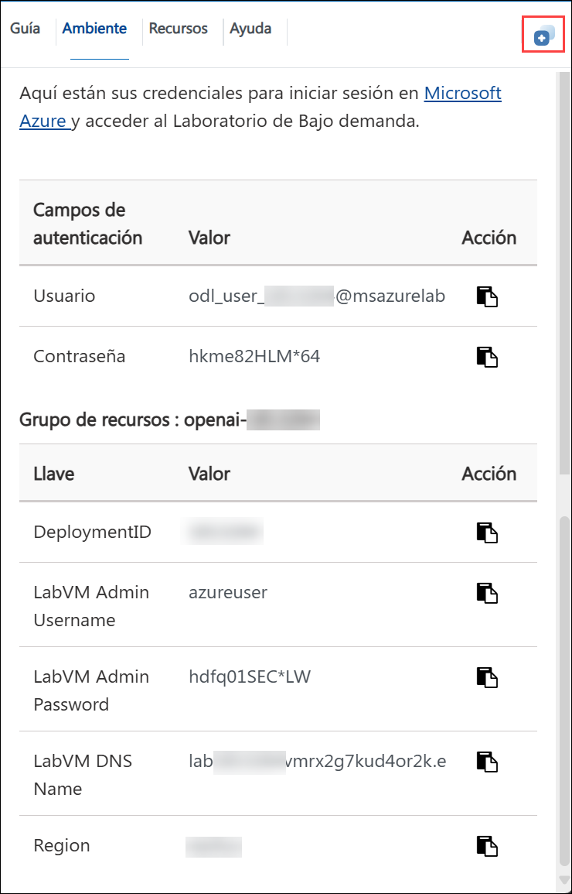
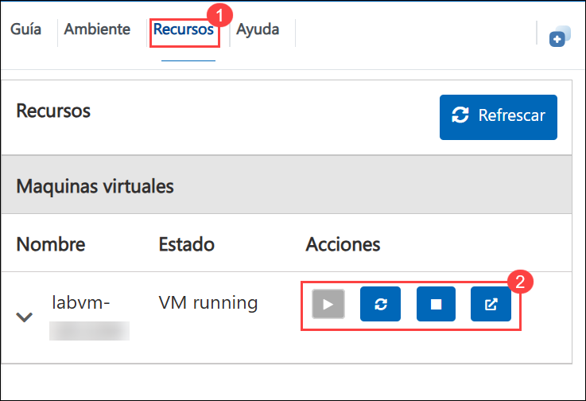
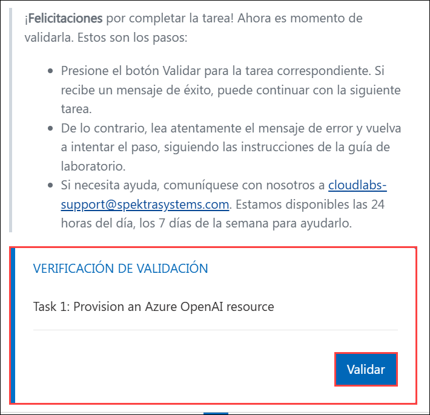
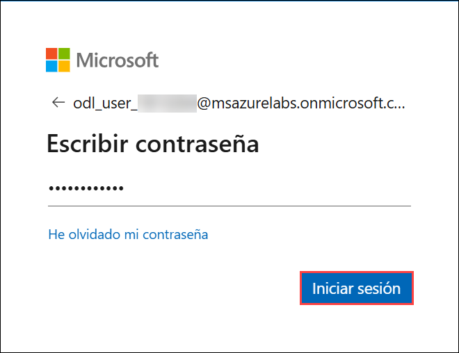

# Comece com o OpenAI para Criar Soluções de Linguagem Natural

### Duração Estimada Total: 4 Horas

## Visão Geral

O Serviço Azure OpenAI disponibiliza os modelos de IA generativa da OpenAI na plataforma Azure, permitindo o desenvolvimento de soluções de IA poderosas que se beneficiam da segurança, escalabilidade e integração dos serviços em nuvem da Microsoft. Neste laboratório, você aprenderá a provisionar o Azure OpenAI como um recurso e a usar o Azure AI Foundry para implantar e explorar os modelos. Com o Azure OpenAI, desenvolvedores podem criar aplicações como chatbots e modelos de linguagem que se destacam na compreensão da linguagem natural humana. O serviço oferece acesso a modelos de IA pré-treinados e um conjunto de APIs e ferramentas para personalizar e realizar o ajuste fino desses modelos, atendendo a requisitos específicos de cada aplicação. Neste cenário, você assumirá o papel de um desenvolvedor de software com a tarefa de implementar um aplicativo para fornecer recomendações de trilhas utilizando IA generativa, demonstrando técnicas aplicáveis a qualquer aplicação que utilize as APIs do Azure OpenAI.

## Objetivo

No final deste laboratório, você será capaz de:

- **Começar com o Serviço Azure OpenAI**: Este exercício prático visa provisionar um recurso Azure OpenAI e implementar um modelo. Você irá explorar as capacidades do modelo no playground de Conclusões e, em seguida, interagir com ele usando o playground de Chat. Você também fará o ajuste fino das respostas, modificando prompts e parâmetros, e explorará a geração de código para automatizar tarefas.
- **Usar os SDKs do Azure OpenAI na sua Aplicação**: Este exercício prático visa provisionar um recurso Azure OpenAI, implementar um modelo, configurar uma aplicação no Cloud Shell e, por fim, executá-la. O processo demonstra o ciclo de vida completo, desde a criação do recurso até a implantação e execução da aplicação.

## Pré-requisitos

- Familiaridade com o serviço Azure OpenAI, Azure CLI e APIs REST.
- Conhecimento básico de conceitos de Inteligência Artificial e Machine Learning.

## Arquitetura

O fluxo de arquitetura para esta tarefa começa com o provisionamento de um recurso Azure OpenAI em sua assinatura do Azure e a implementação de um modelo pré-treinado usando o Azure AI Foundry. Em seguida, você explorará as capacidades do modelo no playground de Conclusões e testará suas habilidades de conversação no playground de Chat, experimentando diferentes prompts e parâmetros para personalizar as respostas. Você também investigará as capacidades de geração de código do modelo. Na fase de desenvolvimento da aplicação, você configurará seu ambiente no Azure Cloud Shell, integrará a aplicação com o modelo OpenAI implantado e, finalmente, a executará para fornecer recomendações de trilhas usando IA generativa.

## Diagrama de Arquitetura

## Explicação dos Componentes

1. **Azure OpenAI**: O serviço Azure OpenAI fornece acesso via API REST aos poderosos modelos de linguagem da OpenAI. Esses modelos se integram aos seus dados, permitindo interações personalizadas e seguras.
2. **Modelos Azure OpenAI**: Oferece modelos de linguagem pré-treinados e personalizáveis para várias aplicações de IA. Estes modelos viabilizam soluções de IA poderosas, gerando conteúdo personalizado e contextualmente relevante com base em prompts bem elaborados.
3. **Azure CloudShell**: O Azure CloudShell oferece uma experiência de terminal integrada e baseada em navegador para gerenciar recursos do Azure. Ele fornece um ambiente pronto para uso com ferramentas pré-instaladas e acesso tanto ao Bash quanto ao PowerShell.

## Iniciando o Laboratório

Bem-vindo ao workshop "Comece com o OpenAI para Criar Soluções de Linguagem Natural". Neste laboratório, você aprenderá a construir e implantar soluções de linguagem natural com os modelos OpenAI. Do conceito básico à aplicação final, vamos explorar juntos o potencial da IA. Mãos à obra!

### Acessando seu Ambiente de Laboratório

Assim que estiver pronto para começar, sua máquina virtual e o guia do laboratório estarão disponíveis diretamente no seu navegador.

### Guia de laboratório Aumentar/diminuir zoom

Para ajustar o nível de zoom da página do ambiente, clique no ícone **A↕ : 100%**, localizado ao lado do cronômetro.

### Máquina Virtual e Guia do Laboratório

Sua máquina virtual é sua estação de trabalho durante todo o workshop. O guia do laboratório é o seu roteiro para o sucesso.

### Explorando os Recursos do Laboratório

Para entender melhor os recursos e credenciais do seu laboratório, navegue até a aba **Ambiente**.

### Utilizando o Recurso de Janela Dividida

Para maior conveniência, você pode abrir o guia do laboratório em uma janela separada selecionando o botão **Janela Dividida** no canto superior direito.

### Gerenciando Sua Máquina Virtual

Sinta-se à vontade para **iniciar, parar ou reiniciar (2)** sua máquina virtual conforme necessário, a partir da aba **Recursos (1)**. Você está no controle da sua experiência!

### Validação do laboratório

Após concluir uma tarefa, clique no botão **Validar** na aba de validação, integrada ao guia do laboratório. Se você receber uma mensagem de sucesso, pode prosseguir para a próxima tarefa. Caso contrário, leia atentamente a mensagem de erro e refaça a etapa, seguindo as instruções no guia de laboratório.

## Vamos Começar com o Portal do Azure

1. Na sua máquina virtual(LabVM), clique no atalho do Portal do Azure conforme mostrado abaixo:

   .png)

2. Será exibida a tela **Entrar no Microsoft Azure**. Prossiga, inserindo suas credenciais:

   - **E-mail/Usuário:** <inject key="AzureAdUserEmail"></inject>

       

3. Em seguida, forneça sua senha:

   - **Senha:** <inject key="AzureAdUserPassword"></inject>

       

4. Se for solicitado para permanecer conectado, você pode clicar em **Não**.

    

5. Se uma janela pop-up **Bem-vindo ao Microsoft Azure** aparecer, simplesmente clique em **Cancelar** para pular o tour.

## Contato de Suporte

A equipe de suporte da CloudLabs está disponível 24/7, 365 dias por ano, via e-mail e chat para garantir assistência contínua a qualquer momento. Oferecemos canais de suporte dedicados especificamente para alunos e instrutores, garantindo que todas as suas necessidades sejam atendidas de forma rápida e eficiente.

Contatos de Suporte para Alunos:

- Suporte por E-mail: cloudlabs-support@spektrasystems.com
- Suporte por Chat ao Vivo: https://cloudlabs.ai/labs-support

Agora, clique em **Próximo** no canto inferior direito para avançar para a próxima página.

## Bons estudos!
