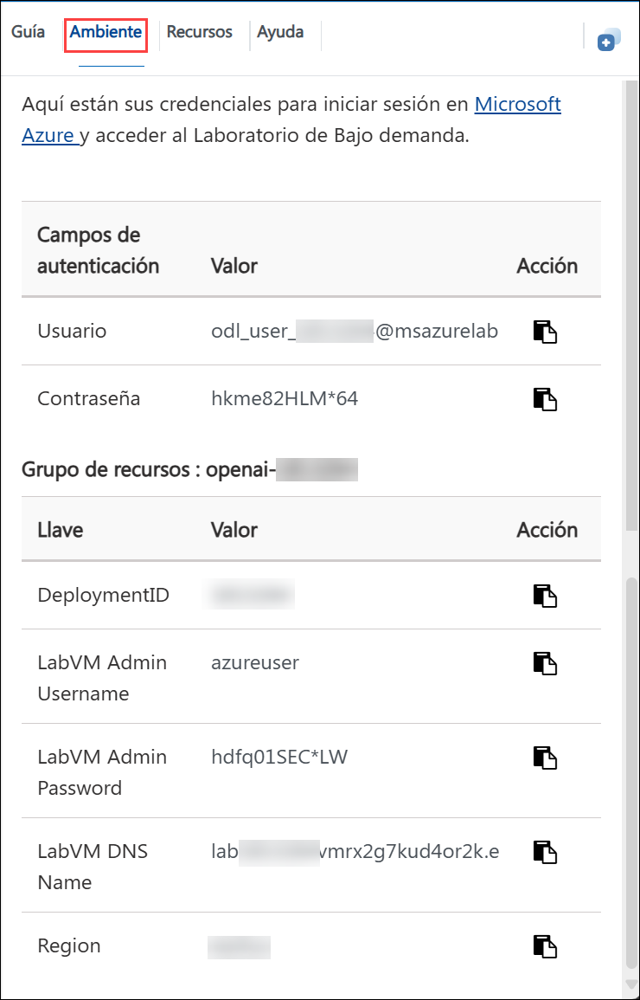
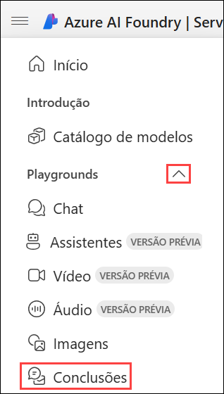
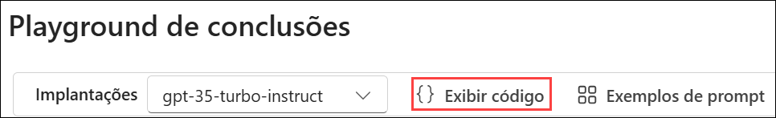
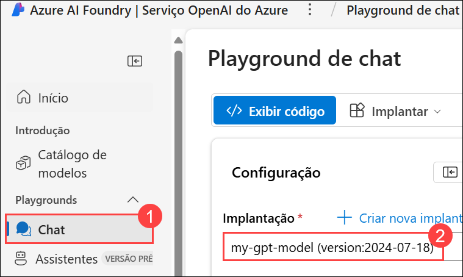

# Laboratório 01: Começar com o Serviço Azure OpenAI

### Duração Estimada: 120 Minutos

## Cenário do Laboratório
Neste laboratório, você aprenderá como começar a usar o Azure OpenAI, provisionando o serviço como um recurso do Azure e utilizando o portal Azure AI Foundry para implantar e explorar modelos OpenAI. O serviço Azure OpenAI integra os modelos de IA generativa desenvolvidos pela OpenAI à plataforma Azure, permitindo que você desenvolva soluções de IA robustas que se beneficiam da segurança, escalabilidade e integração de serviços oferecidos pela plataforma de nuvem do Azure.

## Objetivos do Laboratório
Neste laboratório, você completará as seguintes tarefas:

- Tarefa 1: Provisionar um recurso Azure OpenAI
- Tarefa 2: Implantar um modelo
- Tarefa 3: Explorar um modelo no playground de Conclusões
- Tarefa 4: Usar o playground de Chat
- Tarefa 5: Explorar prompts e parâmetros
- Tarefa 6: Explorar a geração de código

## Tarefa 1: Provisionar um recurso Azure OpenAI

Nesta tarefa, você criará um recurso no portal do Azure, selecionando o serviço OpenAI e configurando definições como a região e a camada de preço. Esta configuração permite integrar os modelos de linguagem avançados da OpenAI em suas aplicações.

1. No **portal do Azure**, pesquise por **Azure OpenAI (1)** e selecione **Azure OpenAI (2)**.

   

2. Na tela **AI Foundry | OpenAI**, clique em **+ Criar**.

   

3. Crie um recurso **Azure OpenAI** com as seguintes configurações e clique em **Próxima (6)** três vezes:
   
    - Assinatura: Padrão - Assinatura pré-atribuída **(1)**
    - Grupo de recursos: **openai-<inject key="DeploymentID" enableCopy="false"></inject> (2)**
    - Região:  **<inject key="Region" enableCopy="false" /> (3)**
    - Nome: **OpenAI-Lab01-<inject key="DeploymentID" enableCopy="false"></inject> (4)**
    - Faixa de preços: **Standard S0 (5)**
  
      

4. Na aba, **Examinar + enviar**, clique em **Criar**.

   

5. Aguarde a conclusão da implantação e, em seguida, acesse o recurso implantado a partir do painel de notificações.

#### Validação

> **Parabéns** por concluir a tarefa! Agora, é hora de validá-la. Siga os passos:
> - Clique no botão Validar para a tarefa correspondente. Se receber uma mensagem de sucesso, você pode prosseguir para a próxima tarefa. 
> - Caso contrário, leia atentamente a mensagem de erro e tente novamente seguindo as instruções do guia do laboratório.
> - Se precisar de auxílio, entre em contato conosco em cloudlabs-support@spektrasystems.com. Estamos disponíveis 24/7 para ajudá-lo.

   <validation step="1fa0e87b-eb46-463d-b63b-edf6e2282e16" />

## Tarefa 2: Implantar um modelo

Nesta tarefa, você implantará uma instância de modelo de IA específica dentro do seu recurso Azure OpenAI para integrar capacidades avançadas de linguagem em suas aplicações.

1. No **portal do Azure**, pesquise por **Azure OpenAI(1)** e selecione **Azure OpenAI (2)**.

   

1. Na tela **AI Foundry | OpenAI**, selecione **OpenAI-Lab01-<inject key="DeploymentID" enableCopy="false"></inject>**

   

1. Na página do recurso do Azure OpenAI, clique em **Go to Azure AI Foundry portal** para navegar até o **portal Azure AI Foundry**.

    

1. Na página do **portal Azure AI Foundry**, clique em **Implantações (1)** em **Recursos compartilhados** no painel à esquerda. Em seguida, clique em **+ Implante o Modelo (2)**, escolha **Implantar o modelo básico (3)**.  

   

1. Na janela **Selecione um modelo**, pesquise por **gpt-4o-mini (1)**, selecione **gpt-4o-mini (2)** e, em seguida, clique em **Confirmar (3)**.

   

1. Clique em **Personalizar**.

   

1. Na interface pop-up **Implantar o modelo**, insira os seguintes detalhes:
    
    - Nome da implantação: **my-gpt-model (1)**

    - Tipo de implantação: **Standard (2)**
    
    - Versão do modelo: **2024-07-18(default) (3)**
    
    - Limite de Taxa de Tokens por Minuto: **8K (4)**

    - Filtro de conteúdo: **DefaultV2 (5)** 
    
    - Habilitar cota dinâmica: **Habilitado (6)**
    
    - Clique em **Implantar (7)**
      
      

1. No painel à esquerda, em **Recursos compartilhados**, selecione **Implantações (1)**. Em seguida, clique em **+ Implante o modelo (2)** e escolha **Implantar o modelo básico (3)**.  

   

1. Na janela **Selecione um modelo**, pesquise por **gpt-35-turbo-instruct (1)**, selecione **gpt-35-turbo-instruct (2)** e clique em **Confirmar (3)**.

      

1. Clique em **Personalizar**.

   
   
1. Na interface pop-up **Implantar o modelo**, insira os seguintes detalhes:
    
    - Nome da implantação: **gpt-35-turbo-instruct (1)**

    - Tipo de implantação: **Standard (2)**
    
    - Versão do modelo: **0914 (Padrao) (3)**
    
    - Limite de Taxa de Tokens por Minuto: **20K (4)**

    - Filtro de conteúdo: **DefaultV2 (5)**  
    
    - Habilitar cota dinâmica: **Habilitado (6)**
    
    - Clique em **Implantar (7)**
      
         

1. Isso implantará os modelos com os quais você poderá experimentar tanto em tarefas de chat quanto de conclusão ao longo do laboratório.

      > **Observação**: você pode ignorar qualquer erro relacionado à atribuição de funções para visualizar os limites de cota.

#### Validação

> **Parabéns** por concluir a tarefa! Agora, é hora de validá-la. Siga os passos:
> - Clique no botão Validar para a tarefa correspondente. Se receber uma mensagem de sucesso, você pode prosseguir para a próxima tarefa. 
> - Caso contrário, leia atentamente a mensagem de erro e tente novamente seguindo as instruções do guia do laboratório.
> - Se precisar de auxílio, entre em contato conosco em cloudlabs-support@spektrasystems.com. Estamos disponíveis 24/7 para ajudá-lo.

   <validation step="3b4a472e-f956-45d8-b828-3e2cc01c2e88" />

## Tarefa 3: Explorar um modelo no playground de Conclusões

Os *Playgrounds* são interfaces úteis no portal do Azure AI Foundry que você pode usar para experimentar seus modelos implantados sem precisar desenvolver a sua aplicação cliente. Nesta tarefa, você explorará um modelo no playground de Conclusões, interagindo com o modelo de IA para testar e refinar suas respostas usando exemplos de entrada e saída em tempo real.

1. No Azure OpenAI Foundry, no painel esquerdo em **Playgrounds**, selecione **Conclusões**.

   

2. Na página **Conclusões**, certifique-se de que sua implantação **gpt-35-turbo-instruct (1)** esteja selecionada, digite `Gerar um questionário de 5 perguntas. Para cada pergunta, forneça as opções de resposta e a resposta correta (2)` no campo prompt e clique em **Generate (3)**.

      

      > **Observação:** O exemplo de texto consiste em um *prompt* que informa ao modelo que tipo de resposta é necessária e inclui algumas informações contextuais.

3. A resposta consiste em um questionário baseado no exemplo do prompt.

      

>**Nota** : O resultado da saída do chat pode variar. A captura de tela é fornecida apenas para referência e pode não refletir exatamente o mesmo resultado.

   >**Observação**: Você pode usar o botão **Regenerate** para reenviar o prompt (caso novas alterações tenham sido feitas)  e observar que a resposta pode variar da original. Um modelo de IA generativa pode produzir uma nova linguagem a cada vez que é chamado.

4. Na parte inferior da página, observe o número de *tokens* detectados no texto. Tokens são as unidades básicas de um prompt – essencialmente, palavras ou partes de palavras no texto.

5. Use o botão **Exibir código** para visualizar o código que um aplicativo cliente usaria para enviar o prompt. Você pode selecionar sua linguagem de programação preferida. A requisição é enviada para a API *Conclusões* do seu serviço Azure OpenAI.

      

      

6. Feche a janela **Sample Code(Código de Amostra)** após revisar o conteúdo.

## Tarefa 4: Usar o playground de Chat

O playground *Chat* fornece uma interface de chatbot para os modelos GPT 3.5 e superiores. Ele usa a API *ChatCompletions* em vez da antiga API *Completions*.

1. Na seção **Playground**, selecione **Chat (1)** e certifique-se de que o modelo **my-gpt-model (2)** esteja selecionado no painel de configuração.

   

1. Na seção **Configuração**, na caixa **Forneça as instruções e o contexto do modelo**, substitua o texto atual pela seguinte afirmação: `O sistema é um professor de IA que ajuda as pessoas a aprender sobre IA (1)`, clique em **Aplicar alterações (2)** e confirme selecionando **Continuar (3)** na solicitação.

      

      

1. Na seção **Configuração**, clique na caixa **Adicionar seção** e, em seguida, clique em **Exemplos**.

      

1. Digite a seguinte mensagem e resposta nas caixas designadas:

    - **Usuário**: `Quais são os diferentes tipos de inteligência artificial?`
    
    - **Assistente**: `Existem três tipos principais de inteligência artificial: IA Restrita ou Fraca (como assistentes virtuais como Siri ou Alexa, software de reconhecimento de imagem e filtros de spam), IA Geral ou Forte (IA projetada para ser tão inteligente quanto um ser humano. Este tipo de IA não existe atualmente e é puramente teórico), e Superinteligência Artificial (IA que é mais inteligente que qualquer ser humano e pode realizar tarefas que estão além da compreensão humana. Este tipo de IA também é puramente teórico e ainda não foi desenvolvido).`

      

      > **Nota**: Exemplos few-shot(demonstrações com poucos exemplos) são usados para fornecer ao modelo um direcionamento sobre o tipo de resposta esperada. Assim, o modelo tentará refletir o tom e o estilo dos exemplos em suas próprias respostas.
  
1. Clique em **Aplicar alterações** e depois em **Continuar** para inicializar uma nova sessão com o contexto atualizado.

      

1. Na caixa de consulta na parte inferior da página, digite o texto `O que é inteligência artificial? (1)`. Use o botão **Enviar (2)** para submeter a mensagem e ver a resposta.

     

      > **Observação**: você pode receber uma resposta informando que a implantação da API ainda não está pronta. Nesse caso, aguarde alguns minutos e tente novamente.

1. Analise a resposta.

   

1. Após analisar a resposta, envie a seguinte mensagem de acompanhamento: `Como isso está relacionado ao aprendizado de máquina?`

1. Revise a nova resposta, observando que o contexto da interação anterior é mantido (para que o modelo entenda que “isso” se refere à inteligência artificial).

1. Use o botão **Exibir código** para visualizar o código da interação. O prompt consiste na mensagem do *sistema*, nos exemplos rápidos de mensagens de *usuário* e *assistente*, e na sequência de mensagens da sessão de chat até o momento.

      

## Tarefa 5: Explorar prompts e parâmetros

Nesta tarefa, você explorará prompts e parâmetros, experimentando diferentes entradas e configurações para ajustar as respostas e o comportamento do modelo de IA.

1. No painel **Configuração**, selecione **Parâmetros (1)**, defina os seguintes valores de parâmetro:

    - **Resposta máxima: (2)**: 500
    - **Temperatura (3)**: 0

      

1. **Envie (2)** a seguinte mensagem na sessão de chat **(1)**

      ```
      Escreva três perguntas de múltipla escolha com base no seguinte texto.
      
      A maioria das soluções de visão computacional baseia-se em modelos de aprendizado de máquina que podem ser aplicados a entradas visuais de câmeras, vídeos ou imagens.
      
      - A classificação de imagens envolve o treinamento de um modelo de aprendizado de máquina para classificar imagens com base em seu conteúdo. Por exemplo, em uma solução de monitoramento de tráfego, você pode usar um modelo de classificação de imagens para classificar imagens com base no tipo de veículo que elas contêm, como táxis, ônibus, ciclistas e assim por diante.
      
      - Os modelos de aprendizado de máquina de detecção de objetos são treinados para classificar objetos individuais dentro de uma imagem e identificar sua localização com uma caixa delimitadora (*bounding box*). Por exemplo, uma solução de monitoramento de tráfego pode usar a detecção de objetos para identificar a localização de diferentes classes de veículos.
      
      - A segmentação semântica é uma técnica avançada de aprendizado de máquina na qual pixels individuais na imagem são classificados de acordo com o objeto ao qual pertencem. Por exemplo, uma solução de monitoramento de tráfego pode sobrepor imagens de tráfego com camadas de "máscara" para destacar diferentes veículos usando cores específicas.
      ```

            

1. Analise os resultados, que devem consistir em perguntas de múltipla escolha que um professor poderia usar para testar alunos sobre os tópicos de visão computacional no prompt. A resposta total deve ser menor do que o comprimento máximo que você esoecificou como parâmetro.

      

1. Observe o seguinte sobre o prompt e os parâmetros que você usou:

    - O prompt especifica que a saída desejada deve ser três perguntas de múltipla escolha.
    
    - Os parâmetros incluem a *Temperatura*, que controla o grau de aleatoriedade na geração da resposta. O valor **0** que você utilizou minimiza a aleatoriedade, resultando em respostas estáveis e previsíveis.

## Tarefa 6: Explorar a geração de código

Além de gerar respostas em linguagem natural, você pode usar modelos GPT para gerar código. Nesta tarefa, você explorará a geração de código testando a capacidade do modelo de IA de gerar e sugerir trechos de código com base em vários prompts e requisitos de programação.

1. No **painel Configuração**, na caixa **Forneça as instruções e o contexto do modelo**, insira a mensagem do sistema: `Você é um desenvolvedor Python. (1)` e salve as alterações clicando em **Aplicar alterações (2)** e clique em **Continuar** quando solicitado.
  
      

1. No painel da **Sessão de chat**, selecione o botão **Limpar chat** e, em seguida, selecione **Limpar** na janela pop-up para limpar o histórico do chat e iniciar uma nova sessão.

      

1. Envie a seguinte mensagem do usuário:

    ```
    Crie uma função em Python chamada Multiplicar que receba dois parâmetros numéricos e retorne a multiplicação entre eles.
    ```
    
1. Analise o trecho de código Python gerado. O modelo deve retornar uma definição de função válida que multiplica duas entradas e retorna o resultado.

     

## Resumo

Neste laboratório:
- Você provisionou um recurso do Serviço Azure OpenAI para integrar capacidades de IA generativa em suas aplicações.
- Implantou dois modelos usando o portal Azure AI Foundry.
- Explorou os modelos nos playgrounds de Completions e Chat, experimentou com prompts e parâmetros, e testou as capacidades de geração de código do modelo.

#### Você completou com sucesso o laboratório. Clique em Próximo >> para prosseguir com o próximo laboratório.
