# Laboratorio 01: Comenzar a usar el Servicio Azure OpenAI

### Duración Estimada: 120 minutos

## Escenario del Laboratorio
El Servicio Azure OpenAI incorpora los modelos de IA generativa desarrollados por OpenAI a la plataforma Azure, lo que le permite desarrollar potentes soluciones de IA que se benefician de la seguridad, la escalabilidad y la integración de los servicios que ofrece la plataforma de nube de Azure. En este ejercicio, aprenderá cómo comenzar con Azure OpenAI mediante el aprovisionamiento del servicio como un recurso de Azure y el uso de Azure AI Foundry portal para implementar y explorar los modelos de OpenAI. 

## Objetivos del laboratorio
En este laboratorio, completará las siguientes tareas:

- Tarea 1: Aprovisionar un recurso de Azure OpenAI
- Tarea 2: Implementar un modelo
- Tarea 3: Explorar un modelo en el Área de juegos (Playground) Completions
- Tarea 4: Utilizar el Área de juegos Chat
- Tarea 5: Explorar prompts y parámetros 
- Tarea 6: Explorar la generación de código

### Tarea 1: Aprovisionar un recurso de Azure OpenAI

En esta tarea, creará un recurso de Azure en Azure Portal, seleccionando el servicio OpenAI y configurará opciones como la región y el plan de tarifa. Esta configuración le permite integrar los modelos de lenguaje avanzados de OpenAI en sus aplicaciones.

1. En el **Portal de Azure**, busque **OpenAI (1)** y seleccione **Azure OpenAI (2)**.

   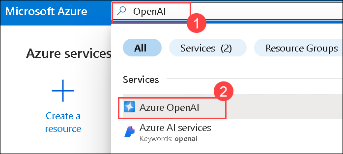

2. En la hoja **AI Foundry | Azure OpenAI**, haga clic en **+ Crear**.

   .png)

3. Complete los detalles requeridos en la página **Crear Azure OpenAI**:
   
    - **Suscripción**: Predeterminada - Suscripción preasignada **(1)**
    - **Grupo de recursos**: **openai-<inject key="DeploymentID" enableCopy="false"></inject> (2)**
    - **Región**: Seleccione **Sweden Central (3)**
    - **Nombre**: **OpenAI-Lab01-<inject key="DeploymentID" enableCopy="false"></inject> (4)**
    - **Plan de tarifa**: **Standard S0 (5)**
  
      

    >**Nota:** Asegúrese de que el recurso esté implementado en la región **Sweden Central**.

4. Haga clic en **Siguiente** en cada pestaña sin cambiar nada.

5. Por último, haga clic en **Revisar + crear** y, a continuación, haga clic en **Crear** para iniciar la implementación.

    .png "Crear recurso de Azure OpenAI")

6. Espere a que se complete la implementación. Luego, vaya al recurso de Azure OpenAI implementado en el Portal de Azure.

> ¡**Felicitaciones** por completar la tarea! Ahora es momento de validarla. Estos son los pasos:
> - Presione el botón Validar para la tarea correspondiente. Si recibe un mensaje de éxito, puede continuar con la siguiente tarea. 
> - De lo contrario, lea atentamente el mensaje de error y vuelva a intentar el paso, siguiendo las instrucciones de la guía de laboratorio.
> - Si necesita ayuda, comuníquese con nosotros a cloudlabs-support@spektrasystems.com. Estamos disponibles las 24 horas del día, los 7 días de la semana para ayudarlo.

   <validation step="1fa0e87b-eb46-463d-b63b-edf6e2282e16" />

### Tarea 2: Implementar un modelo

En esta tarea, implementará una instancia de modelo de IA específica dentro de su recurso de Azure OpenAI para integrar capacidades de lenguaje avanzadas en sus aplicaciones.

1. Desde el **portal de Azure**, diríjase a su recurso de OpenAI **OpenAI-Lab01-<inject key="DeploymentID" enableCopy="false"></inject>**.

    .png)

1. En la página de recursos de **Azure OpenAI**, haga clic en **Información general (1)** y seleccione **Ir al portal de Azure AI Foundry (2)** para acceder al **portal de Azure AI Foundry**.

    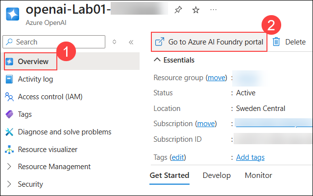

1. En la página **Portal de Azure AI Foundry**, seleccione **Implementaciones (1)** en **Recursos compartidos** en el panel izquierdo. A continuación, haga clic en **+ Implementar modelo (2)** y seleccione **Implementación del modelo base (3)**.

    

1. En la ventana **Seleccionar un modelo**, busque **gpt-4o-mini (1)**, luego seleccione **gpt-4o-mini (2)** y haga clic en **Confirmar (3)**.

    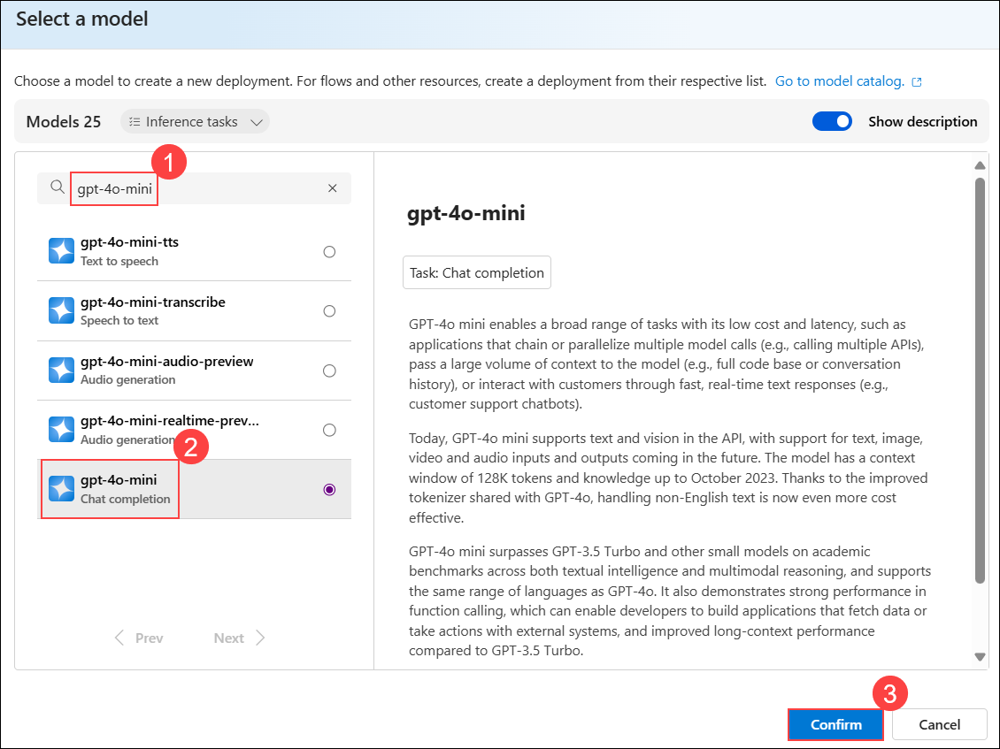

1. Haga clic en **Personalizar**.

    

1. Dentro de la interfaz emergente **Implementar modelo**, ingrese los siguientes detalles:
    
    - Nombre de implementación: **my-gpt-model (1)** 
    - Tipo de implementación: **Estándar (2)**
    - Versión de modelo: **2024-07-18 (Predetermindado) (3)**
    - Tokens por límite de velocidad por minuto (miles): **8K (4)**
    - Filtro de contenido: **DefaultV2 (5)**
    - Habilitar cuota dinámica: **Habilitado (6)**
    - Haga clic en **Implementar** **(7)**
  
      

         > **Nota**: gpt-4o-mini solo se admite para la finalización del chat y no para la API de finalización.

1. Haga clic en la **flecha atrás** para volver a la pantalla anterior. A continuación, en el panel izquierdo, en **Recursos compartidos**, seleccione **Implementaciones (1)**. Luego, haga clic en **+ Implementar modelo (2)** y seleccione **Implementación del modelo base (3)**.

    

    

1. En la ventana **Seleccionar un modelo**, busque **gpt-35-turbo-instruct (1)**, luego seleccione **gpt-35-turbo-instruct (2)** y haga clic en **Confirmar (3)**.

    

1. Haga clic en **Personalizar**.

    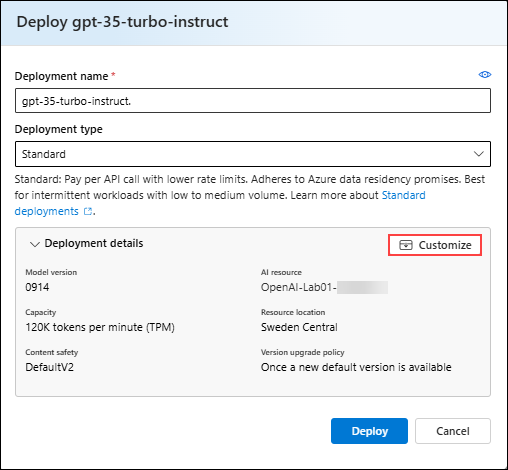


1. Dentro de la interfaz emergente **Implementar modelo**, ingrese los siguientes detalles:
    
    - Nombre de implementación: **gpt-35-turbo-instruct (1)** 
    - Tipo de implementación: **Estándar (2)**
    - Versión de modelo: **0914 (Predeterminado) (3)**
    - Tokens por límite de velocidad por minuto (miles): **20K (4)**
    - Filtro de contenido: **DefaultV2 (5)**
    - Habilitar cuota dinámica: **Habilitado (6)**
    - Haga clic en **Implementar** (7)

       


11. Esto implementará modelos con los que puede experimentar tanto para tareas de chat como de finalización a medida que avanza.

      > **Nota**: Puede ignorar cualquier error relacionado con la asignación de roles para ver los límites de cuota.


    > ¡**Felicitaciones** por completar la tarea! Ahora es momento de validarla. Estos son los pasos:
    > - Pulse el botón Validar para la tarea correspondiente. Si recibe un mensaje de éxito, puede continuar con la siguiente tarea. 
    > - De lo contrario, lea atentamente el mensaje de error y vuelva a intentar el paso, siguiendo las instrucciones de la guía de laboratorio.
    > - Si necesita ayuda, comuníquese con nosotros a cloudlabs-support@spektrasystems.com. Estamos disponibles las 24 horas del día, los 7 días de la semana para ayudarlo.

   <validation step="3b4a472e-f956-45d8-b828-3e2cc01c2e88" />


### Tarea 3: Explorar un modelo en el Área de juegos (Playground) Completions

En esta tarea, explorará un modelo en el área de juegos de Finalizaciones, lo que implica interactuar con el modelo de IA para probar y refinar sus respuestas mediante ejemplos de entrada y salida en tiempo real.

1. En el portal de Azure OpenAI Foundry, navegue al panel izquierdo y seleccione **Patios de juego (1) -> Finalizaciones (2)**.

    

2. En la página **Finalizaciones**: 

    * Asegúrese de que **gpt-35-turbo-instruct (1)** esté seleccionado en **Implementaciones**
    * En el cuadro de texto **Prompt (2)**, introduzca el siguiente prompt: 
    
    ```
         Generate a quiz of 5 questions. For each question, provide me with the answer options and the correct answer.
    ```
    
    * Haga clic en **Generar (3)** para enviar el prompt y recibir la respuesta.

    .png)

     > **Nota**: La muestra de texto resumido consta de un prompt que proporciona texto para indicarle al modelo qué tipo de respuesta se requiere e incluye información contextual.

3. La respuesta consiste en un cuestionario basado en el ejemplo del prompt.

    

      > **Nota**: El resultado del chat puede variar. La captura de pantalla se proporciona solo como referencia y es posible que no refleje exactamente el mismo resultado.

      > **Nota**: Puede utilizar el botón Regenerar para volver a enviar el mensaje (se han realizado nuevos cambios) y tenga en cuenta que la respuesta puede variar de la original. Un modelo de IA generativa puede producir un nuevo lenguaje cada vez que se llama.

4. En la parte inferior de la página, anote la cantidad de **tokens** detectados en el texto. Los tokens son las unidades básicas de un prompt: esencialmente palabras o partes de palabras en el texto.

5. Utilice el botón **Ver código** para ver el código que una aplicación cliente usaría para enviar el mensaje. Puede seleccionar su lenguaje de programación preferido. El mensaje contiene el texto que envió al modelo. La solicitud se envía a la API de *Finalizaciones* de su servicio Azure OpenAI.

    

    

6. Cierre la ventana **Código de muestra** una vez que haya revisado el contenido.

### Tarea 4: Utilizar el Área de juegos Chat

En esta tarea, usará el Área de juegos de Chat para interactuar con el modelo de IA y probar sus capacidades conversacionales mediante una interfaz de chat simulada.

1. Vaya a la sección **Recursos compartidos** en el menú de la izquierda y seleccione **Implementaciones (1)**. En la lista de implementaciones disponibles, elija **my-gpt-model** y haga clic en **Abrir en Área de juegos de Chat (2)**. Esta acción iniciará el **Área de juegos de Chat**, donde podrá interactuar con el modelo implementado en una interfaz conversacional.

    .png)

    .png)

1. En la sección **Configuración**:

    * Reemplace el **Mensaje del sistema (1)** predeterminado con la siguiente instrucción:

     ```
     The system is an AI teacher that helps people learn about AI.
     ```

    * Haga clic en **Aplicar cambios (2)** y confirme seleccionando **Continuar** en el prompt.

      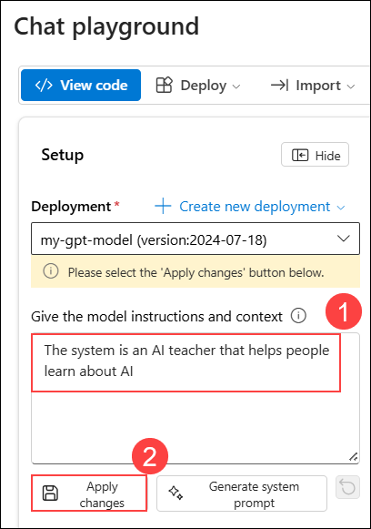

      

1. En la sección **Configuración (1)**, haga clic en el cuadro **+ Agregar sección (2)** y, a continuación, en **Ejemplos (3)**.

      .png)

1. Ingrese el siguiente mensaje y respuesta en las casillas designadas:

      - **User (1)**:
        ```
        What are the different types of artificial intelligence?
        ```
    
      - **Assistant (2)**:
        ```
        There are three main types of artificial intelligence: Narrow or Weak AI (such as virtual assistants like Siri or Alexa, image recognition software, and spam filters), General or Strong AI (AI designed to be as intelligent as a human being. This type of AI does not currently exist and is purely theoretical), and Artificial Superintelligence (AI that is more intelligent than any human being and can perform tasks that are beyond human comprehension. This type of AI is also purely theoretical and has not yet been developed).
        ``` 

         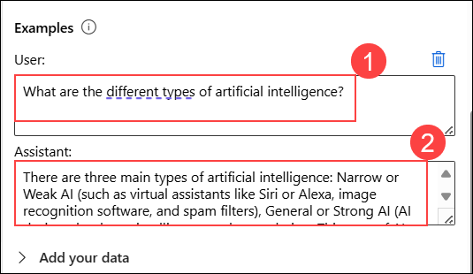

    > **Nota**: Se utilizan algunos ejemplos para proporcionar al modelo ejemplos de los tipos de respuestas que se esperan. El modelo intentará reflejar el tono y el estilo de los ejemplos en sus propias respuestas.
  
1. Haga clic en **Aplicar cambios** y luego en **Continuar** para iniciar el chat con el contexto actualizado.

      

      

1. En el cuadro de consulta al final de la página, introduzca el texto **(1)** que se menciona a continuación. Pulse el botón **Enviar (2)** para enviar el mensaje y ver la respuesta.

   ```
   What is artificial intelligence?
   ```

   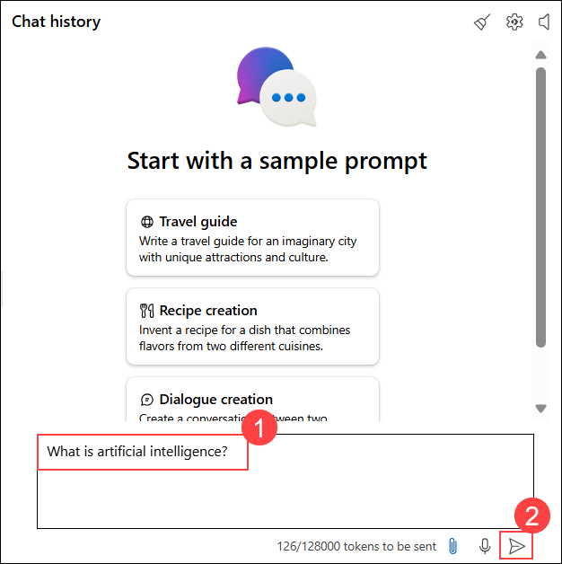

      > **Nota**: Es posible que reciba una respuesta indicando que la implementación de API aún no está lista. Si es así, espere unos minutos y vuelva a intentarlo.

1. Revise la respuesta.

    

1. Después de revisar la respuesta, envíe el siguiente mensaje de seguimiento:

   ```
   How is it related to machine learning?
   ```

1. Revise la respuesta y observe que se conserva el contexto de la interacción anterior (para que el modelo entienda que "eso" se refiere a inteligencia artificial).

     .png)

1. Utilice el botón **Ver código** para ver el código de la interacción. El mensaje consta del mensaje del *sistema*, los ejemplos breves de mensajes de *usuario* y *asistente*, y la secuencia de mensajes de *usuario* y *asistente* en la sesión de chat hasta el momento.

      

      .png)

### Tarea 5: Explorar prompts y parámetros 

En esta tarea, explorará prompts y parámetros experimentando con diferentes entradas y configuraciones para ajustar las respuestas y el comportamiento del modelo de IA.

1. En el panel **Configuración del chat**, seleccione **Parámetros (1)** y configure los siguientes valores de parámetro:
   
    - **Respuesta máxima (tokens)**: 500 **(2)**
    - **Temperatura**: 0 **(3)** (para respuestas deterministas)

      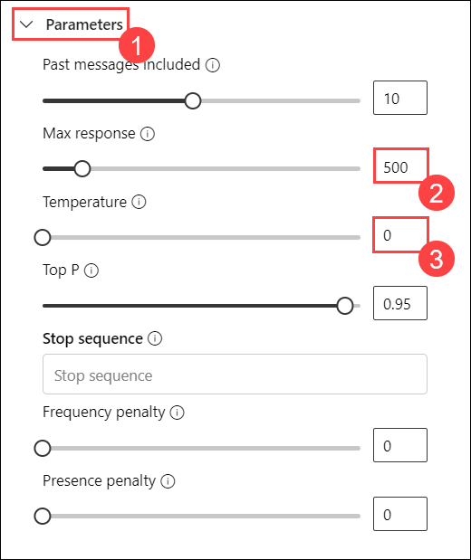
   
2. En el cuadro de entrada del chat, introduzca el mensaje **(1)** y haga clic en **Enviar (2)** para enviarlo.

      ```
      Write three multiple-choice questions based on the following text.

      Most computer vision solutions are based on machine learning models that can be applied to visual input from cameras, videos, or images.*

      - Image classification involves training a machine learning model to classify images based on their contents. For example, in a traffic monitoring solution, you might use an image classification model to classify images based on the type of vehicle they contain, such as taxis, buses, cyclists, and so on.*

      - Object detection machine learning models are trained to classify individual objects within an image and identify their location with a bounding box. For example, a traffic monitoring solution might use object detection to identify the location of different classes of vehicles.*

      - Semantic segmentation is an advanced machine learning technique in which individual pixels in the image are classified according to the object to which they belong. For example, a traffic monitoring solution might overlay traffic images with "mask" layers to highlight different vehicles using specific colors.
      ```

    


3. Revise los resultados, que deben consistir en preguntas de opción múltiple que un maestro podría usar para evaluar a los estudiantes sobre los temas de visión por computadora en el mensaje. La respuesta total debe ser menor que la longitud máxima especificada como parámetro.

      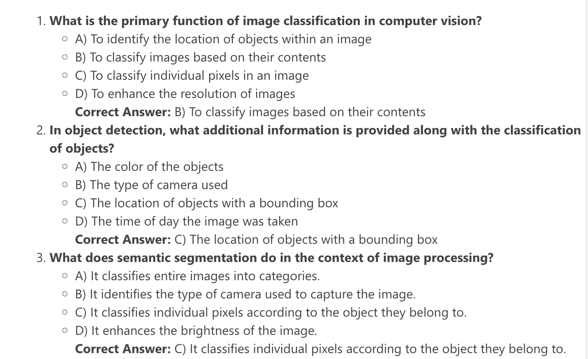

4. Observe lo siguiente sobre el prompt y los parámetros que utilizó:

    - El prompt indica específicamente que el resultado deseado debe ser tres preguntas de opción múltiple.
    
    - Los parámetros incluyen *Temperatura*, que controla el grado en el que la generación de respuestas incluye un elemento de aleatoriedad. El valor **0** utilizado en su envío minimiza la aleatoriedad, lo que da como resultado respuestas estables y predecibles.

### Tarea 6: Explorar la generación de código

En esta tarea, explorará la generación de código probando la capacidad del modelo de IA para generar y sugerir fragmentos de código según diversas indicaciones y requisitos de programación.

1. En el panel **Configuración**, actualice el **Mensaje del sistema (1)** a:

   ```
   You are a Python developer.
   ```

    * Haga clic en **Aplicar cambios (2)** y luego en **Continuar** cuando se le solicite.

     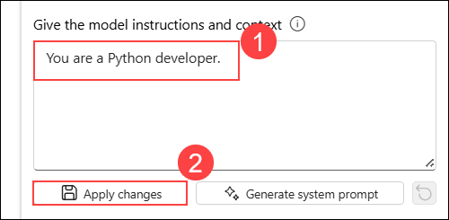

     


2. En el panel **Sesión de chat**, seleccione **Borrar chat** y, a continuación, seleccione **Borrar** en la ventana emergente para borrar el historial de chat e iniciar una nueva sesión.

      

      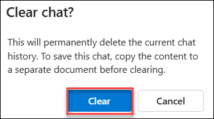

3. Envíe el siguiente mensaje:

    ```
    Write a Python function named Multiply that multiplies two numeric parameters.
    ```

4. Revise el fragmento de código Python generado. El modelo debe devolver una definición de función válida que multiplique dos entradas y devuelva el resultado.

   

## Resumen

- En este laboratorio, aprovisionó un **recurso de Azure OpenAI** para integrar capacidades de IA generativa en sus aplicaciones.
- **Implementó dos modelos** (gpt-4o-mini para chat y gpt-35-turbo-instruct para finalizaciones) mediante el portal de Azure AI Foundry.
- Exploró los modelos en las **áreas de juego Finalizaciones y Chat**, experimentó con prompts y parámetros, y probó las **capacidades de generación de código** del modelo.

### Ha completado con éxito el laboratorio. Haga clic en Siguiente >> para continuar con el siguiente laboratorio.

   