# Laboratório 02: Use SDKs do Azure OpenAI na sua Aplicação

### Duração Estimada: 120 Minutos

## Cenário do laboratório
No cenário deste exercício, você desempenhará o papel de um desenvolvedor de software que foi encarregado de implementar uma aplicação que pode usar IA generativa para ajudar a fornecer recomendações de caminhadas. As técnicas usadas no exercício podem ser aplicadas a qualquer aplicação que queira usar as APIs do Azure OpenAI.

Com o Serviço Azure OpenAI, os desenvolvedores podem criar chatbots, modelos de linguagem e outras aplicações que se destacam na compreensão da linguagem humana natural. O Azure OpenAI fornece acesso a modelos de IA pré-treinados, bem como um conjunto de APIs e ferramentas para personalizar e ajustar esses modelos para atender aos requisitos específicos da sua aplicação. Neste exercício, você aprenderá como implementar um modelo no Azure OpenAI e usá-lo na sua aplicação.

## Objetivos do laboratório
Neste laboratório, você completará as seguintes tarefas:

- Tarefa 1: Provisionar um recurso Azure OpenAI
- Tarefa 2: Configurar uma aplicação no Cloud Shell
- Tarefa 3: Configurar a sua aplicação
- Tarefa 4: Executar a sua aplicação

## Tarefa 1: Provisionar um recurso Azure OpenAI

Antes de poder usar os modelos Azure OpenAI, você deve provisionar um recurso Azure OpenAI em sua assinatura do Azure.

1. No **portal do Azure**, pesquise por **Azure OpenAI (1)** e selecione **OpenAI (2)**.

   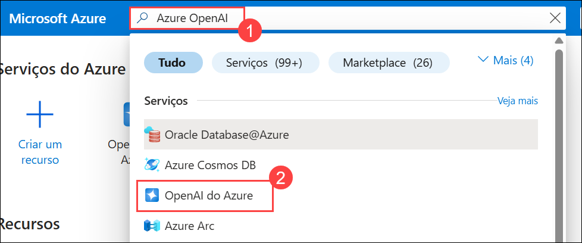

1. Na página **Azure AI Services**, certifique-se de que **Azure OpenAI (1)** esteja selecionado na lâmina esquerda. Em seguida, selecione **OpenAI-Lab01-<inject key="DeploymentID" enableCopy="false"></inject> (2)**.

   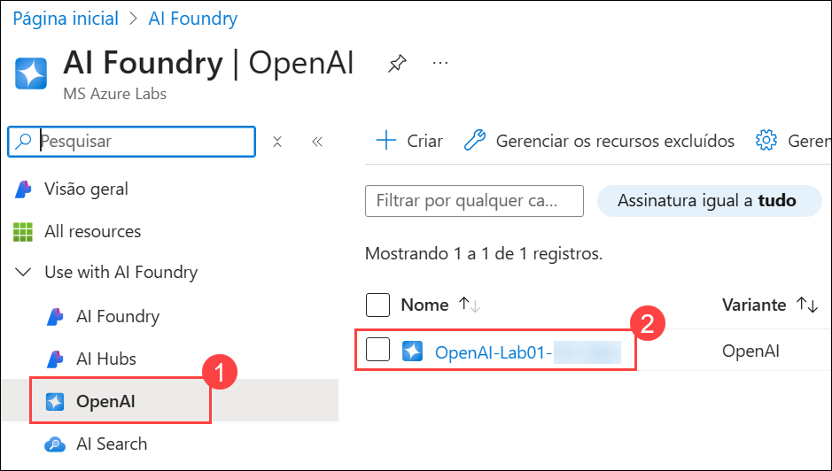

1. Para capturar os valores de Chaves e Endpoints, na lâmina **OpenAI-Lab01-<inject key="DeploymentID" enableCopy="false"></inject>**:

      - Selecione **Chaves e Ponto de extremidade (1)** sob **Gerenciamento de Recursos**.
      - Clique em **Mostrar as Chaves (2)**.
      - Copie a **CHAVE 1 (3)** e certifique-se de colá-la em um editor de texto como o Bloco de Notas para referência futura.
      - Finalmente, copie a URL da API do **Ponto de extremidade (4)** clicando em copiar para a área de transferência. Cole-a em um editor de texto como o Bloco de Notas para uso posterior.

        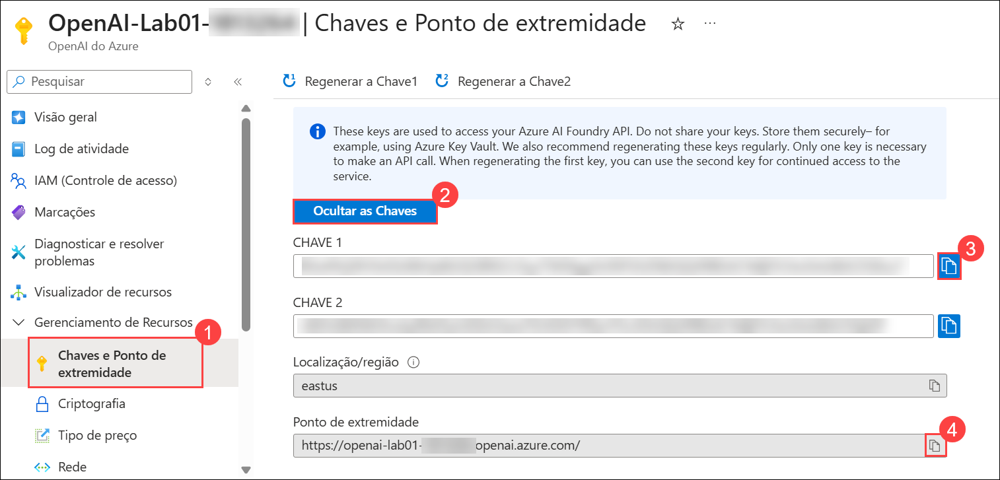

## Tarefa 2: Configurar uma aplicação no Cloud Shell

Para mostrar como integrar com um modelo Azure OpenAI, usaremos uma aplicação de linha de comandos que é executada no Cloud Shell no Azure. Abra uma nova guia do navegador para trabalhar com o Cloud Shell.

1. No [portal do Azure](https://portal.azure.com?azure-portal=true), selecione o botão **[>_]** (*Cloud Shell*) na parte superior da página à direita da caixa de pesquisa. Um painel do Cloud Shell será aberto na parte inferior do portal.

    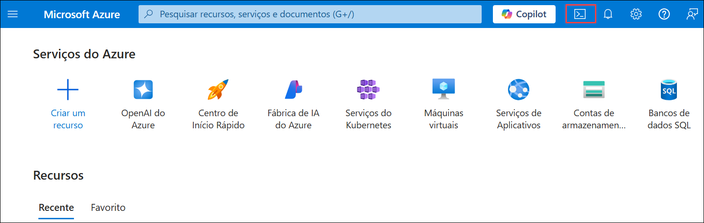

    > **Nota:** Se você não conseguir encontrar o Cloud Shell, clique nas **reticências (...) (1)** e selecione **Cloud Shell (2)** no menu.

      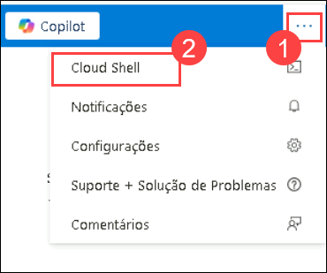
   
1. Na primeira vez que você abrir o Cloud Shell, você pode ser solicitado a escolher o tipo de shell que deseja usar (*Bash* ou *PowerShell*). Selecione **Bash**. Se você não vir esta opção, pule o passo.

   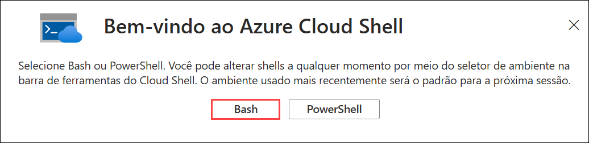

1. Dentro do painel Começando, selecione **Montar conta de armazenamento (1)**, selecione sua **Assinatura da conta de armazenamento (2)** no menu suspenso e clique em **Aplicar (3)**.

   

1. Dentro do painel **Montar conta de armazenamento**, selecione **Eu quero criar uma conta de armazenamento (1)** e clique em **Avançar (2)**.

   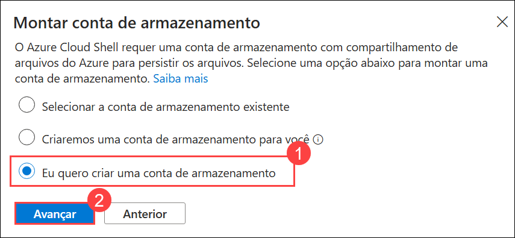

1. Dentro do painel **Configurações avançadas**, insira os seguintes detalhes:

    - Assinatura: Default- Escolha a única assinatura existente atribuída para este laboratório **(1)**
    - Grupo de recursos: Selecione Usar existente **openai-<inject key="DeploymentID" enableCopy="false"></inject> (2)**
    - Região: **<inject key="Region" enableCopy="false" /> (3)**
    - Nome da Conta de armazenamento: **storage<inject key="DeploymentID" enableCopy="false"></inject> (4)**
    - Comp. de arquivos: Crie um novo compartilhamento de arquivo chamado **none (5)**
    - Clique em **Criar (6)**

        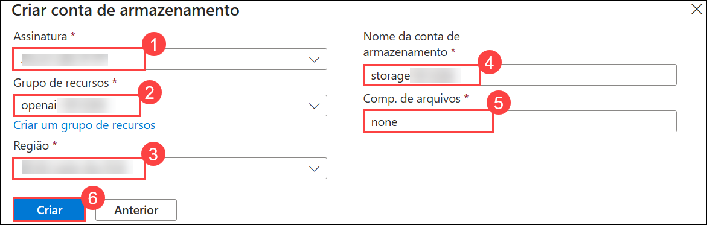

1. Note que você pode redimensionar o cloud shell arrastando a barra separadora na parte superior da página, ou usando os ícones **&#8212;**, **&#9723;**, e **X** no canto superior direito da página para minimizar, maximizar e fechar o painel. Para mais informações sobre como usar o Azure Cloud Shell, consulte a [documentação do Azure Cloud Shell](https://docs.microsoft.com/azure/cloud-shell/overview). 

1. Quando o terminal abrir, clique em **Configurações (1)** e selecione **Ir para a versão clássica (2)**.

   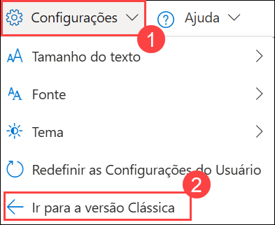

1. Uma vez que o terminal inicie, insira o seguinte comando para baixar a aplicação de demonstração e salvá-la em uma pasta chamada `mslearn-openai`.

    ```bash
   rm -r mslearn-openai -f
   git clone https://github.com/microsoftlearning/mslearn-openai mslearn-openai
    ```

     
  
1. Os arquivos são baixados para uma pasta chamada **mslearn-openai**. Navegue até os arquivos de laboratório deste exercício usando o comando a seguir.

    ```bash
   cd mslearn-openai/Labfiles/01-app-develop
    ```

    Aplicações para C# e Python foram fornecidos, bem como um arquivo de texto de amostra que você pode usar para testar a sumarização. Ambas as aplicações apresentam a mesma funcionalidade. 

1. Abra o editor de código interno e observe o arquivo de texto que você resumirá com seu modelo. Use o comando a seguir para abrir os arquivos de laboratório no editor de código.

    ```bash
    code .
    ```

    > **Nota:** Se você for solicitado a **Alternar para o Cloud Shell Clássico** após executar o comando **code .**, clique em **Confirmar** e execute os passos 9 e 10 novamente.

    .png)
   
#### Validação

> **Parabéns** por completar a tarefa! Agora, é hora de validá-la. Aqui estão os passos:
> - Clique no botão Validar para a tarefa correspondente. Se você receber uma mensagem de sucesso, pode prosseguir para a próxima tarefa. 
> - Caso contrário, leia atentamente a mensagem de erro e tente novamente o passo, seguindo as instruções no guia do laboratório.
> - Se precisar de alguma assistência, por favor, entre em contato conosco em cloudlabs-support@spektrasystems.com. Estamos disponíveis 24/7 para ajudá-lo.

   <validation step="bd2f25c6-d67e-4553-a8ed-32e9f0162e26" />

## Tarefa 3: Configurar a sua aplicação

Para este exercício, você completará algumas partes-chave do aplicativo para permitir o uso do seu recurso Azure OpenAI.

1. No editor de código, expanda a pasta **CSharp** ou **Python**, dependendo da sua preferência de linguagem.

1. Se você estiver usando a linguagem **C#**, abra o arquivo **CSharp.csproj**, substitua-o pelo código a seguir e **salve** o arquivo.

   ```
   <Project Sdk="Microsoft.NET.Sdk">
   
   <PropertyGroup>
   <OutputType>Exe</OutputType>
   <TargetFramework>net8.0</TargetFramework>
   <ImplicitUsings>enable</ImplicitUsings>
   <Nullable>enable</Nullable>
   </PropertyGroup>
   
    <ItemGroup>
    <PackageReference Include="Azure.AI.OpenAI" Version="1.0.0-beta.14" />
    <PackageReference Include="Microsoft.Extensions.Configuration" Version="8.0.*" />
    <PackageReference Include="Microsoft.Extensions.Configuration.Json" Version="8.0.*" />
    </ItemGroup>
   
    <ItemGroup>
      <None Update="appsettings.json">
        <CopyToOutputDirectory>PreserveNewest</CopyToOutputDirectory>
       </None>
     </ItemGroup>
   
    </Project> 
   ```

    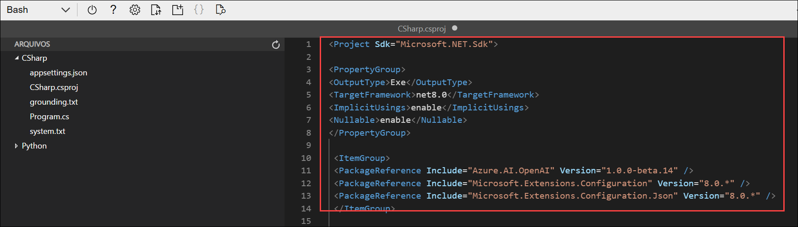

1. Abra o arquivo de configuração para sua linguagem

    - C#: `appsettings.json`
    
    - Python: `.env`
    
1. Atualize os valores de configuração para incluir o **Ponto de extremidade** e a **chave** do recurso Azure OpenAI que você criou, bem como o nome do modelo que você implantou, `my-gpt-model`. Em seguida, salve o arquivo clicando com o botão direito no arquivo no painel esquerdo e clicando em **Salvar**

    - **C#:**
     
      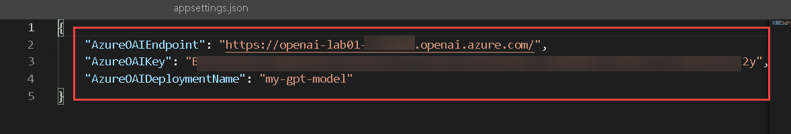   

    - **Python:**
     
      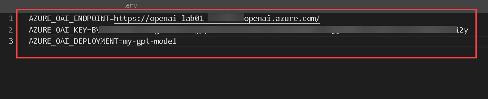

      > **Nota:** Você pode obter o ponto de extremidade do Azure OpenAI e os valores de chave na seção Chave e ponto de extremidade do recurso do Azure OpenAI em Gerenciamento de recursos.

1. Navegue de volta para o Cloudshell e instale os pacotes necessários para o idioma de sua preferência:

   **C#:**

    ```bash
    cd CSharp
    dotnet add package Azure.AI.OpenAI --version 2.1.0
    ```

    **Python:**

    ```bash
    cd Python
    python -m venv labenv
    ./labenv/bin/Activate.ps1
    pip install python-dotenv openai==1.65.2 --user
    ```

1. Navegue até a pasta de idioma de sua preferência e substitua o comentário **Adicionar pacote do OpenAI do Azure** pelo código para adicionar a biblioteca do SDK do OpenAI do Azure:

    **C#:** Program.cs

    ```csharp
    // Add Azure OpenAI packages
    using Azure.AI.OpenAI;
    using OpenAI.Chat;
    ```

     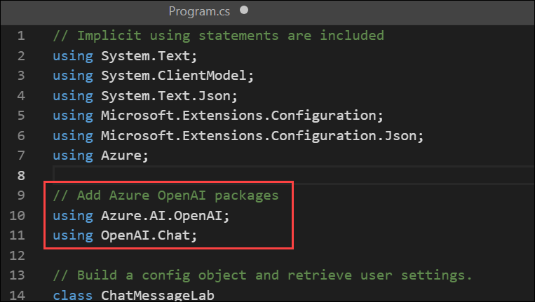   

    **Python:** application.py

    ```python
    # Add Azure OpenAI package
    from openai import AsyncAzureOpenAI
    ```

      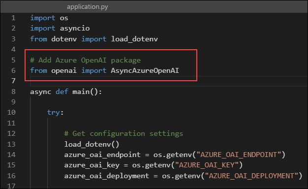   

1. No código do aplicativo para sua linguagem, localize o comentário **Configurar o cliente OpenAI do Azure** e adicione código para configurar o cliente OpenAI do Azure:

    **C#:** Program.cs

    ```csharp
    // Configure the Azure OpenAI client
    AzureOpenAIClient azureClient = new (new Uri(oaiEndpoint), new ApiKeyCredential(oaiKey));
    ChatClient chatClient = azureClient.GetChatClient(oaiDeploymentName);
    ```

     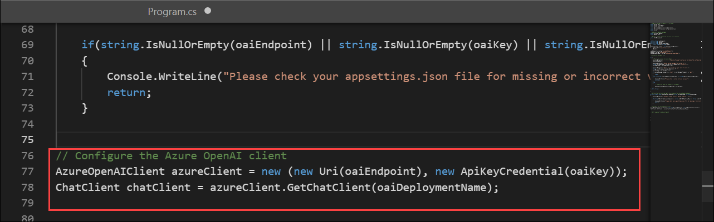   

    **Python:** application.py

    ```python
    # Configure the Azure OpenAI client
    client = AsyncAzureOpenAI(
       azure_endpoint = azure_oai_endpoint, 
       api_key=azure_oai_key,  
       api_version="2024-02-15-preview"
      )
    ```

         

      >**Nota:** Certifique-se de recuar o código eliminando quaisquer espaços em branco extras depois de colá-lo no editor de código.

1. Na função que chama o **modelo OpenAI do Azure**, no comentário **Obter resposta do OpenAI do Azure**, adicione o código para formatar e enviar a solicitação para o modelo.

    **C#**: Program.cs
    ```csharp
      // Get response from Azure OpenAI
      ChatCompletionOptions chatCompletionOptions = new ChatCompletionOptions()
      {
         Temperature = 0.7f,
         MaxOutputTokenCount = 800
      };
      
      ChatCompletion completion = chatClient.CompleteChat(
         [
             new SystemChatMessage(systemMessage),
             new UserChatMessage(userMessage)
         ],
         chatCompletionOptions
      );
      
      Console.WriteLine($"{completion.Role}: {completion.Content[0].Text}");
    ```

     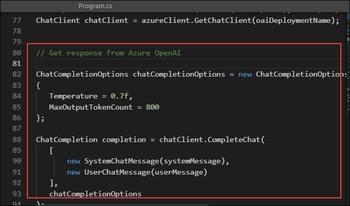      

    **Python**: application.py

    ```python
    # Get response from Azure OpenAI
      messages =[
         {"role": "system", "content": system_message},
         {"role": "user", "content": user_message},
      ]
      
      print("\nSending request to Azure OpenAI model...\n")
      
      # Call the Azure OpenAI model
      response = await client.chat.completions.create(
         model=model,
         messages=messages,
         temperature=0.7,
         max_tokens=800
      )
    ```

      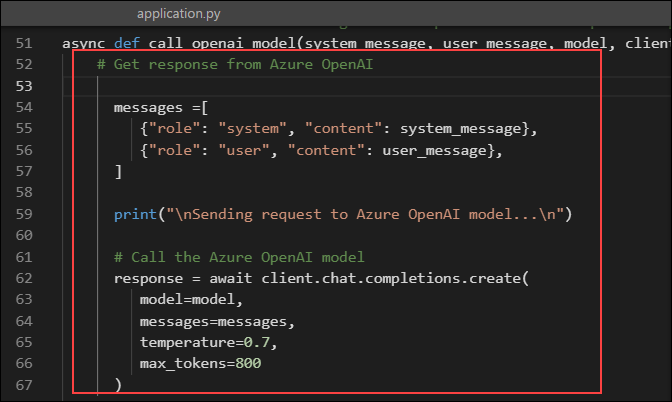      

1. Antes de salvar o arquivo, certifique-se de que seu código seja semelhante ao código fornecido abaixo.

    **C#:** Program.cs
      
      ```CSharp
      // Implicit using statements are included
      using System.Text;
      using System.ClientModel;
      using System.Text.Json;
      using Microsoft.Extensions.Configuration;
      using Microsoft.Extensions.Configuration.Json;
      using Azure;
      
      // Add Azure OpenAI packages
          using Azure.AI.OpenAI;
          using OpenAI.Chat;
      
      // Build a config object and retrieve user settings.
      class ChatMessageLab
      {
      
      static string? oaiEndpoint;
      static string? oaiKey;
      static string? oaiDeploymentName;
          static void Main(string[] args)
      {
      IConfiguration config = new ConfigurationBuilder()
          .AddJsonFile("appsettings.json")
          .Build();
      
      oaiEndpoint = config["AzureOAIEndpoint"];
      oaiKey = config["AzureOAIKey"];
      oaiDeploymentName = config["AzureOAIDeploymentName"];
      
      //Initialize messages list
      
      do {
          // Pause for system message update
          Console.WriteLine("-----------\nPausing the app to allow you to change the system prompt.\nPress any key to continue...");
          Console.ReadKey();
          
          Console.WriteLine("\nUsing system message from system.txt");
          string systemMessage = System.IO.File.ReadAllText("system.txt"); 
          systemMessage = systemMessage.Trim();
      
          Console.WriteLine("\nEnter user message or type 'quit' to exit:");
          string userMessage = Console.ReadLine() ?? "";
          userMessage = userMessage.Trim();
          
          if (systemMessage.ToLower() == "quit" || userMessage.ToLower() == "quit")
          {
              break;
          }
          else if (string.IsNullOrEmpty(systemMessage) || string.IsNullOrEmpty(userMessage))
          {
              Console.WriteLine("Please enter a system and user message.");
              continue;
          }
          else
          {
              // Format and send the request to the model
      
              GetResponseFromOpenAI(systemMessage, userMessage);
          }
      } while (true);
      
      }
      
      // Define the function that gets the response from Azure OpenAI endpoint
      private static void GetResponseFromOpenAI(string systemMessage, string userMessage)  
      {   
          Console.WriteLine("\nSending prompt to Azure OpenAI endpoint...\n\n");
      
          if(string.IsNullOrEmpty(oaiEndpoint) || string.IsNullOrEmpty(oaiKey) || string.IsNullOrEmpty(oaiDeploymentName) )
          {
              Console.WriteLine("Please check your appsettings.json file for missing or incorrect values.");
              return;
          }
      
      // Configure the Azure OpenAI client
      AzureOpenAIClient azureClient = new (new Uri(oaiEndpoint), new ApiKeyCredential(oaiKey));
      ChatClient chatClient = azureClient.GetChatClient(oaiDeploymentName);
      
      
      // Get response from Azure OpenAI
      
      ChatCompletionOptions chatCompletionOptions = new ChatCompletionOptions()
      {
         Temperature = 0.7f,
         MaxOutputTokenCount = 800
      };
      
      ChatCompletion completion = chatClient.CompleteChat(
         [
             new SystemChatMessage(systemMessage),
             new UserChatMessage(userMessage)
         ],
         chatCompletionOptions
      );
      
      Console.WriteLine($"{completion.Role}: {completion.Content[0].Text}");
      
      
      
      }
      
      }
      ```
    
   **Python:** application.py

      ```Python
      import os
      import asyncio
      from dotenv import load_dotenv
      
      # Add Azure OpenAI package
      from openai import AsyncAzureOpenAI
      
      async def main(): 
          try: 
              # Get configuration settings 
              load_dotenv()
              azure_oai_endpoint = os.getenv("AZURE_OAI_ENDPOINT")
              azure_oai_key = os.getenv("AZURE_OAI_KEY")
              azure_oai_deployment = os.getenv("AZURE_OAI_DEPLOYMENT")
              
              # Configure the Azure OpenAI client
              client = AsyncAzureOpenAI(
                  azure_endpoint=azure_oai_endpoint, 
                  api_key=azure_oai_key,  
                  api_version="2024-02-15-preview"
              )
      
              while True:
                  # Pause the app to allow the user to enter the system prompt
                  print("------------------\nPausing the app to allow you to change the system prompt.\nPress enter to continue...")
                  input()
      
                  # Read in system message and prompt for user message
                  system_text = open(file="system.txt", encoding="utf8").read().strip()
                  user_text = input("Enter user message, or 'quit' to exit: ")
                  if user_text.lower() == 'quit' or system_text.lower() == 'quit':
                      print('Exiting program...')
                      break
      
                  # Format and send the request to the model
                  await call_openai_model(
                      system_message=system_text, 
                      user_message=user_text, 
                      model=azure_oai_deployment, 
                      client=client
                  )
      
          except Exception as ex:
              print(ex)
      
      # Define the function that will get the response from Azure OpenAI endpoint
      async def call_openai_model(system_message, user_message, model, client):
          # Get response from Azure OpenAI
          messages = [
              {"role": "system", "content": system_message},
              {"role": "user", "content": user_message},
          ]
          
          print("\nSending request to Azure OpenAI model...\n")
          
          # Call the Azure OpenAI model
          response = await client.chat.completions.create(
              model=model,
              messages=messages,
              temperature=0.7,
              max_tokens=800
          )
      
          print("Response:\n" + response.choices[0].message.content + "\n")
      
      if __name__ == '__main__': 
          asyncio.run(main())
      ```

1. Para salvar as alterações feitas no arquivo, clique com o botão direito no arquivo no painel esquerdo na janela de código e clique em **Salvar**.

   >**Nota:** Certifique-se de indentar o código eliminando quaisquer espaços em branco extras após colá-lo no editor de código.

## Tarefa 4: Executar a sua aplicação

Agora que seu aplicativo foi configurado, basta executá-lo para enviar sua solicitação ao seu modelo e observar a resposta. Você notará que a única diferença entre as diferentes opções é o conteúdo do prompt; Todos os outros parâmetros (como contagem de tokens e temperatura) permanecem os mesmos para cada solicitação.

1. Na pasta do idioma de sua preferência, abra o arquivo **system.txt**. Para cada uma das interações, você inserirá a **mensagem do sistema** neste arquivo e a salvará. Cada iteração será pausada primeiro para que você altere a mensagem do sistema.

1. No painel de terminais interativos, verifique se o contexto da pasta é a pasta do seu idioma preferido. Em seguida, insira o seguinte comando para executar o aplicativo.

    - **C#:** `dotnet run`
    
    - **Python:** `python application.py`

      > **Dica**: Você pode usar o ícone **Maximizar tamanho do painel** (**^**) na barra de ferramentas do terminal para ver mais texto no console.

1. No terminal, ele solicitará que você insira uma chave para continuar.

   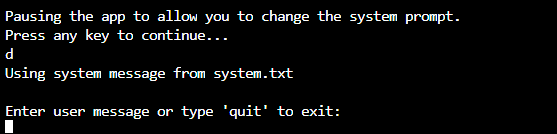

1. Para a primeira iteração, insira os seguintes prompts:   

   **System message:**
   
   ```
   You are an AI assistant
   ```
   > **Nota:** A mensagem do sistema deve ser fornecida em system.txt em C# ou Python. Siga as mesmas etapas para os prompts restantes.
1. Na mensagem Inserir usuário, dê a seguinte mensagem.

   **User message:**
   
   ```
   Write an intro for a new wildlife Rescue 
   ```

   >>**Nota:** A mensagem do usuário deve ser fornecida no terminal em C# ou Python. Siga as mesmas etapas para os prompts restantes.

1. Observe a saída. O modelo de IA provavelmente produzirá uma boa introdução genérica a um resgate de vida selvagem.

1. Em seguida, insira os seguintes prompts, que especificam um formato para a resposta:

   **System message:**
   
   ```
   You are an AI assistant helping to write emails
   ```

   **User message:**
   
   ```
   Write a promotional email for a new wildlife rescue, including the following:-Rescue name is Contoso - It specializes in elephants - Call for donations to be given at our website
   ```

1. Observe a saída. Desta vez, você provavelmente verá o formato de um e-mail com os animais específicos incluídos, bem como o pedido de doações.

1. Em seguida, insira os seguintes prompts que especificam adicionalmente o conteúdo:

   **System message:**
   
   ```
   You are an AI assistant helping to write emails
   ```

   **User message:**

   ```
   Write a promotional email for a new wildlife rescue, including the following: - Rescue name is Contoso - It specializes in elephants, as well as zebras and giraffes - Call for donations to be given at our website - Include a list of the current animals we have at our rescue after the signature, in the form of a table. These animals include elephants, zebras, gorillas, lizards, and jackrabbits.
   ```

1. Observe a saída e veja como o e-mail mudou com base em suas instruções claras.

1. Em seguida, insira os seguintes prompts onde adicionamos detalhes sobre o tom à mensagem do sistema:

   **System message:**
   
   ```
   You are an AI assistant that helps write promotional emails to generate interest in a new business. Your tone is light, chit-chat oriented, and you always include at least two jokes.
   ```

   **User message:**

   ```
   Write a promotional email for a new wildlife rescue, including the following: - Rescue name is Contoso - It specializes in elephants, as well as zebras and giraffes - Call for donations to be given at our website - Include a list of the current animals we have at our rescue after the signature, in the form of a table. These animals include elephants, zebras, gorillas, lizards, and jackrabbits..
   ```

1. Observe a saída. Desta vez, você provavelmente verá o e-mail em um formato semelhante, mas com um tom muito mais informal. Você provavelmente verá até piadas incluídas!

## Revisão

Neste laboratório, você realizou o seguinte:
- Provisionou um recurso Azure OpenAI
- Implementou um modelo OpenAI dentro do estúdio Azure OpenAI
- Integrou modelos Azure OpenAI em suas aplicações

### Você concluiu com sucesso o Laboratório Prático.
