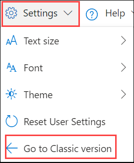
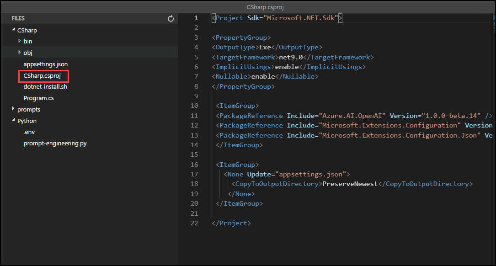
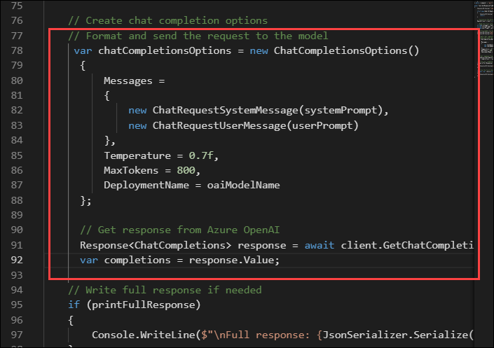
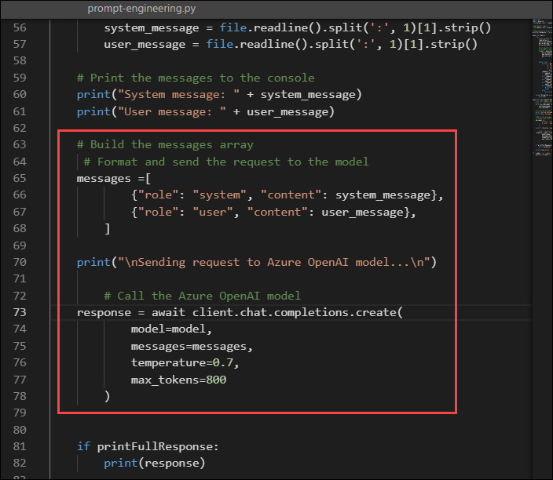
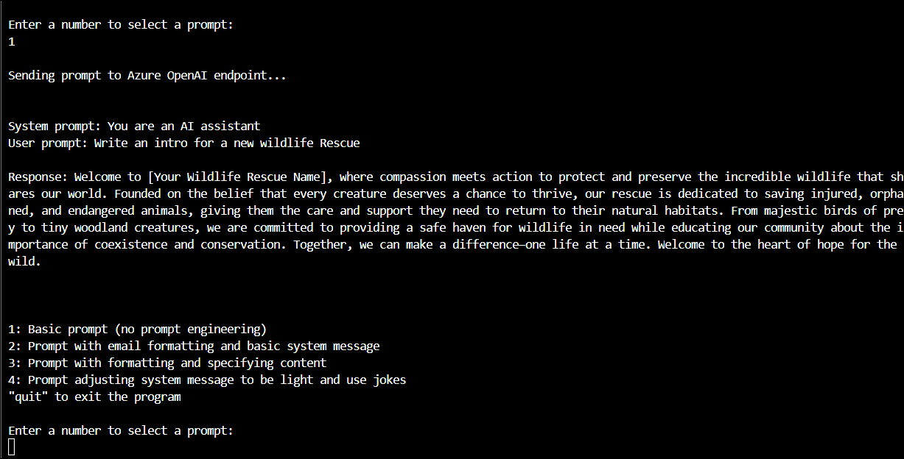
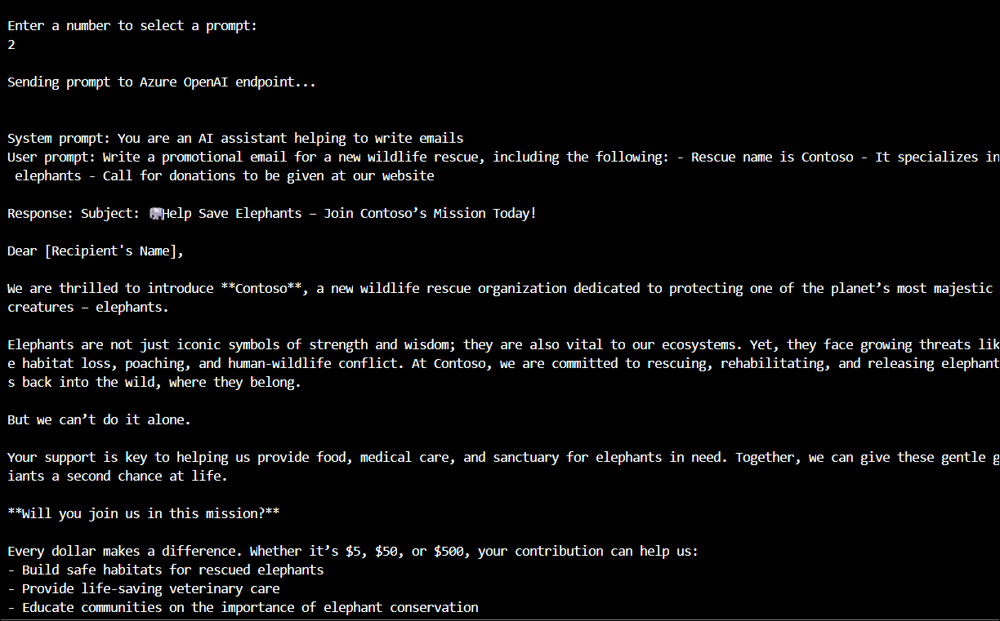
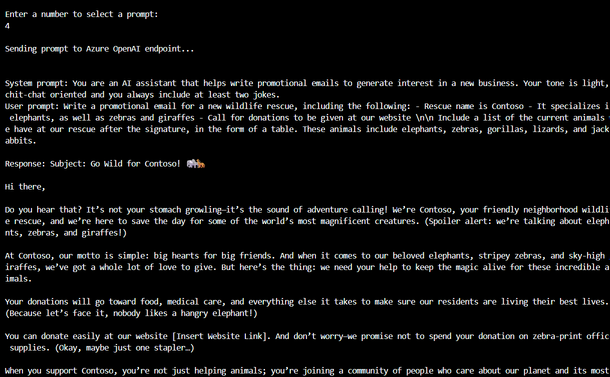

# Lab 03: Utilize prompt engineering in your App

## Estimated Duration: 60 Minutes

## Lab Overview

In this lab, you will perform the role of a software developer working on a wildlife marketing campaign. You are exploring how to use generative AI to improve advertising emails and categorize articles that might apply to your team. The prompt engineering techniques used in the lab can be applied similarly for a variety of use cases.

When working with the Azure OpenAI Service, how developers shape their prompts greatly impacts how the generative AI model will respond. Azure OpenAI models are able to tailor and format content, if requested, in a clear and concise way. In this lab, you'll learn how different prompts for similar content help shape the AI model's response to better satisfy your requirements.

## Lab Objectives
In this lab, you will complete the following tasks:

- Task 1: Apply prompt engineering in the chat playground
- Task 2: Set up an application in Cloud Shell
- Task 3: Configure your application
- Task 4: Run your application

## Task 1: Apply prompt engineering in chat playground

In this task, you'll explore how prompt engineering influences model behavior by experimenting with different instructions and examples in the Chat playground. You'll learn to guide the model's responses—ranging from article categorization to code generation—by modifying system prompts and adding few-shot examples.

1. In [Azure AI Foundry portal](https://oai.azure.com/?azure-portal=true), navigate to the **Chat (1)** section under **Playgrounds** in the left pane and verify that the **my-gpt-model (2)** model is selected in the Deployment.

   

1. Update the  **Give the model instructions and context** with the text mentioned below, and click on **Apply changes**. 

   ```
   You are an AI assistant that helps people find information.
   ```

1. In the **Chat session**, submit the following query:

    ```prompt
    What kind of article is this?
    ---
    Severe drought likely in California
    
    Millions of California residents are bracing for less water and dry lawns as drought threatens to leave a large swath of the region with a growing water shortage.
    
    In a remarkable indication of drought severity, officials in Southern California have declared a first-of-its-kind action limiting outdoor water use to one day a week for nearly 8 million residents.
    
    Much remains to be determined about how daily life will change as people adjust to a drier normal. But officials are warning that the situation is dire and could lead to even more severe limits later in the year.
    ```

    The response describes the article. However, suppose you want a more specific format for article categorization.

1. In the **Setup** section, change the **Give the model instructions and context** to the below text and click on **Apply changes**. 

   ```
   You are a news aggregator that categorizes news articles.
   ```

1. Under the new system message, select the **Add section** button, and choose **Examples**. Then add the following example.

    **User:**
    
    ```prompt
    What kind of article is this?
    ---
    New York Baseballers Win Big Against Chicago
    
    New York Baseballers mounted a big 5-0 shutout against the Chicago Cyclones last night, solidifying their win with a 3-run homerun late in the bottom of the 7th inning.
    
    Pitcher Mario Rogers threw 96 pitches with only two hits for New York, marking his best performance this year.
    
    The Chicago Cyclones' two hits came in the 2nd and the 5th innings, but they were unable to get the runner home to score.
    ```
    
    **Assistant:**
    
    ```prompt
    Sports
      ```

1. Add another example with the following text.

    **User:**
    
    ```prompt
    Categorize this article:
    ---
    Joyous moments at the Oscars
    
    The Oscars this past week were quite something!
    
    Though a certain scandal might have stolen the show, this year's Academy Awards were full of moments that filled us with joy and even moved us to tears.
    These actors and actresses delivered some truly emotional performances, along with some great laughs, to get us through the winter.
    
    From Robin Kline's history-making win to a full performance by none other than Casey Jensen herself, don't miss tomorrow's rerun of all the festivities.
    ```
    
    **Assistant:**
    
    ```prompt
    Entertainment
    ```

   

1. Click on the **Apply changes** button to save your changes.

1. In the **Chat session** section, resubmit the following prompt:

    ```prompt
    What kind of article is this?
    ---
    Severe drought likely in California
    
    Millions of California residents are bracing for less water and dry lawns as drought threatens to leave a large swath of the region with a growing water shortage.
    
    In a remarkable indication of drought severity, officials in Southern California have declared a first-of-its-kind action limiting outdoor water use to one day a week for nearly 8 million residents.
    
    Much remains to be determined about how daily life will change as people adjust to a drier normal. But officials are warning that the situation is dire and could lead to even more severe limits later in the year.
    ```

    The combination of a more specific system message and some examples of expected queries and responses results in a consistent format for the results.

1. Set the **Give the model instructions and context** to the text mentioned below. Save the changes by clicking on **Apply changes**.
   ```
   You are an AI assistant that helps people find information.
   ```

1. In the **Chat session** section, submit the following prompt:

    ```prompt
    # 1. Create a list of animals
    # 2. Create a list of whimsical names for those animals
    # 3. Combine them randomly into a list of 25 animal and name pairs
    ```

    The model will likely respond with an answer to satisfy the prompt, split into a numbered list. This is an appropriate response, but suppose what you wanted was for the model to write a Python program that performs the tasks you described?

1. Change the **Give the model instructions and context** to the text mentioned below, and apply the changes.

   ```
   You are a coding assistant helping write Python code.
   ```

1. Resubmit the following prompt to the model:

    ```
    # 1. Create a list of animals
    # 2. Create a list of whimsical names for those animals
    # 3. Combine them randomly into a list of 25 animal and name pairs
    ```

    The model should correctly respond with Python code, doing what the comments requested.

## Task 2: Set up an application in Cloud Shell

In this task, you will integrate with an Azure OpenAI model by using a short command-line application running in Cloud Shell on Azure. Open a new browser tab to work with Cloud Shell.

1. In the [Azure portal](https://portal.azure.com?azure-portal=true), select the **[>_] (Cloud Shell)** button at the top of the page to the right of the search box. A Cloud Shell pane will open at the bottom of the portal.

    

   > **Note:** If you open the Cloud Shell for the first time, you will be prompted to choose the type of shell. Please choose **Bash**.

   >  

1. Once the terminal opens, click on **Settings** and select **Go to Classic version**.

   

1. Once the terminal starts, enter the following command to download the sample application and save it to a folder called `mslearn-openai`.

    ```bash
   rm -r mslearn-openai -f
   git clone https://github.com/CloudLabs-MOC/mslearn-openai
    ```

1. The files are downloaded to a folder named **mslearn-openai**. Navigate to the lab files for this task using the following command.

    ```bash
    cd mslearn-openai/Labfiles/03-prompt-engineering
    ```

    Applications for both C# and Python have been provided, as well as a text files that provide the prompts. Both apps feature the same functionality.

1. Open the built-in code editor, and you can observe the prompt files that you'll be using in `prompts`. Use the following command to open the lab files in the code editor.

   ```bash
   code .
    ```

## Task 3: Configure your application

In this task, you will complete key parts of the provided C# or Python application to enable it to use your Azure OpenAI resource with asynchronous API calls, as both apps feature the same functionality.

1. In the code editor, expand the **CSharp** or **Python** folder, depending on your language preference. Each folder contains the language-specific files for an app into which you're going to integrate Azure OpenAI functionality.

1. Open the configuration file for your language.

    - C#: `appsettings.json`
    - Python: `.env`
    
1. Update the configuration values to include the **endpoint** and **key** from the Azure OpenAI resource you created, as well as the model's name that you deployed, `my-gpt-model`. Then save the file by right-clicking on the file from the left pane and hit **Save**

1. If you're using **C#**, navigate to `CSharp.csproj`, delete the existing code, then replace it with the following code, and then press **Ctrl+S** to save the file.

    ```
    <Project Sdk="Microsoft.NET.Sdk">

    <PropertyGroup>
    <OutputType>Exe</OutputType>
    <TargetFramework>net8.0</TargetFramework>
    <ImplicitUsings>enable</ImplicitUsings>
    <Nullable>enable</Nullable>
    </PropertyGroup>

     <ItemGroup>
     <PackageReference Include="Azure.AI.OpenAI" Version="1.0.0-beta.14" />
     <PackageReference Include="Microsoft.Extensions.Configuration" Version="8.0.404" />
     <PackageReference Include="Microsoft.Extensions.Configuration.Json" Version="8.0.404" />
     </ItemGroup>

     <ItemGroup>
       <None Update="appsettings.json">
         <CopyToOutputDirectory>PreserveNewest</CopyToOutputDirectory>
        </None>
     </ItemGroup>

    </Project>
    ```    

         

1. Navigate to the folder for your preferred language and install the necessary packages.

   For **C#:**

    ```
    cd CSharp
    export DOTNET_ROOT=$HOME/.dotnet
    export PATH=$DOTNET_ROOT:$PATH
    mkdir -p $DOTNET_ROOT
    ```     

     >**Note:** Azure Cloud Shell often does not have admin privileges, so you need to install .NET in your home directory. So here you are creating a separate `.dotnet` directory under your home directory to isolate your configuration.
     - `DOTNET_ROOT` specifies where your .NET runtime and SDK are located (in your `$HOME/.dotnet directory`).
     - `PATH=$DOTNET_ROOT:$PATH` ensures that the locally installed .NET SDK can be accessed globally by your terminal.
     - `mkdir -p $DOTNET_ROOT` This creates the directory where the .NET runtime and SDK will be installed.

1. Run the following command to install the required SDK version locally:     

     ```
     wget https://dotnet.microsoft.com/download/dotnet/scripts/v1/dotnet-install.sh
     chmod +x dotnet-install.sh
     ./dotnet-install.sh --version 8.0.404 --install-dir $DOTNET_ROOT
     ```

      >**Note:** These commands download and prepare the official `.NET` installation script, grant it execute permissions, and install the required .NET SDK version (8.0.404) in the `$DOTNET_ROOT` directory, as we don't have the admin privileges to install it globally.

1. Enter the following command to restore the workload.

    ```
    dotnet workload restore
    ```

     >**Note:** Restores any required workloads for your project, such as additional tools or libraries that are part of the .NET SDK.
    
1. Enter the following command to add the `Azure.AI.OpenAI` NuGet package to your project, which is necessary for integrating with Azure OpenAI services.

    ```
    dotnet add package Azure.AI.OpenAI --version 1.0.0-beta.14
    ```

1. If you prefer Python, please perform below steps to install the packages
   
    **Python**
   
    ```bash
    cd Python
    pip install --user python-dotenv
    pip install --user openai==1.56.2
    ```

1. Navigate to your preferred language folder, select the code file, and add the necessary libraries in the **Add Azure OpenAI package** section.

    **C#:** Program.cs

    ```csharp
   // Add Azure OpenAI package
   using Azure.AI.OpenAI;
    ```

      

    **Python:** prompt-engineering.py

    ```python
    # Add Azure OpenAI import
    from openai import AsyncAzureOpenAI
    ```

      

1. Open the application code for your language and add the necessary code for configuring the client.

    **C#:** Program.cs - Add the code in **Initialize the Azure OpenAI client** section

    ```csharp
   // Initialize the Azure OpenAI client
   OpenAIClient client = new OpenAIClient(new Uri(oaiEndpoint), new AzureKeyCredential(oaiKey));
    ```

      

    **Python:** prompt-engineering.py - Add the code in **Set OpenAI configuration settings** section

   ```python
    # Configure the Azure OpenAI client
    client = AsyncAzureOpenAI(
        azure_endpoint = azure_oai_endpoint, 
        api_key=azure_oai_key,  
        api_version="2024-02-15-preview"
        )
    ```

      

    >**Note:** Make sure to indent the code by eliminating any extra white spaces after pasting it into the code editor.

1. In the function that calls the Azure OpenAI model, add the code to format and send the request to the model.

    **C#:** Program.cs - Add the code in **Create chat completion options** section

    ```csharp
    // Format and send the request to the model
         var chatCompletionsOptions = new ChatCompletionsOptions()
          {
              Messages =
              {
                  new ChatRequestSystemMessage(systemPrompt),
                  new ChatRequestUserMessage(userPrompt)
              },
              Temperature = 0.7f,
              MaxTokens = 800,
              DeploymentName = oaiModelName
          };
           
          // Get response from Azure OpenAI
          Response<ChatCompletions> response = await client.GetChatCompletionsAsync(chatCompletionsOptions);
          var completions = response.Value;
    ```

      

    **Python:** prompt-engineering.py - Add the code in **Build the messages array** section

   ```python
    # Format and send the request to the model
    messages =[
        {"role": "system", "content": system_message},
        {"role": "user", "content": user_message},
    ]
    
    print("\nSending request to Azure OpenAI model...\n")

    # Call the Azure OpenAI model
    response = await client.chat.completions.create(
        model=model,
        messages=messages,
        temperature=0.7,
        max_tokens=800
    )
    ```

      

    >**Note:** Make sure to indent the code by eliminating any extra white spaces after pasting it into the code editor.

1. The modified code should look as shown below:

    **C#**
      
      ```csharp
        // Implicit using statements are included
         using System.Text;
         using System.Text.Json;
         using Microsoft.Extensions.Configuration;
         using Microsoft.Extensions.Configuration.Json;
         using Azure;
         
         // Add Azure OpenAI package
         using Azure.AI.OpenAI;
         
         // Build a config object and retrieve user settings.
         IConfiguration config = new ConfigurationBuilder()
             .AddJsonFile("appsettings.json")
             .Build();
         string? oaiEndpoint = config["AzureOAIEndpoint"];
         string? oaiKey = config["AzureOAIKey"];
         string? oaiModelName = config["AzureOAIModelName"];
         
         string command;
         bool printFullResponse = false;
         
         do {
             Console.WriteLine("\n1: Basic prompt (no prompt engineering)\n" +
             "2: Prompt with email formatting and basic system message\n" +
             "3: Prompt with formatting and specifying content\n" +
             "4: Prompt adjusting system message to be light and use jokes\n" +
             "\"quit\" to exit the program\n\n" + 
             "Enter a number to select a prompt:");
         
             command = Console.ReadLine() ?? "";
             
             switch (command) {
                 case "1":
                     await GetResponseFromOpenAI("../prompts/basic.txt");
                     break;
                 case "2":
                     await GetResponseFromOpenAI("../prompts/email-format.txt");
                     break;
                 case "3":
                     await GetResponseFromOpenAI("../prompts/specify-content.txt");
                     break;
                 case "4":
                     await GetResponseFromOpenAI("../prompts/specify-tone.txt");
                     break;
                 case "quit":
                     Console.WriteLine("Exiting program...");
                     break;
                 default:
                     Console.WriteLine("Invalid input. Please try again.");
                     break;
             }
         } while (command != "quit");
         
         async Task GetResponseFromOpenAI(string fileText)  
         {   
             Console.WriteLine("\nSending prompt to Azure OpenAI endpoint...\n\n");
         
             if(string.IsNullOrEmpty(oaiEndpoint) || string.IsNullOrEmpty(oaiKey) || string.IsNullOrEmpty(oaiModelName) )
             {
                 Console.WriteLine("Please check your appsettings.json file for missing or incorrect values.");
                 return;
             }
             
             // Initialize the Azure OpenAI client
             OpenAIClient client = new OpenAIClient(new Uri(oaiEndpoint), new AzureKeyCredential(oaiKey));
         
             // Read text file into system and user prompts
             string[] prompts = System.IO.File.ReadAllLines(fileText);
             string systemPrompt = prompts[0].Split(":", 2)[1].Trim();
             string userPrompt = prompts[1].Split(":", 2)[1].Trim();
         
             // Write prompts to console
             Console.WriteLine("System prompt: " + systemPrompt);
             Console.WriteLine("User prompt: " + userPrompt);
             
             // Create chat completion options
             // Format and send the request to the model
              var chatCompletionsOptions = new ChatCompletionsOptions()
               {
                   Messages =
                   {
                       new ChatRequestSystemMessage(systemPrompt),
                       new ChatRequestUserMessage(userPrompt)
                   },
                   Temperature = 0.7f,
                   MaxTokens = 800,
                   DeploymentName = oaiModelName
               };
                
               // Get response from Azure OpenAI
               Response<ChatCompletions> response = await client.GetChatCompletionsAsync(chatCompletionsOptions);
               var completions = response.Value;
             
             // Write full response if needed
             if (printFullResponse)
             {
                 Console.WriteLine($"\nFull response: {JsonSerializer.Serialize(completions, new JsonSerializerOptions { WriteIndented = true })}\n\n");
             }
         
             // Write the first choice's message
             foreach (var choice in completions.Choices)
             {
                 Console.WriteLine($"\nResponse: {choice.Message.Content}\n\n");
             }
         }       
      ```
   
     **Python**
   
      ```python
      import os
      import asyncio
      from dotenv import load_dotenv
      
      # Add OpenAI import
      # Add Azure OpenAI package
      from openai import AsyncAzureOpenAI
      
      # Set to True to print the full response from OpenAI for each call
      printFullResponse = False
      
      async def main(): 
          try: 
              # Get configuration settings 
              load_dotenv()
              azure_oai_endpoint = os.getenv("AZURE_OAI_ENDPOINT")
              azure_oai_key = os.getenv("AZURE_OAI_KEY")
              azure_oai_model = os.getenv("AZURE_OAI_MODEL")
              
              # Set OpenAI configuration settings
              # Configure the Azure OpenAI client
              client = AsyncAzureOpenAI(
                  azure_endpoint = azure_oai_endpoint, 
                  api_key=azure_oai_key,  
                  api_version="2024-02-15-preview"
                  )
             
      
              while True:
                  print('1: Basic prompt (no prompt engineering)\n' +
                        '2: Prompt with email formatting and basic system message\n' +
                        '3: Prompt with formatting and specifying content\n' +
                        '4: Prompt adjusting system message to be light and use jokes\n' +
                        '\'quit\' to exit the program\n')
                  command = input('Enter a number:')
                  if command == '1':
                      await call_openai_model(messages="../prompts/basic.txt", model=azure_oai_model, client=client)
                  elif command =='2':
                      await call_openai_model(messages="../prompts/email-format.txt", model=azure_oai_model, client=client)
                  elif command =='3':
                      await call_openai_model(messages="../prompts/specify-content.txt", model=azure_oai_model, client=client)
                  elif command =='4':
                      await call_openai_model(messages="../prompts/specify-tone.txt", model=azure_oai_model, client=client)
                  elif command.lower() == 'quit':
                      print('Exiting program...')
                      break
                  else :
                      print("Invalid input. Please try again.")
      
          except Exception as ex:
              print(ex)
      
      async def call_openai_model(messages, model, client):
          # In this sample, each file contains both the system and user messages
          # First, read them into variables, strip whitespace, then build the messages array
          with open(messages, encoding="utf8") as file:
              system_message = file.readline().split(':', 1)[1].strip()
              user_message = file.readline().split(':', 1)[1].strip()
      
          # Print the messages to the console
          print("System message: " + system_message)
          print("User message: " + user_message)
      
          # Build the messages array
          # Format and send the request to the model
          messages =[
                  {"role": "system", "content": system_message},
                  {"role": "user", "content": user_message},
          ]
       
          print("\nSending request to Azure OpenAI model...\n")
      
       # Call the Azure OpenAI model
          response = await client.chat.completions.create(
             model=model,
             messages=messages,
             temperature=0.7,
             max_tokens=800
          )
          
      
          if printFullResponse:
              print(response)
      
          print("Completion: \n\n" + response.choices[0].message.content + "\n")
      
      if __name__ == '__main__': 
          asyncio.run(main())

      ```

    >**Note:** Make sure to indent the code by eliminating any extra white spaces after pasting it into the code editor.

1. To save the changes made to the file, right-click on the file from the left pane and hit **Save**.

## Task 4: Run your application

In this task, you will run your configured app to send a request to your model and observe the response. You'll notice that the only difference between the options is the content of the prompt, while all other parameters (such as token count and temperature) remain consistent across requests.

1. In the **Cloud Shell** bash terminal, navigate to the folder for your preferred language.

1. In the interactive terminal pane, ensure the folder context is the folder for your preferred language. Then, enter the following command to run the application.

    - **C#:** `dotnet run`

      > **Note:** If you receive any warning messages, you can ignore them and continue.
      
    - **Python:** `python prompt-engineering.py`

       >**Note:** If you encounter any errors after running the Python script, try upgrading the OpenAI package by running the following command: `pip install --user --upgrade openai`

       >**Note:** If you get any **ImportError: cannot import name 'ChatCompletionReasoningEffort' from 'openai.types.chat'**, then try executing the below commands once and then try to run the Python application.
       
       >```
       >pip uninstall -y openai
       >rm -rf /home/odl_user/.local/lib/python3.12/site-packages/openai
       >rm -rf /home/odl_user/.local/lib/python3.12/site-packages/openai-*
       >pip install --user --no-cache-dir openai==1.56.2
       >```

1. For the first iteration, Type **1** which selects the **Basic prompt (no prompt engineering)**, and press enter for **Enter a number to select a prompt**.

1. The AI tool will take the,

   -  **System prompt:** `You are an AI assistant`
   -  **User prompt:** `Write an intro for a new wildlife Rescue`

        

1. Observe the output. The model will likely produce a good generic introduction to a wildlife rescue.

1. Next, enter **2** to select **Prompt with email formatting and basic system message** and press enter for **Enter a number to select a prompt**.

1. This time it will take the,

   - **System prompt:** `You are an AI assistant helping to write emails`
   - **User prompt:** `Write a promotional email for a new wildlife rescue, including the following: - Rescue name is Contoso - It specializes in elephants - Call for donations to be given at our website`

        

1. Observe the output. This time, you'll likely see the format of an email with the specific animals included, as well as the call for donations.

1. Next, enter **3** to select **Prompt with formatting and specifying content** and press enter for **Enter a number to select a prompt**.

1. Observe, it will take the,

   - **System prompt:** `You are an AI assistant helping to write emails`
   - **User prompt:** `Write a promotional email for a new wildlife rescue, including the following: - Rescue name is Contoso - It specializes in elephants, as well as zebras and giraffes - Call for donations to be given at our website \n\n Include a list of the current animals we have at our rescue after the signature, in the form of a table. These animals include elephants, zebras, gorillas, lizards, and jackrabbits.`

        

1. Observe the output and see how the email has changed based on your clear instructions.

1. Next, enter **4** to select **Prompt adjusting system message to be light and use jokes** and press enter for **Enter a number to select a prompt**.

1. It will take the,

   - **System prompt:** `You are an AI assistant that helps write promotional emails to generate interest in a new business. Your tone is light, chit-chat oriented, and you always include at least two jokes.`
   - **User prompt:** `Write a promotional email for a new wildlife rescue, including the following: Rescue name is Contoso, it specializes in elephants, as well as zebras and giraffes, call for donations to be given at our website, include a list of the current animals we have at our rescue after the signature in the form of a table, these animals include elephants, zebras, gorillas, lizards, and jackrabbits.`

        

11. Observe the output. This time, you'll likely see the email in a similar format, but with a much more informal tone. You'll likely even see jokes included!

## Summary

In this lab, you explored how prompt engineering can influence the behavior of an AI model. You experimented with different system messages and few-shot examples in the chat playground to see how they affected the model's responses. You also set up a simple application in Cloud Shell that interacts with your Azure OpenAI model, allowing you to see how different prompts yield different results while keeping other parameters constant.

### Congratulations on completing the lab! Click Next >> to continue to the next lab.


