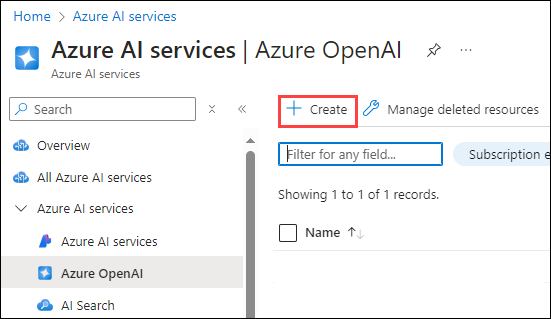
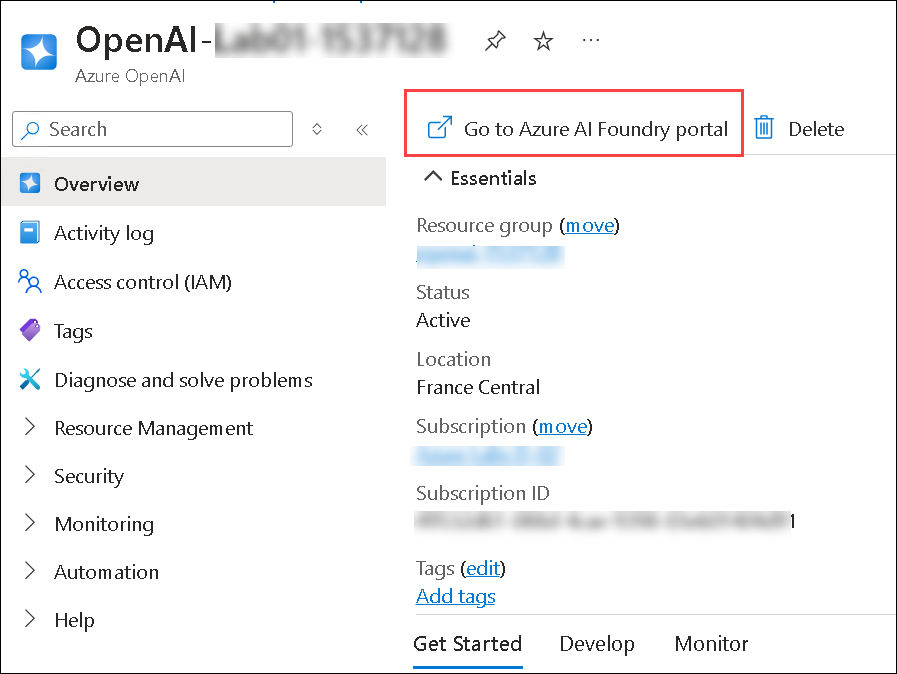
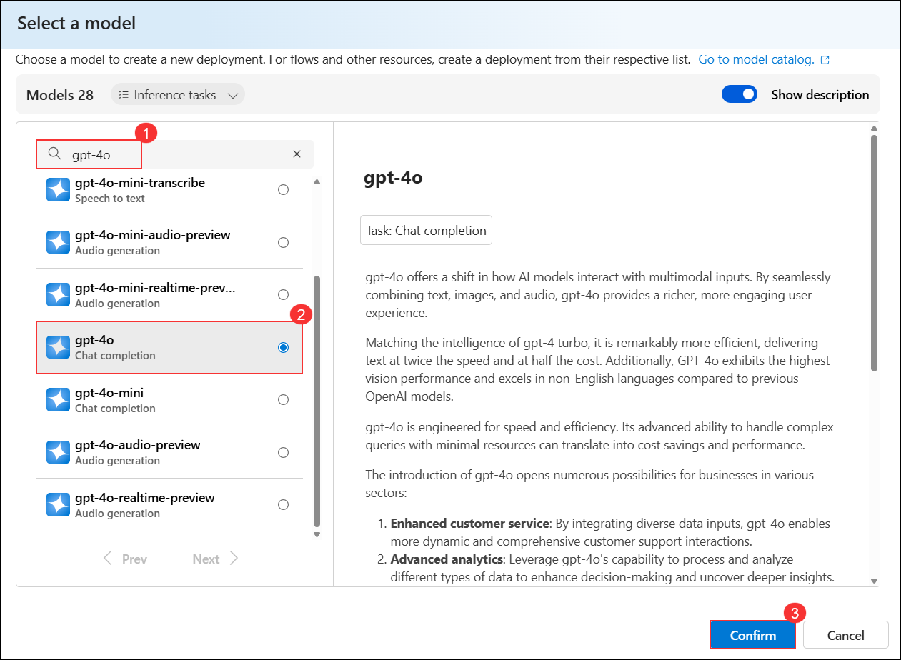
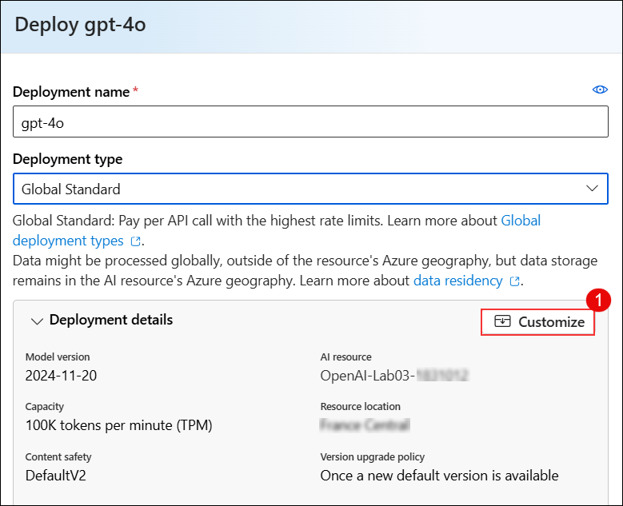
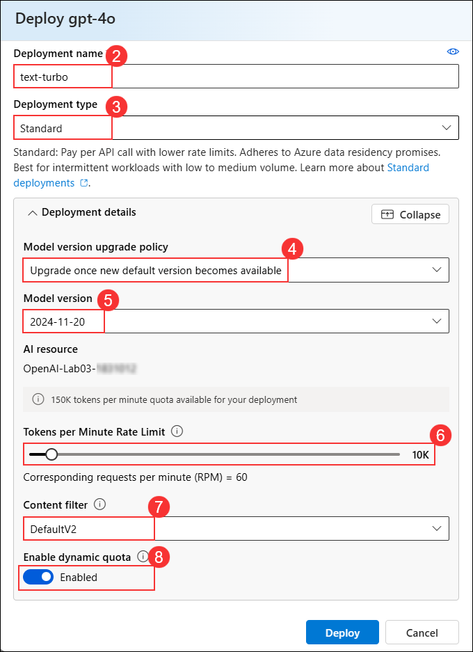
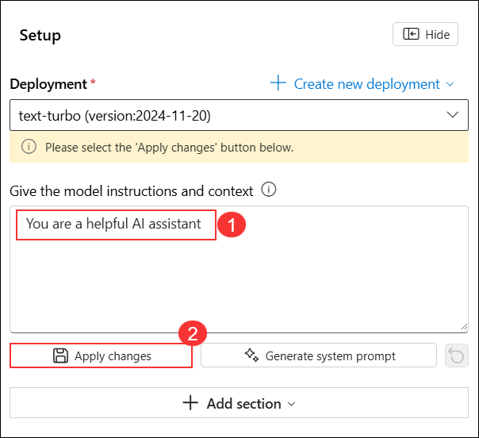
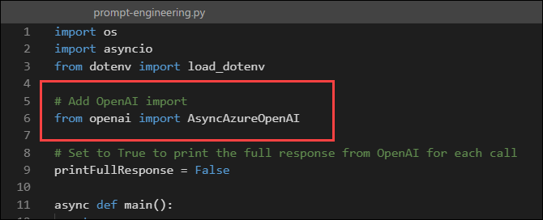
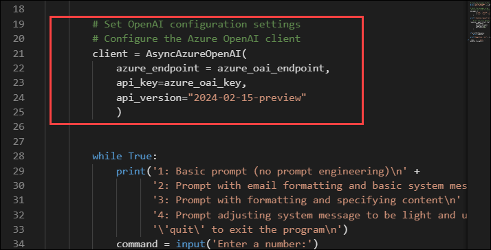
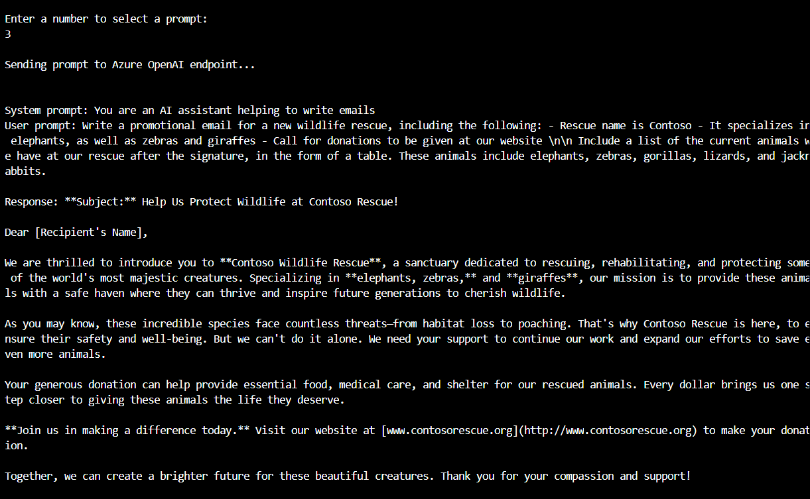

# Lab 01: Utilize prompt engineering in your app

## Lab scenario

When working with the Azure OpenAI Service, how developers shape their prompt greatly impacts how the generative AI model will respond. Azure OpenAI models are able to tailor and format content, if requested in a clear and concise way. In this exercise, you'll learn how different prompts for similar content help shape the AI model's response to better satisfy your requirements.

In scenario for this exercise, you will perform the role of a software developer working on a wildlife marketing campaign. You are exploring how to use generative AI to improve advertising emails and categorize articles that might apply to your team. The prompt engineering techniques used in the exercise can be applied similarly for a variety of use cases.

## Lab objectives
In this lab, you will complete the following tasks:

- Task 1: Provision an Azure OpenAI resource
- Task 2: Deploy a model
- Task 3: Apply prompt engineering in chat playground
- Task 4: Set up an application in Cloud Shell
- Task 5: Configure your application
- Task 6: Run your application

## Estimated time: 60 minutes

### Task 1: Provision an Azure OpenAI resource

In this task , you'll create an Azure resource in the Azure portal, selecting the OpenAI service and configuring settings such as region and pricing tier. This setup allows you to integrate OpenAI's advanced language models into your applications.

1. In the **Azure portal**, search for **Azure OpenAI (1)** and select **Azure OpenAI (2)**.

   

1. On the **Azure AI Services** page, select **Azure OpenAI (1)** from the left pane, then click **+ Create (2)**.

   

1. Create an **Azure OpenAI** resource with the following settings 

    - **Subscription**: Default - Pre-assigned subscription (1).
    - **Resource group**: openai-<inject key="Deployment-ID" enableCopy="false"></inject> (2)
    - **Region**: Select **France Central** (3)
    - **Name**: OpenAI-Lab03-<inject key="Deployment-ID" enableCopy="false"></inject> (4)
    - **Pricing tier**: Standard S0 (5)
    -  Click on **Next** (6)
  
         

1. Click on **Next** twice and subsequently click on **Create** 

1. Wait for deployment to complete. Then go to the deployed Azure OpenAI resource in the Azure portal.

1. To capture the Keys and Endpoints values, on **openai-<inject key="Deployment-ID" enableCopy="false"></inject>** blade:
      - Select **Keys and Endpoint (1)** under **Resource Management**.
      - Click on **Show Keys (2)**.
      - Copy **Key 1 (3)** and ensure to paste it in a text editor such as Notepad for future reference.
      - Finally copy the **Endpoint (4)** API URL by clicking on copy to clipboard. Paste it in a text editor such as Notepad for later use.

          

<validation step="92fd5d61-ee1f-44aa-b7cc-4545c53b5b92" />

> **Congratulations** on completing the task! Now, it's time to validate it. Here are the steps:
> - Hit the Validate button for the corresponding task. If you receive a success message, you can proceed to the next task. 
> - If not, carefully read the error message and retry the step, following the instructions in the lab guide.
> - If you need any assistance, please contact us at cloudlabs-support@spektrasystems.com. We are available 24/7 to help you out.

### Task 2: Deploy a model

In this task, you'll deploy a specific AI model instance within your Azure OpenAI resource to integrate advanced language capabilities into your applications.

1. In the **Azure portal**, search for **Azure OpenAI** and select **Azure OpenAI**.

   

1. On the **Azure AI Services** page, select **Azure OpenAI (1)** from the left pane, then select **OpenAI-Lab03-<inject key="Deployment-ID" enableCopy="false"></inject>** **(2)**

   

1. In the Azure OpenAI resource pane, select 
   **Overview (1)** from the left-hand menu, then click on **Go to Azure AI Foundry portal (2)**. This will navigate you to **Azure AI Foundry portal**.

   

1. Click on **Deployments (1)** under **Shared 
   Resources**, then select **+ Deploy Model**. Next, choose **Deploy Base Model (2).**

      

1. Search for **gpt-4o (1)**, select it from the list **(2)**, and then click **Confirm (3)**.

    

1. On the **Deploy gpt-4o** interface, click on **Customize (1)** and enter the details as mentioned below, then click on **Deploy (9):**

   | Settings | Action |
   | -- | -- |
   | **Deployment name** | **text-turbo (2)** |
   | **Deployment type** | **Standard (3)**|
   | **Model version upgrade policy** | **Upgrade once new default version becomes available. (4)** |
   | **Model version** | 2024-11-20 **(5)**|
   | **Tokens per Minute Rate Limit (thousands)** | **10K (6)** |
   | **Content Filter** | **DefaultV2 (7)**|
   | **Enable dynamic quota** |**Enabled (8)**|
  
      

      
   
    >**Note:** gpt-4o is supported only for chat completions.

<validation step="e3805450-2e13-40c4-80fa-58a0cd695e6e" />

> **Congratulations** on completing the task! Now, it's time to validate it. Here are the steps:
> - Hit the Validate button for the corresponding task. If you receive a success message, you can proceed to the next task. 
> - If not, carefully read the error message and retry the step, following the instructions in the lab guide.
> - If you need any assistance, please contact us at cloudlabs-support@spektrasystems.com. We are available 24/7 to help you out.


### Task 3: Apply prompt engineering in chat playground

In this task, you will examine how prompt engineering improves model responses in the playground by experimenting with prompts, such as writing a Python app for animals with fun names.

1. In [Azure AI Foundry portal](https://oai.azure.com/?azure-portal=true), navigate to the **Chat** playground in the left pane.

1. In the **Setup** section at the top, enter `You are a helpful AI assistant` **(1)** under Give the model instructions and context and click on **Apply changes (2)** and subsequently click on **Continue**.

    

    >**Note**: If the **Setup** option is not visible, click on **Show set** to display it.

1. Scroll down and in the **Chat session** section, enter the following prompt and press *Enter*.

    ```code
   1. Create a list of animals
   2. Create a list of whimsical names for those animals
   3. Combine them randomly into a list of 25 animal and name pairs
    ```
    >**Note:** Kindly refresh the screen incase you encounter any error message and perform the above step again.

1. The model will probably provide a satisfactory response to the prompt, presented as a numbered list. While this is a decent answer, it doesn't meet our specific needs.

1. Next, update the Give the model instructions and context to include instructions `You are an AI assistant helping write python code. Complete the app based on provided comments` **(1)**. Click **Apply changes (2)** and subsequently click on **Continue**.

    

1. Format the instructions as python comments. Send the following prompt to the model.

    ```code
   # 1. Create a list of animals
   # 2. Create a list of whimsical names for those animals
   # 3. Combine them randomly into a list of 25 animal and name pairs
    ```

1. The model should correctly respond with complete python code doing what the comments requested.

1. Next we'll see the impact of few shot prompting when attempting to classify articles. Return to the Give the model instructions and context and enter `You are a helpful AI assistant` again, and **Apply changes** your changes and subsequently click on **Continue**. This will create a new chat session.

1. Send the following prompt to the model.

    ```code
   Severe drought likely in California

   Millions of California residents are bracing for less water and dry lawns as drought threatens to leave a large swath of the region with a growing water shortage.
   
   In a remarkable indication of drought severity, officials in Southern California have declared a first-of-its-kind action limiting outdoor water use to one day a week for nearly 8 million residents.
   
   Much remains to be determined about how daily life will change as people adjust to a drier normal. But officials are warning the situation is dire and could lead to even more severe limits later in the year.
    ```

1. The response will likely be some information about drought in California. While not a bad response, it's not the classification we're looking for.

1. In the **Setup** section near the Give the model instructions and context, select the **+ Add section** button. then click on **Examples** Add the following example.

    

    **User:**

    ```code
      New York Baseballers Wins Big Against Chicago

      New York Baseballers mounted a big 5-0 shutout against the Chicago Cyclones last night, solidifying their win with a 3 run homerun late in the bottom of the 7th inning.

      Pitcher Mario Rogers threw 96 pitches with only two hits for New York, marking his best performance this year.

      The Chicago Cyclones' two hits came in the 2nd and the 5th innings, but were unable to get the runner home to score.
    ```

    **Assistant:**
       
    ```code
    Sports
    ```

1. Add another example with the following text.

    **User:**

    ```code
    Joyous moments at the Oscars

    The Oscars this past week where quite something!

    Though a certain scandal might have stolen the show, this year's Academy Awards were full of moments that filled us with joy and even moved us to tears.
    These actors and actresses delivered some truly emotional performances, along with some great laughs, to get us through the winter.

    From Robin Kline's history-making win to a full performance by none other than Casey Jensen herself, don't miss tomorrows rerun of all the festivities.
    ```

    **Assistant:**

    ```code
    Entertainment
    ```

1. Save those changes to the assistant setup, click continue, and send the same prompt about California drought, provided here again for convenience.

    ```code
    Severe drought likely in California

    Millions of California residents are bracing for less water and dry lawns as drought threatens to leave a large swath of the region with a growing water shortage.

    In a remarkable indication of drought severity, officials in Southern California have declared a first-of-its-kind action limiting outdoor water use to one day a week for nearly 8 million residents.

    Much remains to be determined about how daily life will change as people adjust to a drier normal. But officials are warning the situation is dire and could lead to even more severe limits later in the year.
    ```

1. This time the model should respond with an appropriate classification, even without instructions.

### Task 4: Set up an application in Cloud Shell

In this task, you will integrate with an Azure OpenAI model by using a short command-line application running in Cloud Shell on Azure. Open a new browser tab to work with Cloud Shell.

1. In the [Azure portal](https://portal.azure.com?azure-portal=true), select the **[>_]** (*Cloud Shell*) button at the top of the page to the right of the search box. A Cloud Shell pane will open at the bottom of the portal.

    

    >**Note :** If you don't see the Cloud Shell icon, click on the **ellipsis** button and select **Cloud Shell**.

     

1. The first time you open the Cloud Shell, you may be prompted to choose the type of shell you want to use (*Bash* or *PowerShell*). Select **Bash**. If you don't see this option, skip the step.  

   

1. Within the Getting Started pane, select **Mount storage account (1)**, select your **Storage account subscription (2)** from the dropdown and click **Apply (3)**.

   

1. Within the **Mount storage account** pane, select **I want to create a storage account (1)** and click **Next (2)**.

   

1. Within the **Advanced settings** pane, enter the following details:

    - **Subscription**: Default- Choose the only existing subscription assigned for this lab (1).
    - **Resource group**: Select openai-<inject key="Deployment-ID" enableCopy="false"></inject>(2)
    - **CloudShell region**: <inject key="Region" enableCopy="false" /> (3)
    - **Storage account name**: storage<inject key="Deployment-ID" enableCopy="false"></inject>(4)
    - **File share**: Create a new file share named **none** (5)
    - Click **Create** (6)

        
   
1. Make sure the type of shell indicated on the top left of the Cloud Shell pane is switched to *Bash*. If it's *PowerShell*, switch to *Bash* by using the drop-down menu.

1. Note that you can resize the cloud shell by dragging the separator bar at the top of the pane, or by using the **&#8212;**, **&#9723;**, and **X** icons at the top right of the pane to minimize, maximize, and close the pane. For more information about using the Azure Cloud Shell, see the [Azure Cloud Shell documentation](https://docs.microsoft.com/azure/cloud-shell/overview).

1. Once the terminal opens, click on **Settings** and select **Go to Classic Version**.

   

1. Once the terminal starts, enter the following command to download the sample application and save it to a folder called `mslearn-openai`.

    ```bash
   rm -r mslearn-openai -f
   git clone https://github.com/CloudLabs-MOC/mslearn-openai
    ```

1. The files are downloaded to a folder named **mslearn-openai**. Navigate to the lab files for this task using the following command.

    ```bash
    cd mslearn-openai/Labfiles/03-prompt-engineering
    ```

    Applications for both C# and Python have been provided, as well as a text files that provide the prompts. Both apps feature the same functionality.

1. Open the built-in code editor, and you can observe the prompt files that you'll be using in `prompts`. Use the following command to open the lab files in the code editor.

   ```bash
   code .
    ```

<validation step="b83818f3-0527-485b-85c5-57c7f0149fe1" />

> **Congratulations** on completing the task! Now, it's time to validate it. Here are the steps:
> - Hit the Validate button for the corresponding task. If you receive a success message, you can proceed to the next task. 
> - If not, carefully read the error message and retry the step, following the instructions in the lab guide.
> - If you need any assistance, please contact us at cloudlabs-support@spektrasystems.com. We are available 24/7 to help you out.

### Task 5: Configure your application

In this task, you will complete key parts of the provided C# or Python application to enable it to use your Azure OpenAI resource with asynchronous API calls, as both apps feature the same functionality.

1. In the code editor, expand the **CSharp** or **Python** folder, depending on your language preference. Each folder contains the language-specific files for an app into which you're going to integrate Azure OpenAI functionality.

1. Open the configuration file for your language.

    - C#: `appsettings.json`
    - Python: `.env`
    
1. Update the configuration values to include the **endpoint** and **key** from the Azure OpenAI resource you created, as well as the model's name that you deployed, `my-gpt-model`. Then save the file by right-clicking on the file from the left pane and hit **Save**

1. If you're using **C#**, navigate to `CSharp.csproj`, delete the existing code, then replace it with the following code, and then press **Ctrl+S** to save the file.

    ```
    <Project Sdk="Microsoft.NET.Sdk">

    <PropertyGroup>
    <OutputType>Exe</OutputType>
    <TargetFramework>net8.0</TargetFramework>
    <ImplicitUsings>enable</ImplicitUsings>
    <Nullable>enable</Nullable>
    </PropertyGroup>

     <ItemGroup>
     <PackageReference Include="Azure.AI.OpenAI" Version="1.0.0-beta.14" />
     <PackageReference Include="Microsoft.Extensions.Configuration" Version="8.0.404" />
     <PackageReference Include="Microsoft.Extensions.Configuration.Json" Version="8.0.404" />
     </ItemGroup>

     <ItemGroup>
       <None Update="appsettings.json">
         <CopyToOutputDirectory>PreserveNewest</CopyToOutputDirectory>
        </None>
     </ItemGroup>

    </Project>
    ```    

         

1. Navigate to the folder for your preferred language and install the necessary packages.

   For **C#:**

    ```
    cd CSharp
    export DOTNET_ROOT=$HOME/.dotnet
    export PATH=$DOTNET_ROOT:$PATH
    mkdir -p $DOTNET_ROOT
    ```     

     >**Note:** Azure Cloud Shell often does not have admin privileges, so you need to install .NET in your home directory. So here you are creating a separate `.dotnet` directory under your home directory to isolate your configuration.
     - `DOTNET_ROOT` specifies where your .NET runtime and SDK are located (in your `$HOME/.dotnet directory`).
     - `PATH=$DOTNET_ROOT:$PATH` ensures that the locally installed .NET SDK can be accessed globally by your terminal.
     - `mkdir -p $DOTNET_ROOT` This creates the directory where the .NET runtime and SDK will be installed.

1. Run the following command to install the required SDK version locally:     

     ```
     wget https://dotnet.microsoft.com/download/dotnet/scripts/v1/dotnet-install.sh
     chmod +x dotnet-install.sh
     ./dotnet-install.sh --version 8.0.404 --install-dir $DOTNET_ROOT
     ```

      >**Note:** These commands download and prepare the official `.NET` installation script, grant it execute permissions, and install the required .NET SDK version (8.0.404) in the `$DOTNET_ROOT` directory, as we don't have the admin privileges to install it globally.

1. Enter the following command to restore the workload.

    ```
    dotnet workload restore
    ```

     >**Note:** Restores any required workloads for your project, such as additional tools or libraries that are part of the .NET SDK.
    
1. Enter the following command to add the `Azure.AI.OpenAI` NuGet package to your project, which is necessary for integrating with Azure OpenAI services.

    ```
    dotnet add package Azure.AI.OpenAI --version 1.0.0-beta.14
    ```

1. If you prefer Python, please perform below steps to install the packages
   
    **Python**
   
    ```bash
    cd Python
    pip install python-dotenv
    pip install openai==1.56.2
    ```
   

      > **Note:** If you receive a permission error after executing the installation command as shown in the above image, please run the below command for installation/
      > ```bash
      > pip install --user python-dotenv
      > pip install --user openai==1.56.2
      > ```

1. Navigate to your preferred language folder, select the code file, and add the necessary libraries in the **Add Azure OpenAI package** section.

    **C#:** Program.cs

    ```csharp
   // Add Azure OpenAI package
   using Azure.AI.OpenAI;
    ```

      

    **Python:** prompt-engineering.py

    ```python
    # Add Azure OpenAI import
    from openai import AsyncAzureOpenAI
    ```

      

1. Open the application code for your language and add the necessary code for configuring the client.

    **C#:** Program.cs - Add the code in **Initialize the Azure OpenAI client** section

    ```csharp
   // Initialize the Azure OpenAI client
   OpenAIClient client = new OpenAIClient(new Uri(oaiEndpoint), new AzureKeyCredential(oaiKey));
    ```

      

    **Python:** prompt-engineering.py - Add the code in **Set OpenAI configuration settings** section

   ```python
    # Configure the Azure OpenAI client
    client = AsyncAzureOpenAI(
        azure_endpoint = azure_oai_endpoint, 
        api_key=azure_oai_key,  
        api_version="2024-02-15-preview"
        )
    ```

      

    >**Note:** Make sure to indent the code by eliminating any extra white spaces after pasting it into the code editor.

1. In the function that calls the Azure OpenAI model, add the code to format and send the request to the model.

    **C#:** Program.cs - Add the code in **Create chat completion options** section

    ```csharp
    // Format and send the request to the model
         var chatCompletionsOptions = new ChatCompletionsOptions()
          {
              Messages =
              {
                  new ChatRequestSystemMessage(systemPrompt),
                  new ChatRequestUserMessage(userPrompt)
              },
              Temperature = 0.7f,
              MaxTokens = 800,
              DeploymentName = oaiModelName
          };
           
          // Get response from Azure OpenAI
          Response<ChatCompletions> response = await client.GetChatCompletionsAsync(chatCompletionsOptions);
          var completions = response.Value;
    ```

      

    **Python:** prompt-engineering.py - Add the code in **Build the messages array** section

   ```python
    # Format and send the request to the model
    messages =[
        {"role": "system", "content": system_message},
        {"role": "user", "content": user_message},
    ]
    
    print("\nSending request to Azure OpenAI model...\n")

    # Call the Azure OpenAI model
    response = await client.chat.completions.create(
        model=model,
        messages=messages,
        temperature=0.7,
        max_tokens=800
    )
    ```

      

    >**Note:** Make sure to indent the code by eliminating any extra white spaces after pasting it into the code editor.

1. The modified code should look as shown below:

    **C#**
      
      ```csharp
        // Implicit using statements are included
         using System.Text;
         using System.Text.Json;
         using Microsoft.Extensions.Configuration;
         using Microsoft.Extensions.Configuration.Json;
         using Azure;
         
         // Add Azure OpenAI package
         using Azure.AI.OpenAI;
         
         // Build a config object and retrieve user settings.
         IConfiguration config = new ConfigurationBuilder()
             .AddJsonFile("appsettings.json")
             .Build();
         string? oaiEndpoint = config["AzureOAIEndpoint"];
         string? oaiKey = config["AzureOAIKey"];
         string? oaiModelName = config["AzureOAIModelName"];
         
         string command;
         bool printFullResponse = false;
         
         do {
             Console.WriteLine("\n1: Basic prompt (no prompt engineering)\n" +
             "2: Prompt with email formatting and basic system message\n" +
             "3: Prompt with formatting and specifying content\n" +
             "4: Prompt adjusting system message to be light and use jokes\n" +
             "\"quit\" to exit the program\n\n" + 
             "Enter a number to select a prompt:");
         
             command = Console.ReadLine() ?? "";
             
             switch (command) {
                 case "1":
                     await GetResponseFromOpenAI("../prompts/basic.txt");
                     break;
                 case "2":
                     await GetResponseFromOpenAI("../prompts/email-format.txt");
                     break;
                 case "3":
                     await GetResponseFromOpenAI("../prompts/specify-content.txt");
                     break;
                 case "4":
                     await GetResponseFromOpenAI("../prompts/specify-tone.txt");
                     break;
                 case "quit":
                     Console.WriteLine("Exiting program...");
                     break;
                 default:
                     Console.WriteLine("Invalid input. Please try again.");
                     break;
             }
         } while (command != "quit");
         
         async Task GetResponseFromOpenAI(string fileText)  
         {   
             Console.WriteLine("\nSending prompt to Azure OpenAI endpoint...\n\n");
         
             if(string.IsNullOrEmpty(oaiEndpoint) || string.IsNullOrEmpty(oaiKey) || string.IsNullOrEmpty(oaiModelName) )
             {
                 Console.WriteLine("Please check your appsettings.json file for missing or incorrect values.");
                 return;
             }
             
             // Initialize the Azure OpenAI client
             OpenAIClient client = new OpenAIClient(new Uri(oaiEndpoint), new AzureKeyCredential(oaiKey));
         
             // Read text file into system and user prompts
             string[] prompts = System.IO.File.ReadAllLines(fileText);
             string systemPrompt = prompts[0].Split(":", 2)[1].Trim();
             string userPrompt = prompts[1].Split(":", 2)[1].Trim();
         
             // Write prompts to console
             Console.WriteLine("System prompt: " + systemPrompt);
             Console.WriteLine("User prompt: " + userPrompt);
             
             // Create chat completion options
             // Format and send the request to the model
              var chatCompletionsOptions = new ChatCompletionsOptions()
               {
                   Messages =
                   {
                       new ChatRequestSystemMessage(systemPrompt),
                       new ChatRequestUserMessage(userPrompt)
                   },
                   Temperature = 0.7f,
                   MaxTokens = 800,
                   DeploymentName = oaiModelName
               };
                
               // Get response from Azure OpenAI
               Response<ChatCompletions> response = await client.GetChatCompletionsAsync(chatCompletionsOptions);
               var completions = response.Value;
             
             // Write full response if needed
             if (printFullResponse)
             {
                 Console.WriteLine($"\nFull response: {JsonSerializer.Serialize(completions, new JsonSerializerOptions { WriteIndented = true })}\n\n");
             }
         
             // Write the first choice's message
             foreach (var choice in completions.Choices)
             {
                 Console.WriteLine($"\nResponse: {choice.Message.Content}\n\n");
             }
         }       
      ```
   
     **Python**
   
      ```python
      import os
      import asyncio
      from dotenv import load_dotenv
      
      # Add OpenAI import
      # Add Azure OpenAI package
      from openai import AsyncAzureOpenAI
      
      # Set to True to print the full response from OpenAI for each call
      printFullResponse = False
      
      async def main(): 
          try: 
              # Get configuration settings 
              load_dotenv()
              azure_oai_endpoint = os.getenv("AZURE_OAI_ENDPOINT")
              azure_oai_key = os.getenv("AZURE_OAI_KEY")
              azure_oai_model = os.getenv("AZURE_OAI_MODEL")
              
              # Set OpenAI configuration settings
              # Configure the Azure OpenAI client
              client = AsyncAzureOpenAI(
                  azure_endpoint = azure_oai_endpoint, 
                  api_key=azure_oai_key,  
                  api_version="2024-02-15-preview"
                  )
             
      
              while True:
                  print('1: Basic prompt (no prompt engineering)\n' +
                        '2: Prompt with email formatting and basic system message\n' +
                        '3: Prompt with formatting and specifying content\n' +
                        '4: Prompt adjusting system message to be light and use jokes\n' +
                        '\'quit\' to exit the program\n')
                  command = input('Enter a number:')
                  if command == '1':
                      await call_openai_model(messages="../prompts/basic.txt", model=azure_oai_model, client=client)
                  elif command =='2':
                      await call_openai_model(messages="../prompts/email-format.txt", model=azure_oai_model, client=client)
                  elif command =='3':
                      await call_openai_model(messages="../prompts/specify-content.txt", model=azure_oai_model, client=client)
                  elif command =='4':
                      await call_openai_model(messages="../prompts/specify-tone.txt", model=azure_oai_model, client=client)
                  elif command.lower() == 'quit':
                      print('Exiting program...')
                      break
                  else :
                      print("Invalid input. Please try again.")
      
          except Exception as ex:
              print(ex)
      
      async def call_openai_model(messages, model, client):
          # In this sample, each file contains both the system and user messages
          # First, read them into variables, strip whitespace, then build the messages array
          with open(messages, encoding="utf8") as file:
              system_message = file.readline().split(':', 1)[1].strip()
              user_message = file.readline().split(':', 1)[1].strip()
      
          # Print the messages to the console
          print("System message: " + system_message)
          print("User message: " + user_message)
      
          # Build the messages array
          # Format and send the request to the model
          messages =[
                  {"role": "system", "content": system_message},
                  {"role": "user", "content": user_message},
          ]
       
          print("\nSending request to Azure OpenAI model...\n")
      
       # Call the Azure OpenAI model
          response = await client.chat.completions.create(
             model=model,
             messages=messages,
             temperature=0.7,
             max_tokens=800
          )
          
      
          if printFullResponse:
              print(response)
      
          print("Completion: \n\n" + response.choices[0].message.content + "\n")
      
      if __name__ == '__main__': 
          asyncio.run(main())

      ```

    >**Note:** Make sure to indent the code by eliminating any extra white spaces after pasting it into the code editor.

1. To save the changes made to the file, right-click on the file from the left pane and hit **Save**.

### Task 6: Run your application

In this task, you will run your configured app to send a request to your model and observe the response. You'll notice that the only difference between the options is the content of the prompt, while all other parameters (such as token count and temperature) remain consistent across requests.

1. In the **Cloud Shell** bash terminal, navigate to the folder for your preferred language.

1. In the interactive terminal pane, ensure the folder context is the folder for your preferred language. Then, enter the following command to run the application.

    - **C#:** `dotnet run`

      > **Note:** If you receive any warning messages, you can ignore them and continue.
      
    - **Python:** `python prompt-engineering.py`

       >**Note:** If you encounter any errors after running the Python script, try upgrading the OpenAI package by running the following command: `pip install --user --upgrade openai`

       >Note: If you get any **ImportError: cannot import name 'ChatCompletionReasoningEffort' from 'openai.types.chat'**, then try executing the below commands once and then try to run the Python application.
       
       >```
       >pip uninstall -y openai
       >rm -rf /home/odl_user/.local/lib/python3.12/site-packages/openai
       >rm -rf /home/odl_user/.local/lib/python3.12/site-packages/openai-*
       >pip install --user --no-cache-dir openai==1.56.2
       >```

       > **Tip:** You can use the **Maximize panel size** (**^**) icon in the terminal toolbar to see more of the console text.

1. For the first iteration, Type **1** which selects the **Basic prompt (no prompt engineering)**, and press enter for **Enter a number to select a prompt**.

1. The AI tool will take the **System prompt** as `You are an AI assistant` and the **User prompt** as `Write an intro for a new wildlife Rescue`

     

1. Observe the output. The model will likely produce a good generic introduction to a wildlife rescue.

1. Next, enter **2** to select **Prompt with email formatting and basic system message** and press enter for **Enter a number to select a prompt**.

1. This time it will take the **System prompt** as `You are an AI assistant helping to write emails` and the **User prompt** as `Write a promotional email for a new wildlife rescue, including the following: - Rescue name is Contoso - It specializes in elephants - Call for donations to be given at our website`

     

1. Observe the output. This time, you'll likely see the format of an email with the specific animals included, as well as the call for donations.

1. Next, enter **3** to select **Prompt with formatting and specifying content** and press enter for **Enter a number to select a prompt**.

1. Observe, it will take the **System prompt** as `You are an AI assistant helping to write emails` and the **User prompt** as `Write a promotional email for a new wildlife rescue, including the following: - Rescue name is Contoso - It specializes in elephants, as well as zebras and giraffes - Call for donations to be given at our website \n\n Include a list of the current animals we have at our rescue after the signature, in the form of a table. These animals include elephants, zebras, gorillas, lizards, and jackrabbits.`

     

1. Observe the output and see how the email has changed based on your clear instructions.

1. Next, enter **4** to select **Prompt adjusting system message to be light and use jokes** and press enter for **Enter a number to select a prompt**.

1. It will take the **System prompt** as `You are an AI assistant that helps write promotional emails to generate interest in a new business. Your tone is light, chit-chat oriented and you always include at least two jokes.` and the **User prompt** as `Write a promotional email for a new wildlife rescue, including the following: Rescue name is Contoso, it specializes in elephants, as well as zebras and giraffes, call for donations to be given at our website, include a list of the current animals we have at our rescue after the signature in the form of a table, these animals include elephants, zebras, gorillas, lizards, and jackrabbits.`

     

11. Observe the output. This time, you'll likely see the email in a similar format, but with a much more informal tone. You'll likely even see jokes included!

## Summary

In this lab, you have accomplished the following:

- Provisioned an **Azure OpenAI resource**.  
- Deployed a **GPT-4o model** in the **Azure AI Foundry portal**.  
- Applied **prompt engineering** in the chat playground.  
- Set up and configured an **application in Cloud Shell**.  
- Ran the app to observe how different prompts influence model responses.  

### You have successfully completed the lab.