# Hands-On Lab: Get started with Azure OpenAI Service

### Estimated Duration: 60 Minutes

## Overview

Azure OpenAI Service brings the generative AI models developed by OpenAI to the Azure platform, enabling you to develop powerful AI solutions that benefit from the security, scalability, and integration of services provided by the Azure cloud platform. In this exercise, you'll learn how to get started with Azure OpenAI by provisioning the service as an Azure resource and using Azure OpenAI Foundry to deploy and explore OpenAI models.

## Lab Objectives
In this lab, you will complete the following tasks:

- Task 1: Provision an Azure OpenAI resource
- Task 2: Deploy a model
- Task 3: Use the Chat playground
- Task 4: Explore prompts and parameters 
- Task 5: Explore code generation

## Task 1: Provision an Azure OpenAI resource

In this task, you'll create an Azure resource in the Azure portal, selecting the OpenAI service and configuring settings such as region and pricing tier. This setup allows you to integrate OpenAI's advanced language models into your applications.

1. In the **Azure portal**, search for **Azure OpenAI (1)** and select **Azure OpenAI (2)** from the result.

   

2. On  **AI Foundary | Azure OpenAI** blade, click on **+ Create**.

   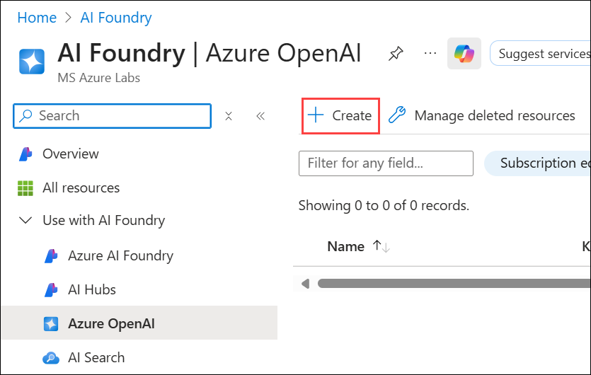

3. Create an **Azure OpenAI** resource using the settings below, then click **Next (6)** three times, leaving all other options at their defaults.
    
    - Subscription: **Default Subscription (1)**
    
    - Resource group: **openai-<inject key="DeploymentID" enableCopy="false"></inject> (2)**
    
    - Region: **<inject key="Region" enableCopy="false"></inject> (3)**
    
    - Name: **OpenAI-Lab01-<inject key="DeploymentID" enableCopy="false"></inject> (4)**
    
    - Pricing tier: **Standard S0 (5)**
  
      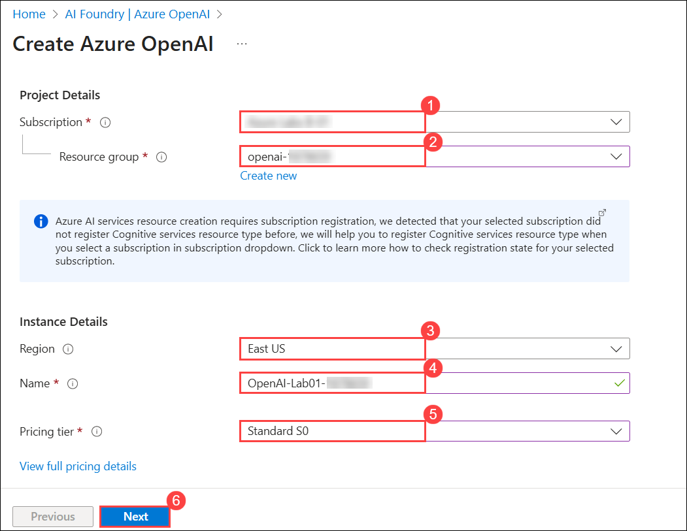

4. Under the **Review + submit** tab, click on **Create**.

      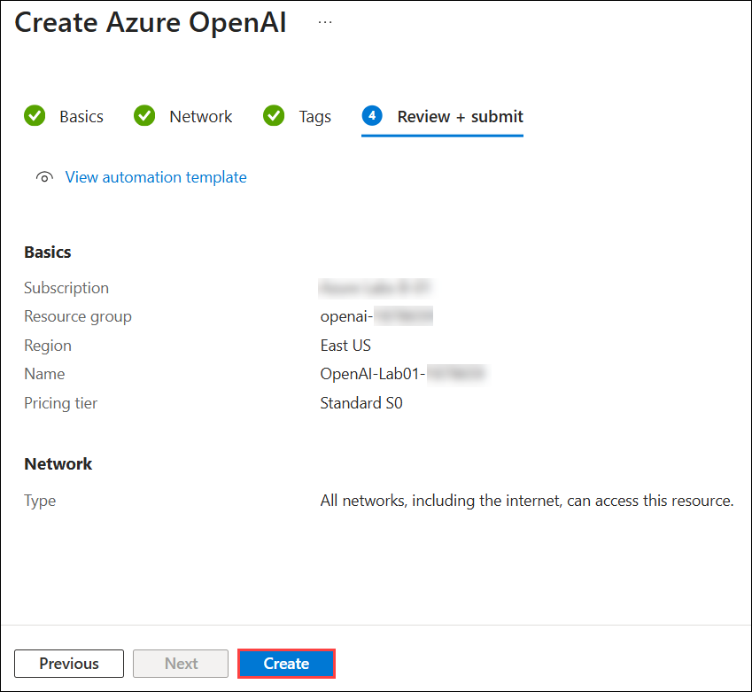

5. Wait for deployment to complete. Click on **Go to resource** to navigate to the deployed Azure OpenAI resource in the Azure portal.

      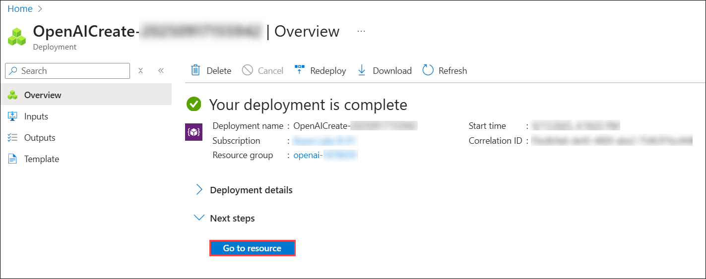

> **Congratulations** on completing the task! Now, it's time to validate it. Here are the steps:
- Hit the Validate button for the corresponding task.
- If you receive a success message, you can proceed to the next task.
- If not, carefully read the error message and retry the step, following the instructions in the lab guide.
- If you need any assistance, please contact us at cloudlabs-support@spektrasystems.com. We are available 24/7 to help you out.

<validation step="8aae5f66-b7a9-4963-bf1f-8db101bab3db" />

## Task 2: Deploy a model

In this task, you'll deploy a specific AI model instance within your Azure OpenAI resource to integrate advanced language capabilities into your applications.

1. In the Azure OpenAI resource pane, click on **Go to Azure AI Foundry portal**, which will navigate to **Azure AI Foundry**.

    

1. Select the **Deployments (1)** from the left pane, click on **+ Deploy model (2)** and choose **Deploy base model (3)**.

    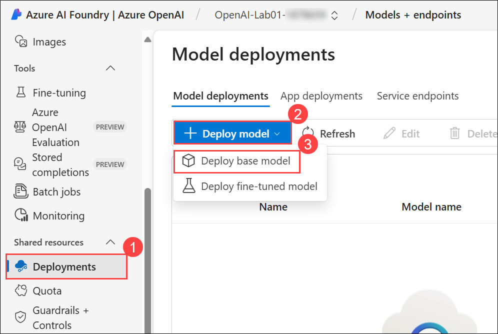

1. Search for **gpt-4o-mini (1)** in the search bar, select **gpt-4o-mini (2)** and click on **Confirm (3)**.

   

   >**Note:** If pop-up window **Unlock the full capabilities of Azure Al Foundry with projects** appears, click **Continue with existing setup**

      .png)
   
1. Within the **Deploy model gpt-4o-mini** pop-up interface, click on **Customize**.

   

1. Within the **Deploy model gpt-4o-mini** pop-up interface, enter the following details:

      - Deployment name: **my-gpt-model (2)**

      - Deployment type: **Standard (1)**

      - Model version:**2024-07-18 (Default) (3)**

      - Tokens per Minute Rate Limit (thousands): **10K (4)**

      - Content filter: **DefaultV2 (5)**

      - Enable dynamic quota: **Enabled (6)**

      - Click on **Deploy (7)**

        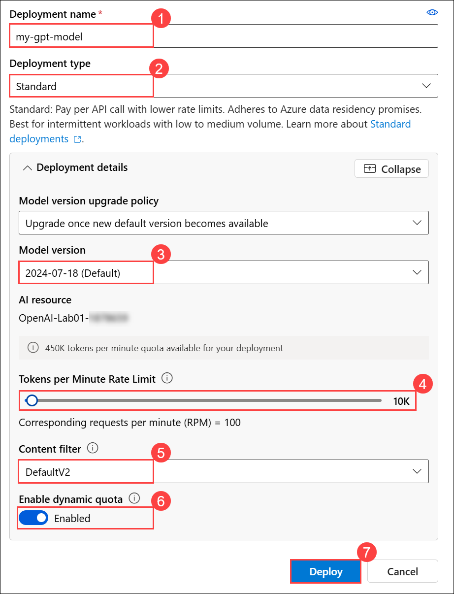
      
        >**Note:** gpt-4o-mini is supported only for chat completions, and it is not supported for the completions API.
        
1. This will deploy a model that you will be playing around with as you proceed.

    > **Note:** You can ignore any error related to the assignment of roles to view the quota limits.
   
    > **Note:** Azure OpenAI includes multiple models, each optimized for a different balance of capabilities and performance. In this exercise, you'll use the **gpt-4o-mini** model, which is a good model for summarizing and generating natural language and code. For more information about the available models in Azure OpenAI, see [Models](https://learn.microsoft.com/azure/cognitive-services/openai/concepts/models) in the Azure OpenAI documentation.


> **Congratulations** on completing the task! Now, it's time to validate it. Here are the steps:
- Hit the Validate button for the corresponding task.
- If you receive a success message, you can proceed to the next task.
- If not, carefully read the error message and retry the step, following the instructions in the lab guide.
- If you need any assistance, please contact us at cloudlabs-support@spektrasystems.com. We are available 24/7 to help you out.

<validation step="29d502af-cb10-4d86-80b8-e1d97420284f" />
   
## Task 3: Use the Chat playground

In this task, you'll use the Chat playground to interact and test the AI model's conversational abilities through a simulated chat interface.

1. In the **Playgrounds** section, select the **Chat (1)** page, and ensure that the **my-gpt-model(version:2024-07-18) (2)** model is selected in the configuration pane.

      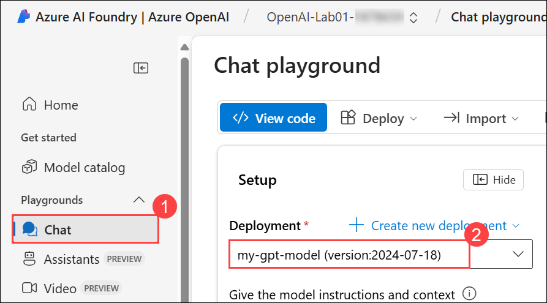  

1. In the **Setup** section, in the **Give the model instructions and context** box, replace the existing text with the following statement: **`The system is an AI teacher that helps people learn about AI`** **(1)** and click on **Apply changes (2)**. 

      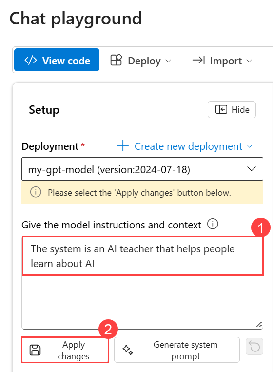

1. In the **Update system message?** window, click on **Continue**.

      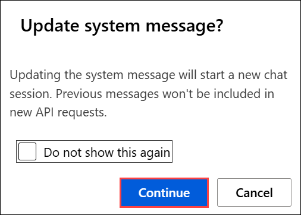
   
1. In the **Setup** section, click on **+ Add section (1)** drop-down box, then click on **Examples (2)**.

      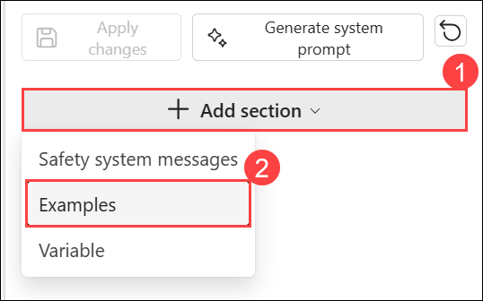

1. Enter the following message and response in the designated boxes:

      - **User:** `What are the different types of artificial intelligence?` **(1)**
    
      - **Assistant:** `There are three main types of artificial intelligence: Narrow or Weak AI (such as virtual assistants like Siri or Alexa, image recognition software, and spam filters), General or Strong AI (AI designed to be as intelligent as a human being. This type of AI does not currently exist and is purely theoretical), and Artificial Superintelligence (AI that is more intelligent than any human being and can perform tasks that are beyond human comprehension. This type of AI is also purely theoretical and has not yet been developed).` **(2)**

         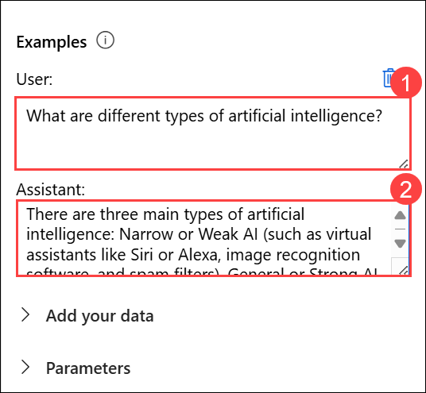
   
         > **Note:** Few-shot examples are used to provide the model with examples of the types of responses that are expected. The model will attempt to reflect the tone and style of the examples in its own responses.

1. Save the changes by clicking on **Apply changes**.

      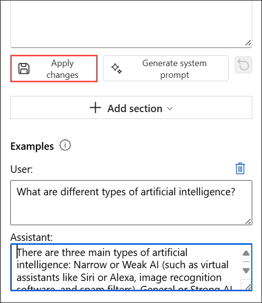

1. In the **Update system message?** pop-up window, click on **Continue**.

      
   
1. In the query box at the bottom of the page, enter the text **`What is artificial intelligence?`**. Use the **Send** button to submit the message and view the response.

      
   
      > **Note:** You may receive a response that the API deployment is not yet ready. If so, wait for a few minutes and try again.

1. Review the response and then submit the following message to continue the conversation: **`How is it related to machine learning?`**

      

1. Review the response, note that context from the previous interaction is retained (so the model understands that "it" refers to artificial intelligence).

1. Use the **</>View Code** button to view the code for the interaction. The prompt consists of the *system* message, the few-shot examples of *user* and *assistant* messages, and the sequence of *user* and *assistant* messages in the chat session so far.

      

## Task 4: Explore prompts and parameters

In this task, you'll explore prompts and parameters by experimenting with different inputs and settings to fine-tune the AI model's responses and behavior.

1. In the **Chat Configuration** pane select **Parameters (1)**, set the following parameter values:
      
      - Max response: **500 (2)**
     
      - Temperature: **0 (3)**
   
          
      
2. Submit the following message as a query in a chat session

      ```
      Write three multiple choice questions based on the following text.

      Most computer vision solutions are based on machine learning models that can be applied to visual input from cameras, videos, or images.*

      - Image classification involves training a machine learning model to classify images based on their contents. For example, in a traffic monitoring solution, you might use an image classification model to classify images based on the type of vehicle they contain, such as taxis, buses, cyclists, and so on.*

      - Object detection machine learning models are trained to classify individual objects within an image and identify their location with a bounding box. For example, a traffic monitoring solution might use object detection to identify the location of different classes of vehicles.*

      - Semantic segmentation is an advanced machine learning technique in which individual pixels in the image are classified according to the object to which they belong. For example, a traffic monitoring solution might overlay traffic images with "mask" layers to highlight different vehicles using specific colors.
      ```

3. Review the **results**, which should consist of multiple-choice questions that a teacher could use to test students on the computer vision topics in the prompt. The total response should be smaller than the maximum length you specified as a parameter.

      
   
4. Observe the following about the prompt and parameters you used:

      - The prompt specifically states that the desired output should be three multiple-choice questions.
       
      - The parameters include *Temperature*, which controls the degree to which response generation includes an element of randomness. The value of **0** used in your submission minimizes randomness, resulting in stable, predictable responses.

## Task 5: Explore code generation

In this task, you'll explore code generation by testing the AI model’s ability to generate and suggest code snippets based on various programming prompts and requirements.

1. In the **Setup pane**, under the **Give the model instructions and context** box, enter the system message: **`You are a Python developer.`** **(1)** then save the changes by clicking on **Apply changes (2)**.

      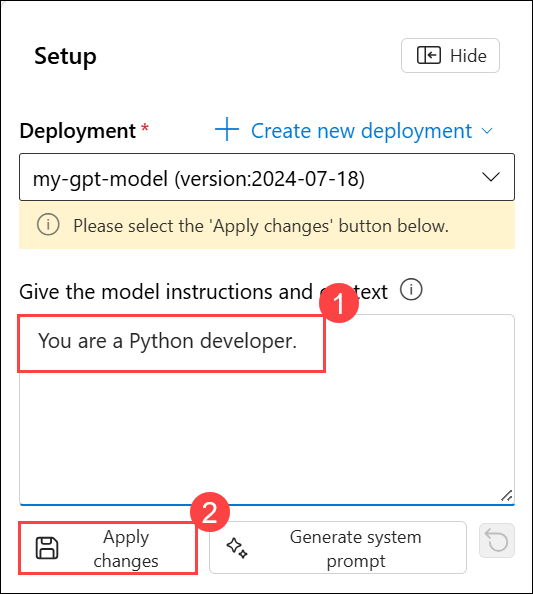

1. In the **Update system message?** pop-up window, click on **Continue**.

      

1. In the **Chat session** pane, click on the **Clear chat** icon to clear the chat history and start a new session.

      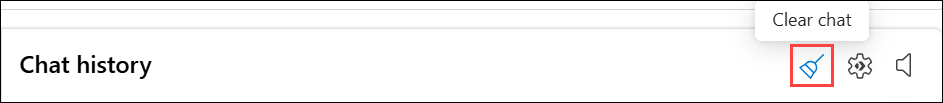

1. Click on **Clear** in **Clear chat?** pop-up window.      

      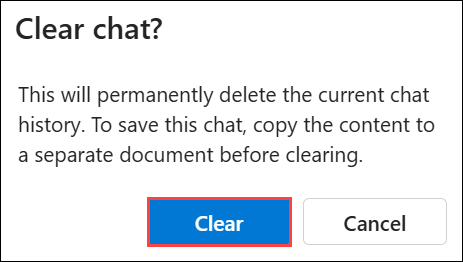

1. Submit the following user message:

      ```
      Write a Python function named Multiply that multiplies two numeric parameters.
      ```

1. Review the response, which should include sample Python code that meets the requirement in the prompt.

      

## Summary

In this lab, you have accomplished the following:
- Provisioned an Azure OpenAI resource.
- Deployed an Azure OpenAI model within the Azure OpenAI Foundry.
- Used the chat playground to utilise the functionalities of prompts, parameters, and code generation.

### Conculsion
By completing this hands-on lab, you’ve gained practical experience with Azure OpenAI Service and Azure AI Foundry. You started by provisioning an Azure OpenAI resource and deploying model that support both conversational and instruction-based scenarios. You then explored the Chat playground, experimenting with prompts, parameters, and few-shot examples to shape model responses. Finally, you tested the model’s ability to generate code, highlighting its potential for developer productivity.

These exercises introduced not just the mechanics of deploying and interacting with models, but also how to configure them for different use cases, whether that’s conversational AI, educational Q\&A, or programming assistance. With this foundation, you’re now better equipped to integrate Azure OpenAI into real-world applications that demand scalability, flexibility, and secure access through the Azure ecosystem.

### You have successfully completed the Hands-on lab!
