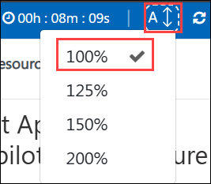
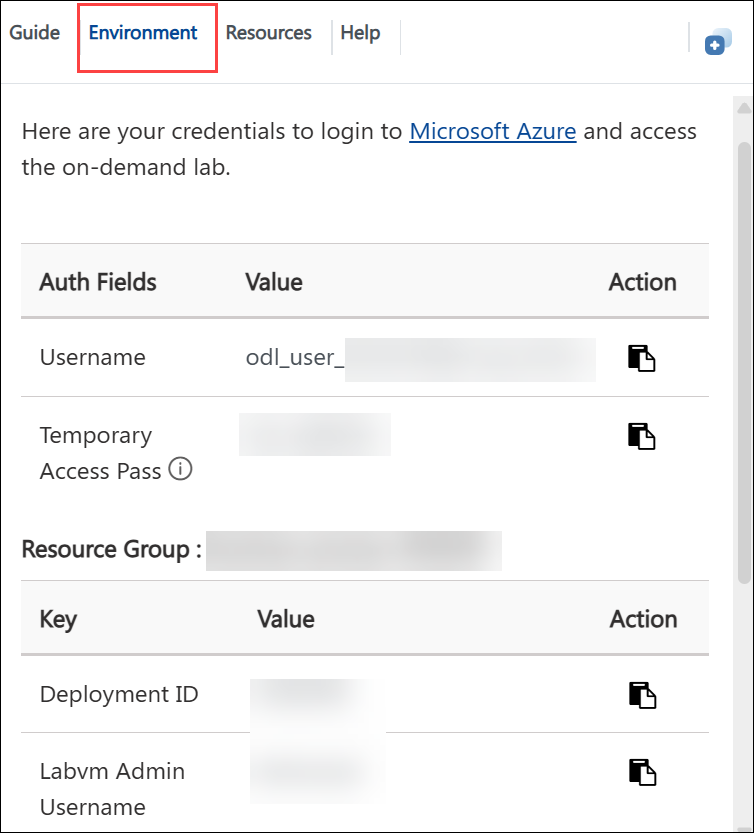
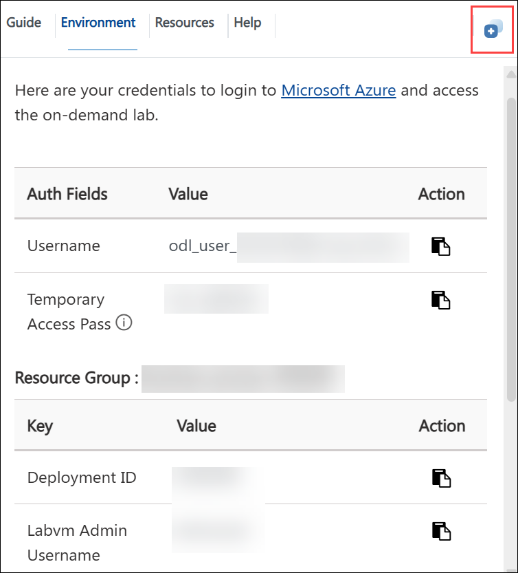
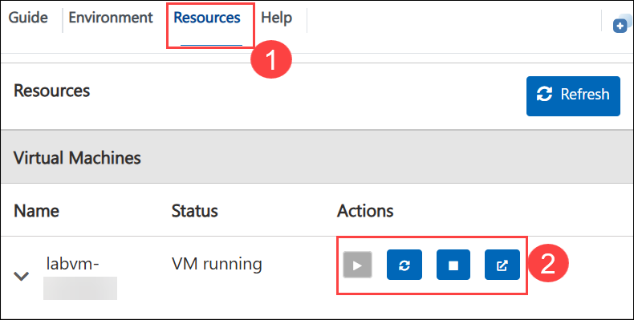
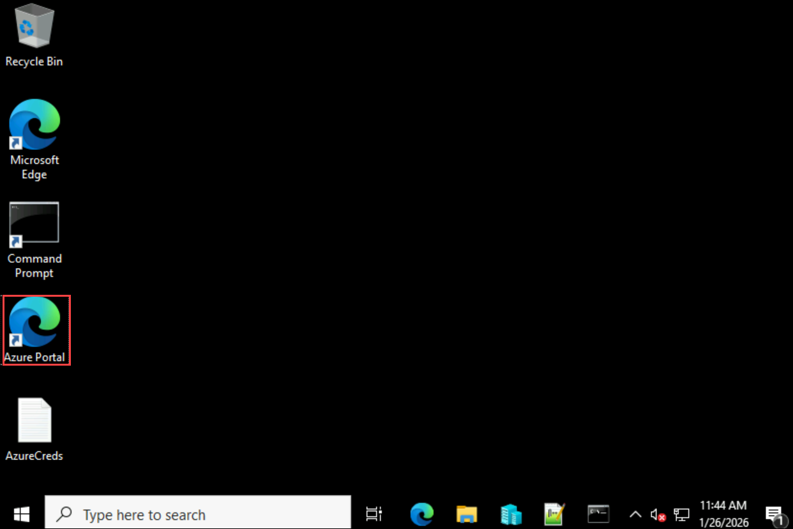
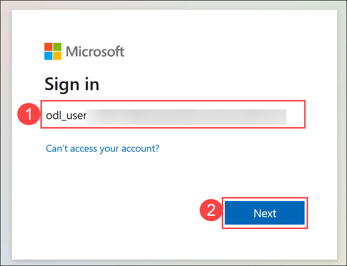
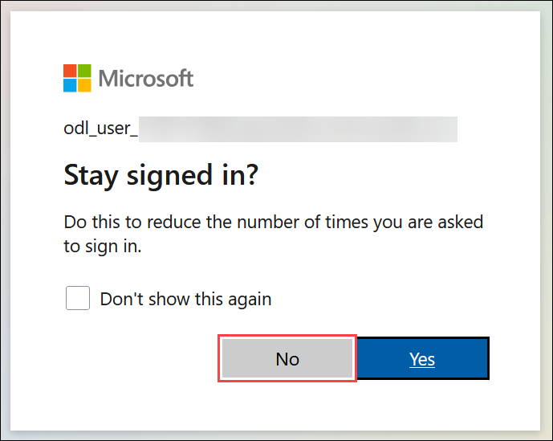

# Generative AI Application Using Your Own Data

### Overall Estimated Duration: 60 Minutes

## Overview

In this hands-on lab, you will explore how to **build a Retrieval Augmented Generation (RAG)** solution using **Microsoft Foundry** in Azure. You will learn how to deploy the required Foundry hub and project resources, configure embedding and generative models, and integrate locally available custom data into your application. Through guided exercises, you will upload and index documents, enable intelligent data retrieval, and connect the retrieved content to a language model to generate accurate, context-aware responses. By the end of the lab, you will test and validate your application, gaining practical experience in developing enterprise-ready generative AI solutions grounded in your organization’s data.

## Objective

In this hands on lab you will aims to enhance your skills in building data-driven generative AI applications using Microsoft Foundry in Azure. By completing this lab, you will learn:

* **Build a Retrieval Augmented Generation (RAG) solution:** Gain hands-on experience in deploying Foundry hub and project resources, configuring embedding and generative models, and integrating custom data to create a context-aware AI application.
* **Integrate and index custom data:** Learn how to upload locally available documents, enable indexing, and use vector embeddings to support efficient information retrieval.
* **Test and validate AI responses:** Understand how to connect retrieved data to a language model and evaluate the accuracy and relevance of generated responses.

## Prerequisites

* **Basic Azure Knowledge:** Familiarity with Azure resources and navigating the Azure portal.
* **AI and Generative Concepts:** Understanding of large language models, embeddings, and prompt engineering concepts.
* **Data Handling Basics:** Basic knowledge of working with documents and structured/unstructured data for AI applications.

## Architecture

This architecture allows users to leverage Azure's cloud infrastructure to deploy and interact with advanced AI models.
The flow of the lab will be to use an existing Resource Group, then create and deploy an OpenAI model in Azure. Next, explore the model in the playground and generate code using AI. Through the Azure Portal, users manage their resources, while Azure AI Foundry provides the tools needed to deploy and test these models. Chat playgrounds within Azure AI Foundry enable hands-on experimentation and refinement, facilitating the development of robust AI-powered applications.

## Architecture Diagram:

## Explanation of Components

- **Azure Portal:** Central interface for provisioning and managing Azure OpenAI resources, including model deployment settings and resource configuration.

- **Resource Group:** This is a container in Azure that holds related resources for your project. It helps us organize and manage services like your OpenAI model in one place.

- **Azure OpenAI Service:** The managed service that brings OpenAI’s generative models, such as GPT-4o-mini, into the Azure ecosystem. It provides secure, scalable endpoints to use language models for tasks like chat, summarization, Q\&A, or code generation, while also supporting enterprise-grade features such as quotas, authentication, and monitoring.

- **Microsoft Foundry:** A unified workspace where you deploy, test, and interact with AI models. It provides tools like the Chat Playground for experimenting with conversational use cases, and configuration options for prompts, parameters, and system instructions. Foundry also integrates with observability and monitoring features, making it the primary interface for fine-tuning and experimenting with deployed models.

## Getting Started with the Lab

Welcome to your Get Started with Azure OpenAI Service Workshop! We've prepared a seamless environment for you to explore and learn about Azure services. Let's begin by making the most of this experience.
 
## Accessing Your Lab Environment
 
Once you're ready to dive in, your virtual machine and the **Guide** will be right at your fingertips within your web browser.
 

## Virtual Machine & Lab Guide
 
Your virtual machine is your workhorse throughout the workshop. The lab guide is your roadmap to success.
 
## Lab Guide Zoom In/Zoom Out

To adjust the zoom level for the environment page, click the **A↕ : 100%** icon located next to the timer in the lab environment.

   

## Exploring Your Lab Resources
 
To get a better understanding of your lab resources and credentials, navigate to the **Environment** tab.
 

 
## Utilizing the Split Window Feature
 
For your convenience, you can open the lab guide in a separate window by selecting the **Split Window** button from the top right corner.
 

 
## Managing Your Virtual Machine
 
Feel free to **Start, Restart, or Stop (2)** your virtual machine as needed from the **Resources (1)** tab. Your experience is in your hands!
 

## Let's Get Started with Azure Portal
 
1. On your virtual machine, click on the **Azure Portal** icon as shown below:
 
      
    
2. You'll see the **Sign in to continue to Microsoft Azure** tab. Here, enter your credentials:
 
   - **Email/Username:** <inject key="AzureAdUserEmail"></inject>
 
       
 
3. Next, provide your password:
 
   - **Password:** <inject key="AzureAdUserPassword"></inject>
 
       
 
4. In the **Stay signed in?** pop-up, click **No**.

   

5. If a **Welcome to Microsoft Azure** popup window appears, click **Cancel** to skip the tour.

    .png)

6. Now you will see Azure Portal Dashboard, click on **Resource groups** from the Navigate panel to see the resource groups.

     
 
## Support Contact

The CloudLabs support team is available 24/7, 365 days a year, via email and live chat to ensure seamless assistance at any time. We offer dedicated support channels tailored specifically for both learners and instructors, ensuring that all your needs are promptly and efficiently addressed.

Learner Support Contacts:

- Email Support: cloudlabs-support@spektrasystems.com

- Live Chat Support: https://cloudlabs.ai/labs-support

Now, click on **Next** from the lower right corner to move on to the next page.

## Happy Learning!!
