# Generative AI Application Using Your Own Data

## Estimated Duration: 60 Minutes

## Lab Overview

Retrieval Augmented Generation (RAG) is a design pattern that enables AI developers in Azure to build intelligent applications by combining large language models with organization-specific data. Instead of relying only on the model’s pre-trained knowledge, RAG retrieves relevant information from custom data sources—such as documents, databases, or knowledge bases—and incorporates it into the prompt to generate more accurate, context-aware responses. This approach is widely used for developing chat-based and enterprise AI applications. In this exercise, AI developers will use Microsoft Foundry within Azure to integrate custom data into a generative AI solution, enabling more reliable and domain-specific outputs.


## Task 1: Provision Microsoft Foundry Hub and Project

To use the Foundry features in this task, you must first create a project that is built on a Foundry hub resource. The hub acts as the central resource that manages shared services such as model access, connections, and security. Once the hub is created, projects linked to it can access these capabilities and allow you to build, manage, and deploy your AI solutions.


1. In a new window browser, navigate to the **Microsoft Foundry** portal at `https://ai.azure.com` and Click on **Sign in to get started (1)**. 

    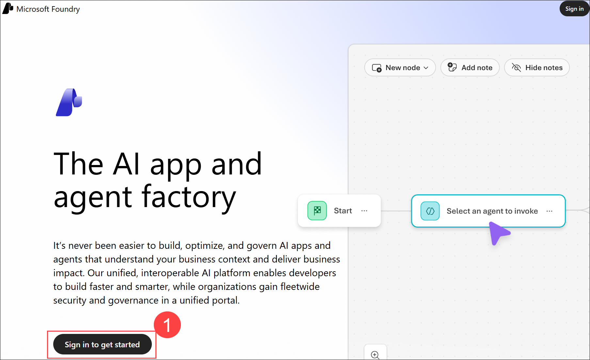

    >**Note**: Close any tips or quick start panes that are opened the first time you sign in, and if necessary use the Foundry logo at the top left to navigate to the home page, which looks similar to the following image (close the Help pane if it’s open).

1. Once after the login is succeeded, you should see the Home page of the **Microsoft Foundry**.

    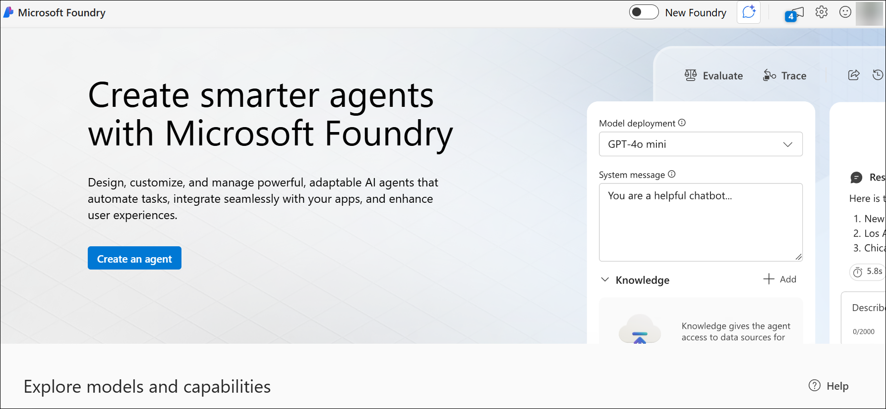

1. Navigate to `https://ai.azure.com/managementCenter/allResources`. 

    

1. Select **Create new (1)**, then choose the option to create a new **AI hub resource (2)** then select **Next (3)**.

    

    

1. In the **Create a new project** wizard, enter **aiproject- <inject key="DeploymentID" enableCopy="false" />(1)** for your project. Select the option **Rename hub (2)** to create a new hub. 

    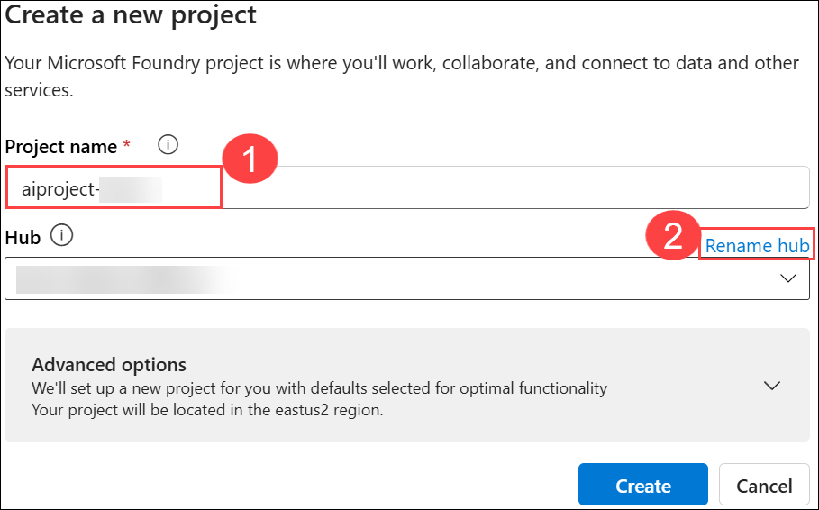

1. Enter **aihub- <inject key="DeploymentID" enableCopy="false" /> (1)** name for your new hub and click on **Next (2)**.

    

1. Expand **Advanced options (1)**, and set the following settings for your project:

    - **Subscription**: Use an existing Azure subscription **(2)**
    - **Resource group**: Select **openai-<inject key="DeploymentID" enableCopy="false" /> (3)**
    - **Region**: Select **East US2 / Sweden Central (4)**
    - **Foundry or Azure OpenAI**: Click on **Create new Foundry (5)**, provide name as **aifoundry-<inject key="DeploymentID" enableCopy="false" /> (6)** and click on **ok(7)**
    - Click on **Create (8)**

    


1. Now lets wait for your project to be created.

    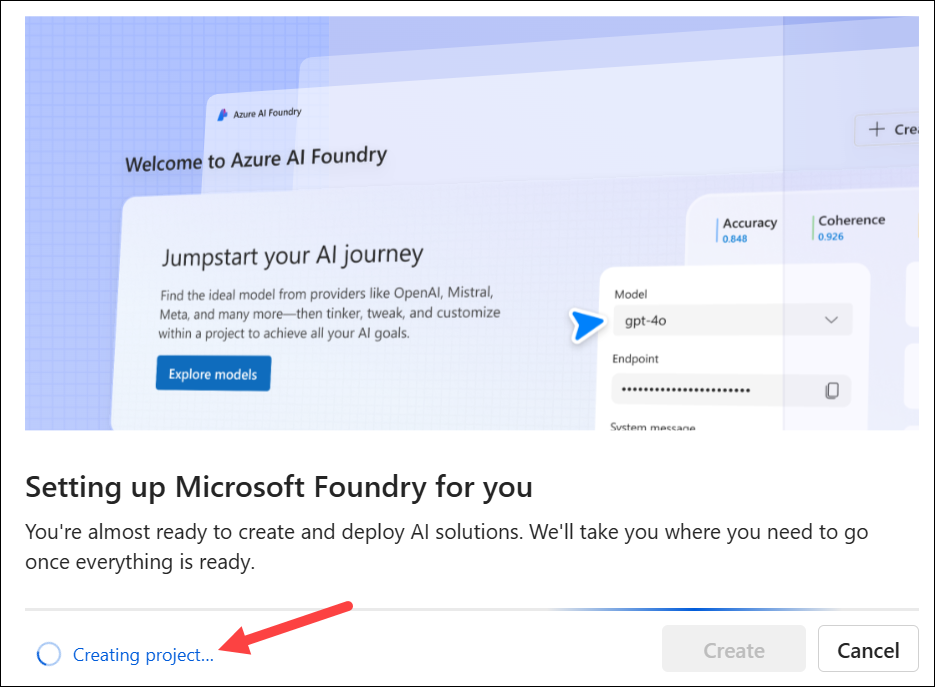

1. Once the project is successfully created, you will be automatically navigated to the overview page of the **aiproject- <inject key="DeploymentID" enableCopy="false" />**.

    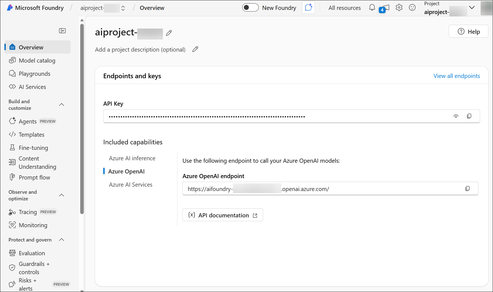

## Task 2: Deploy a model

In this task, you will configure two models within your Azure Foundry project to implement a Retrieval Augmented Generation (RAG) solution. First, you will use an embedding model to convert your custom text data into vector representations, enabling efficient indexing and retrieval of relevant information. Then, you will use a generative language model to process the retrieved data and generate accurate, context-aware natural language responses. Together, these models enable your solution to deliver intelligent answers grounded in your organization’s data.

1. In **aiproject- <inject key="DeploymentID" enableCopy="false" />** inside the **Micrsoft Foundry**, select **Model catalog** from the navigation pane on the left.

    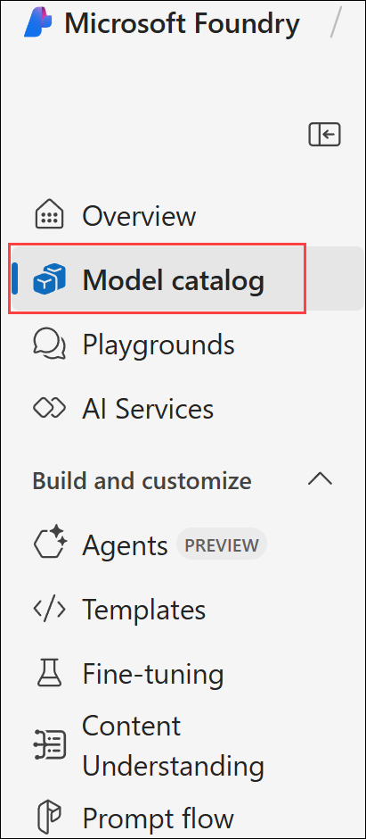


1. On the filter panel, select the **Collections (1)** and check the box fror **Azure OpenAI (2)** to filter by Azure OpenAI collections only.

    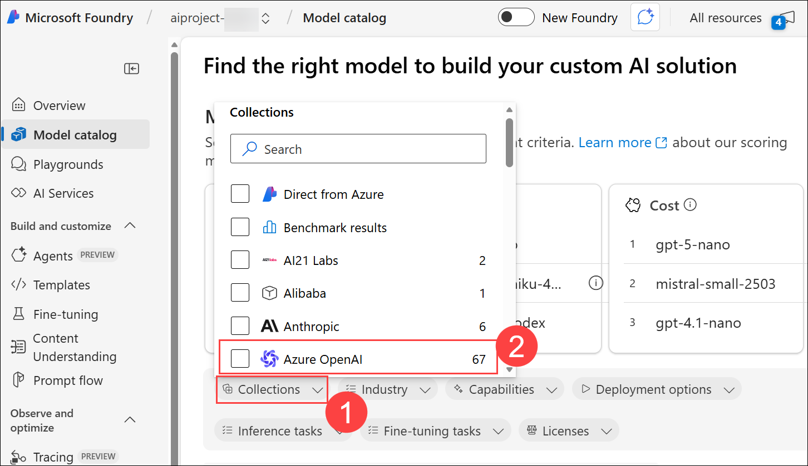

1. Search for **text-embedding-ada-002(1)**, select it **(2)**. On the detail page select **Use this model (3)**.

    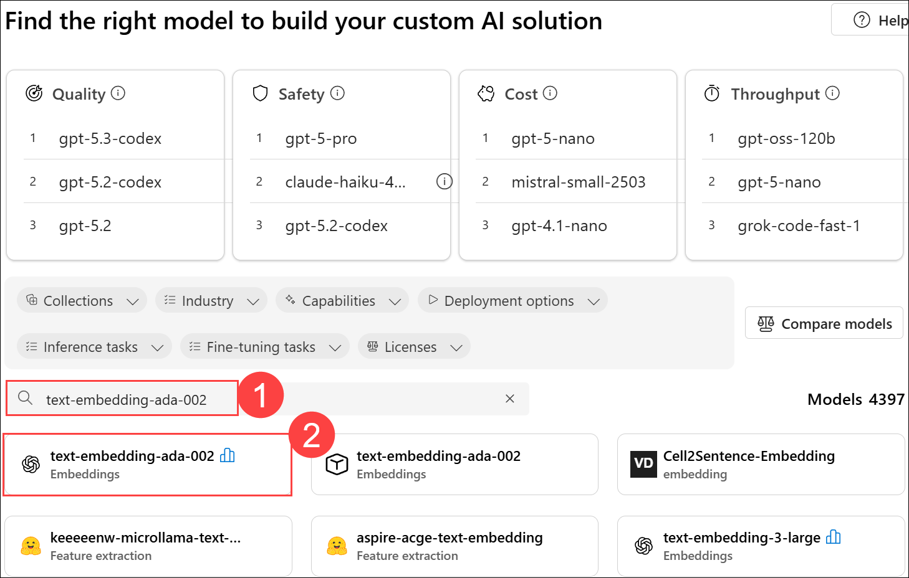

1. There will be a pop-up with purchase options appears, select the **Direct from Azure models** option.

    

1. Use the following settings in the **Deploy model wizard** and then click on **Deploy**:

    - **Deployment name**: **`text-embedding-ada-002` (1)**
    - **Deployment type**: **`Global Standard` (2)**
    - In order to edit the Deployment details click on **Customize (3)**.

        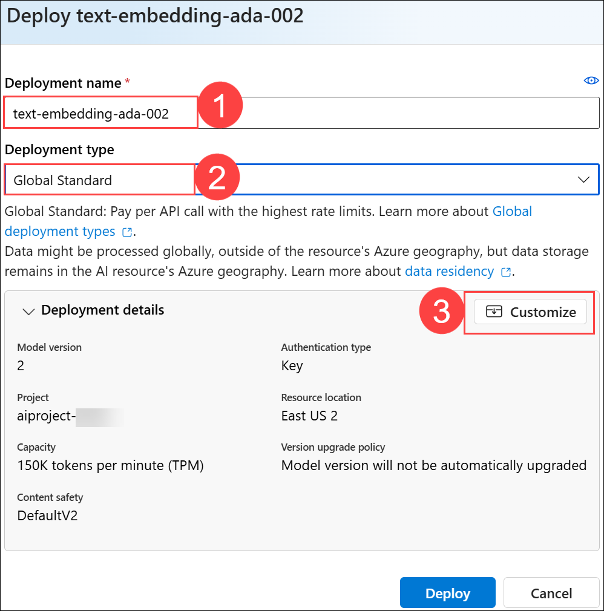

    - **Model version**: **`2(default)`(4)**
    - **Connected AI resource**: **`Select the resource created previously` (5)**
    - **Tokens per Minute Rate Limit (thousands)**: **`10k` (6)**
    - **Content filter**: **`DefaultV2` (7)**

        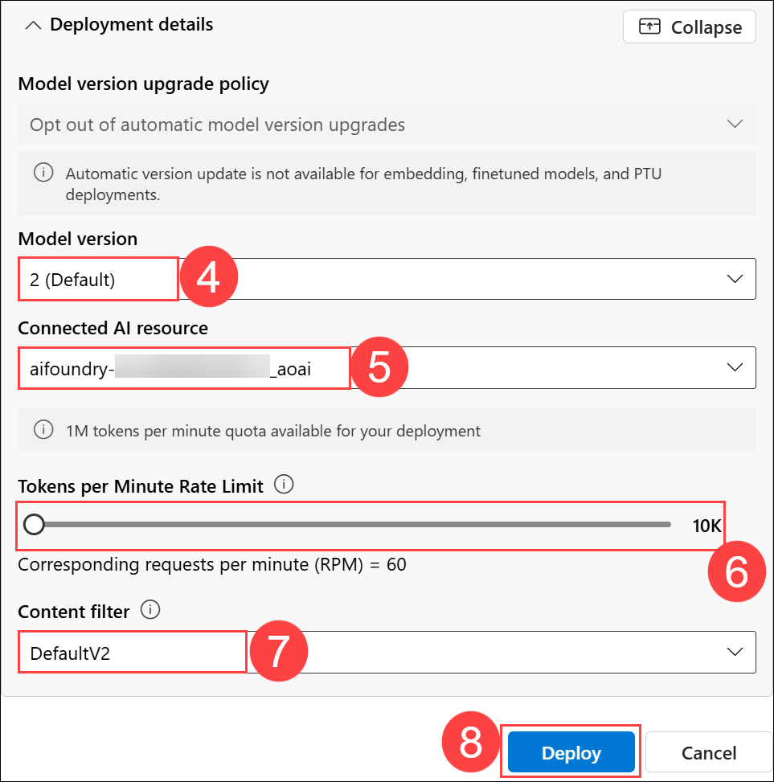
    
    > **Note:** If your current AI resource location doesn’t have quota available for the model you want to deploy, you will be asked to choose a different location where a new AI resource will be created and connected to your project.

1. Now lets return to the **Models catalog (1)** page, Make sure the collection is set to **Azure OpenAI (2)**  select and search for **gpt-4o (3)**.On the detail page select **Use this model (4)**.

    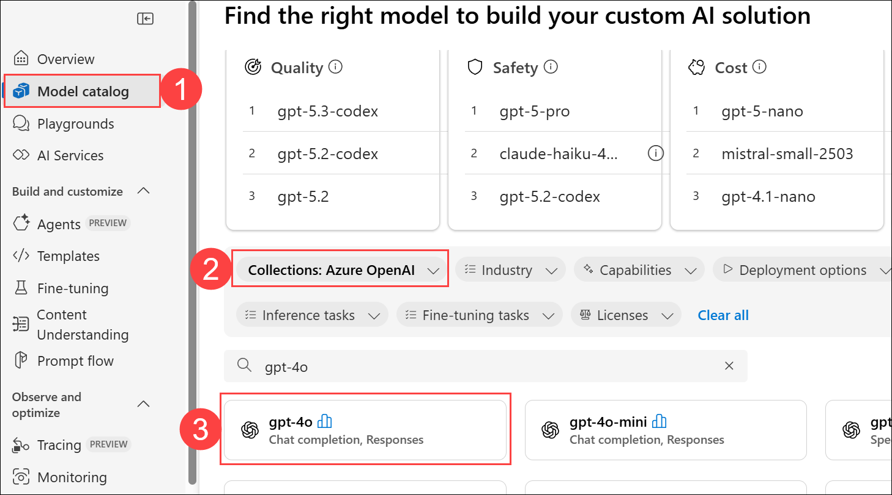

    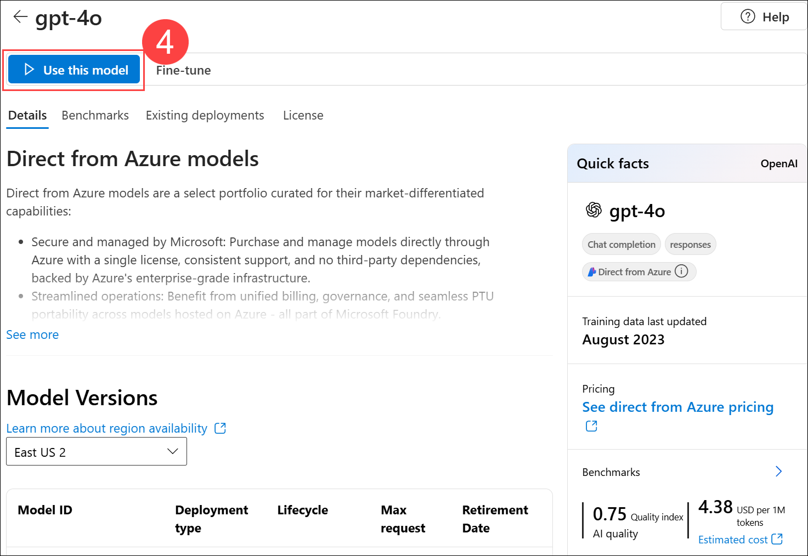

1. There will be a pop-up with purchase options appears, select the **Direct from Azure models** option.

    

1. Use the following settings in the **Deploy model wizard** and then click on **Deploy**:

    - **Deployment name**: **`gpt-4o` (1)**
    - **Deployment type**: **`Global Standard` (2)**
    - In order to edit the Deployment details click on **Customize (3)**.

        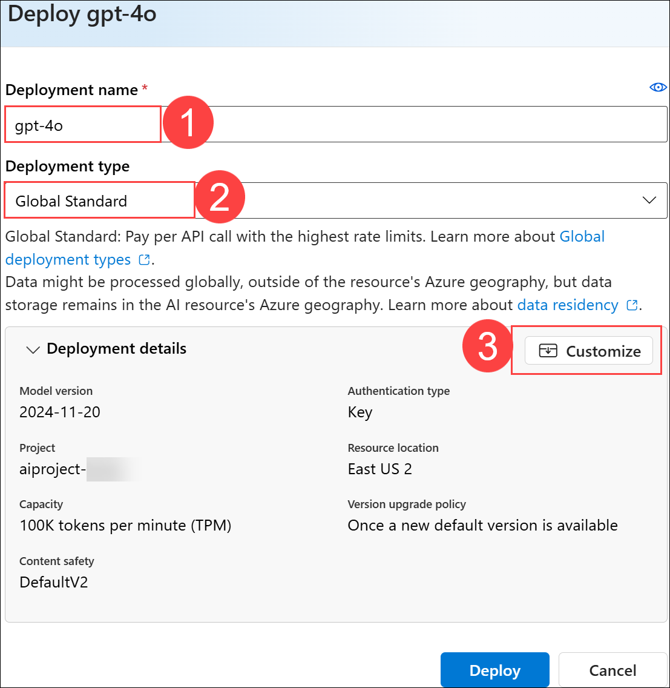

    - **Model version**: **`2024-11-20`(4)**
    - **Connected AI resource**: **`Select the resource created previously` (5)**
    - **Tokens per Minute Rate Limit (thousands)**: **`10k` (6)**
    - **Content filter**: **`DefaultV2` (7)**

        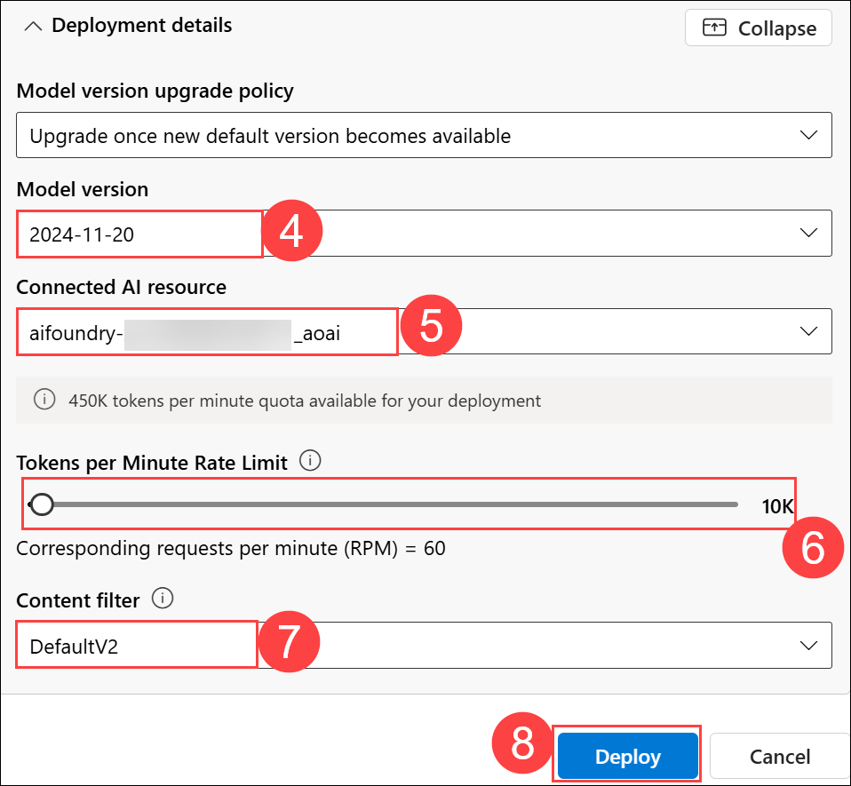
    
    > **Note:** If your current AI resource location doesn’t have quota available for the model you want to deploy, you will be asked to choose a different location where a new AI resource will be created and connected to your project.

    > **Note:** Reducing the Tokens Per Minute (TPM) helps avoid over-using the quota available in the subscription you are using. 10,000 TPM is sufficient for the data used in this exercise.

1. Once the models are deployed, on the left navigation click on **Models + Endpoints (1)** and view the newly deployed models **(2)**.

    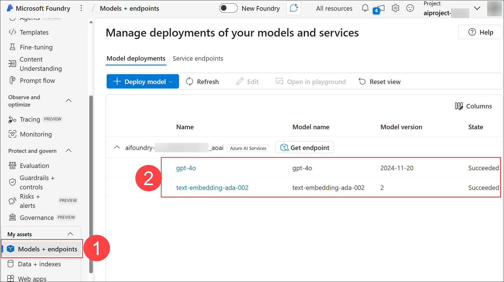

## Task 3: Add data to the AI Project

In this task, you will add data to your Azure Foundry project to support your generative AI application. The dataset consists of travel brochures in PDF format from the fictitious travel agency Margie’s Travel. You will upload these documents to the project so they can be indexed and used as a custom data source. This step ensures that the AI solution can retrieve relevant information from the brochures and generate accurate, context-aware responses based on their content.

1. Open **File Explorer 📁 (1)** from the **Start** menu and navigate to `C:\labfiles`. 

1. Create a new folder **📁New Folder (1)** and name it as **brochures (2)**.

1. In a new browser tab, download the zipped archive of brochures on to the **LabVM**.
    ```
    https://github.com/MicrosoftLearning/mslearn-ai-studio/raw/main/data/brochures.zip 
    ```
1. Open downloaded folder location **📁(1)**.Extract it to a folder named brochures on LabVM i.e,`C:\labfiles`.

1. In **aiproject- <inject key="DeploymentID" enableCopy="false" />** within the **Micrsoft Foundry**, select **Data + indexes (1)** from the navigation pane on the left, under **My assets**.   Select **+ New data (2)**.

    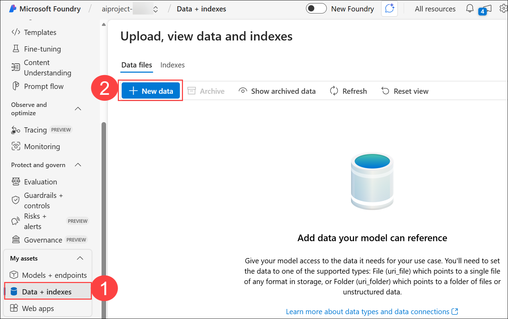

1. On the Add your data wizard, expand the drop-down menu of **Data Source (1)** to select **Upload files/folders (2)**.

    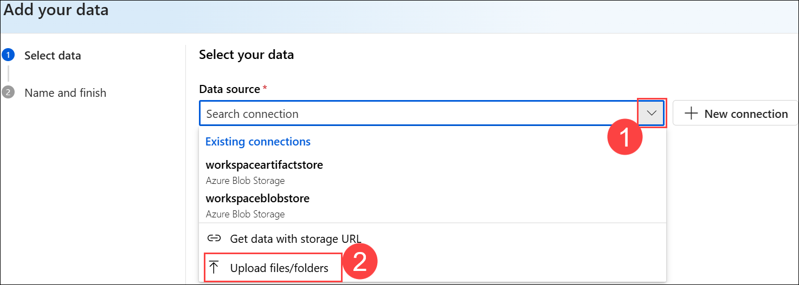

1. Click on **Upload files or folders (1)** and select **Upload folder (2)** then upload the brochures folder. Wait until all the files in the folder are listed.

    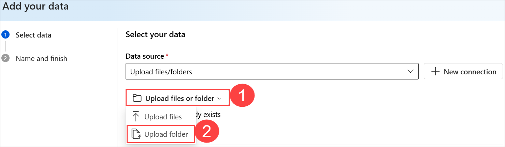

1. Wait until all the files in the folder are listed **(1)**. Select **Next (2)** and set the data name to **brochures (3)** then click on **Create (4)**. Wait for the folder to be uploaded and note that it contains several .pdf files.

    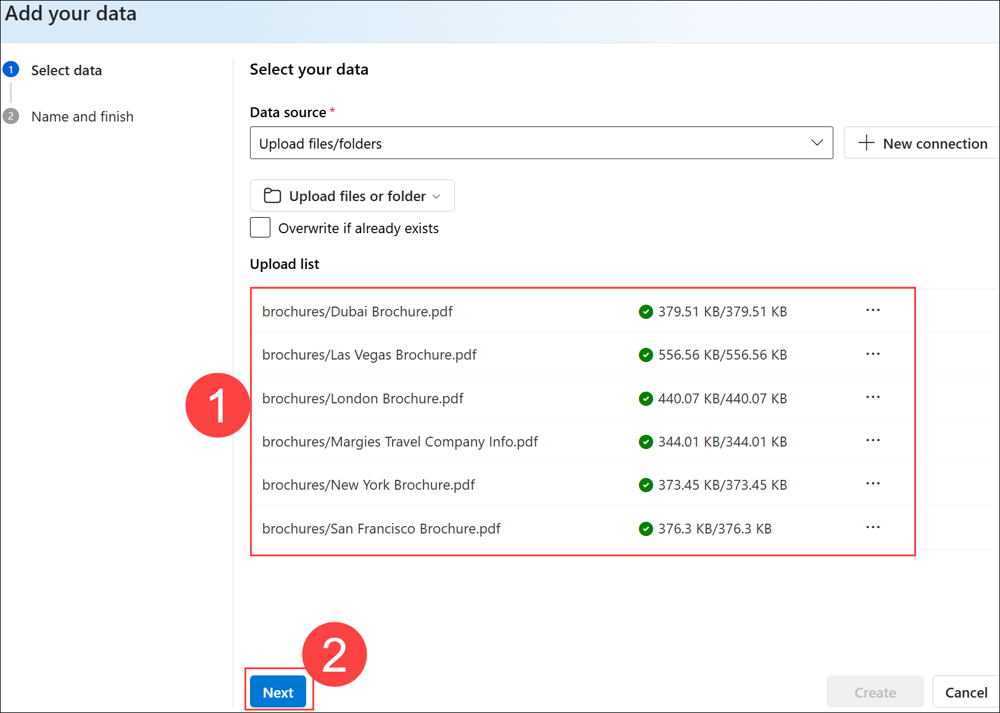

    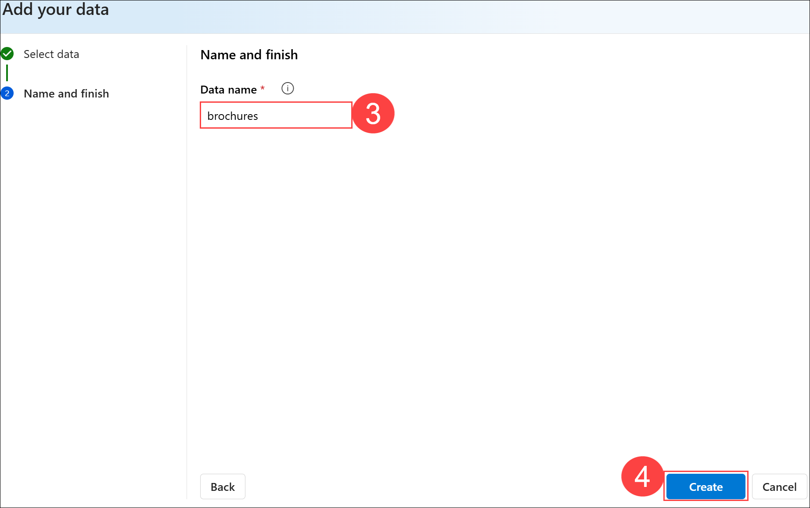

1. Now that the data is created lets move to next task to create an index for the same data.

## Task 4: Create an index for your data

Now that you’ve added a data source to the AI project, we can use it to create an index in the Azure AI Search resource.

1. In **aiproject- <inject key="DeploymentID" enableCopy="false" />** within the **Micrsoft Foundry**, select **Data + indexes (1)** from the navigation pane on the left, under **My assets**.   Select **+ New Index (2)**.

    

1. In the **Create a vector index** wizard, add a new index with the following settings:

    - **Source location**:

        - **Data source**: **`Data in Foundry` (1)**.
        - Select the **`brochures` (2)** as data source.
        - Click on **Next (3)**.

            

    - **Index configuration**:

        - **Select Azure AI Search Service**: **`Create a new Azure AI Search resource`**.
        
            

            > **Note**: This will redirect you to the Azure Portal

        - Provide the following details to create Azure AI Search Service:

            - **Subscription**: Choose the Default Azure subscription **(1)**
            - **Resource group**: Select **openai-<inject key="DeploymentID" enableCopy="false" /> (2)**
            - **Service name**: Name the resource name as **aisearch-<inject key="DeploymentID" enableCopy="false" /> (3)**
            - **Location**: Use the same location as your AI hub resource **(4)**
            - **Pricing tier**: Make sure **Basic (5)** is selected
            - Click on **Review + Create (6)** and then **Create**.

            

            

1. Wait for the **AI Search** resource to be created. 

    

1. Lets return to the **Create a vector index** wizard in Microsoft Foundry, click on the drop down of **Select Azure AI Search service (1)** and select **Connect other Azure AI Search (2)** resource and adding a connection to the AI Search resource you just created.

    - Vector index: brochures-index
    - Virtual machine: Auto select
    - Search settings:
        - Vector settings: Add vector search to this search resource
        - Azure OpenAI connection: Select the default Azure OpenAI resource for your hub.
        - Embedding model: text-embedding-ada-002
        - Embedding model deployment: Your deployment of the text-embedding-ada-002 model
        - Create the vector index 
        
1. Wait for the indexing process to be completed, which can take a while depending on available compute resources in your subscription.

1. The index creation operation consists of the following jobs:

    - Crack, chunk, and embed the text tokens in your brochures data.
    - Create the Azure AI Search index.
    - Register the index asset.

1. Now that we have the required data is added to the Project and created index to the added data, lets move ahead with the next task to test the index in Playground.

## Task 5: Test the index in the Playground

Before using your index in a RAG-based prompt flow, let’s verify that it can be used to affect generative AI responses.

1. In the navigation pane on the left, select the **Playgrounds (1)** page and click on the **Try the Chat playground (2)**.

    

1. On the **Chat playground** page, in the Setup pane, ensure that your **gpt-4o (version:2024-11-20)(1)** model deployment is selected. 

    

1. Then, in the main chat session panel, enter the prompt 
    ```
    Where can I stay in New York?
    ```
    

1. Review the response, which should be a generic answer from the model without any data from the index.

1. In the Setup pane, expand the Add your data field, and then add the brochures-index project index and select the hybrid (vector + keyword) search type.


