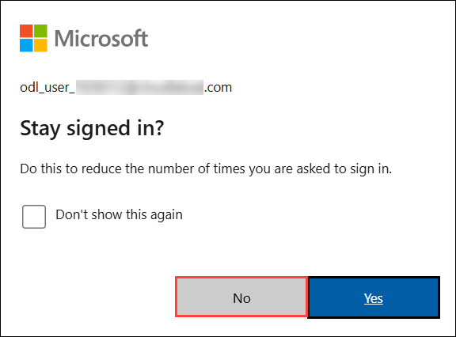

# Lunch and Learn: Integrate Azure OpenAI into your App

### Overall Estimated Duration: 60 Minutes

## Overview

The purpose of the lab is to enable you to effectively integrate Azure OpenAI Service into your applications, focusing on AI-driven functionalities. Through this lab, you will create and configure an Azure OpenAI resource, deploy and interact with a language model, and build a command line application in Azure Cloud Shell. Additionally, you will learn to manage conversation history to enhance the contextual relevance of AI responses. This lab offers a professional, hands-on approach to understanding and applying Azure OpenAI capabilities in real world scenarios.

## Objective

Understand how to deploy OpenAI models in Azure, configure them, and secure them with API keys. Gain skills in Command-line interfaces. By the end of this lab, you will be able to perform the below:

- **Azure OpenAI Integration**: Gain proficiency in integrating Azure OpenAI Service into your applications to leverage AI-driven functionalities.

- **Create and Configure Azure OpenAI Resources**: Gain experience in setting up and configuring an Azure OpenAI resource to facilitate the deployment of language models.

- **Deploy and Interact with Language Models**: Successfully deploy a language model and use a command line application in Azure Cloud Shell to interact with it, understanding its role in processing natural language.

- **Manage Conversation History**: Learn how to manage conversation history to ensure that AI responses remain contextually relevant and meaningful.

- **Develop Practical AI-Powered Applications**: Acquire hands-on experience in building AI-powered applications, applying Azure OpenAI capabilities effectively in real-world scenarios.

## Prerequisites

You should have basic knowledge and understanding of the following:

- **Azure Portal**: The web interface for managing and provisioning Azure resources.
- **Azure services, including Azure OpenAI and Azure Cloud Shell**: Core Azure offerings for AI capabilities and command-line management.
- **Command-line interfaces**: Tools like Bash for executing commands.

## Architecture

This architecture allows users to leverage advanced AI capabilities by starting with the provision of an Azure OpenAI resource in the Azure portal. You will then deploy a model and set up a sample application using Cloud Shell. The application will be integrated with the Azure OpenAI model for text-based tasks. You'll test the application by sending prompts and reviewing responses. Finally, you'll enhance the application to manage conversation history for a more interactive experience.

## Architecture Diagram

## Explanation of Components

The architecture for this lab involves the following key components:

- **Resource Group**: A Resource Group is a container in Azure used to manage and organize related Azure resources. It facilitates access control, monitoring, and billing by grouping resources together and streamlining their management.

- **OpenAI Resource**: An OpenAI resource in Azure supports the deployment and management of OpenAI models. It provides the necessary infrastructure and APIs for utilizing advanced AI capabilities, such as natural language processing and generation.

- **Cloud Shell App**: A Cloud Shell app is an interactive, browser based command line tool provided by Azure. It enables you to manage and configure Azure resources directly from the portal, offering a convenient environment for executing scripts and commands.

## Getting Started with the Lab

Once the environment is provisioned, a virtual machine (JumpVM) and lab guide will get loaded in your browser. Use this virtual machine throughout the workshop to perform the lab. You can see the number on the bottom of the lab guide to switch to different lab guide exercises.

## Accessing Your Lab Environment
 
Once you're ready to dive in, your virtual machine and **Guide** will be right at your fingertips within your web browser.
 

## Virtual Machine & Lab Guide
Your virtual machine is your workhorse throughout the workshop. The lab guide is your roadmap to success.

## Exploring Your Lab Resources
To get a better understanding of your lab resources and credentials, navigate to the **Environment** tab.

## Utilizing the Split Window Feature
For convenience, you can open the lab guide in a separate window by selecting the **Split Window** button from the top right corner.

## Managing Your Virtual Machine
Feel free to **start, restart, or stop (2)** your virtual machine as needed from the **Resources (2)** tab. Your experience is in your hands!

## Lab Guide Zoom In/Zoom Out

To adjust the zoom level for the environment page, click the **A↕: 100%** icon located next to the timer in the lab environment.

## Let's Get Started with Azure Portal
 
1. On your virtual machine, click on the **Azure Portal** icon as shown below:

   

1. On the **Sign in to Microsoft Azure** tab, you will see the login screen. In that enter the following email/username, and click on **Next (2)**. 

   * **Email/Username**: <inject key="AzureAdUserEmail"></inject> **(1)**
   
     
     
1. Now enter the following password and click on **Sign in (2)**.
   
   * **Password**: <inject key="AzureAdUserPassword"></inject> **(1)**
   
     

     >**Note:** If prompted to Enter Temporary Access Pass, enter the following **Password**: <inject key="AzureAdUserPassword"></inject> **(1)** and click on **Sign in (2)**.

      
       
1. If prompted to stay signed in, you can click **No**.
    
     

1. If a **Welcome to Microsoft Azure** popup window appears, click **Cancel** to skip the tour.

1. If you see the pop-up **You have free Azure Advisor recommendations!**, close the window to continue the lab.

1. If a **Welcome to Microsoft Azure** popup window appears, select **Maybe Later** to skip the tour.

## Support Contact
 
The CloudLabs support team is available 24/7, 365 days a year, via email and live chat to ensure seamless assistance at any time. We offer dedicated support channels tailored specifically for both learners and instructors, ensuring that all your needs are promptly and efficiently addressed.

Learner Support Contacts:

- Email Support: Cloudlabs-support@spektrasystems.com

- Live Chat Support: https://cloudlabs.ai/labs-support

Now, click on **Next** from the lower right corner to move on to the next page.
 
   .png)

### Happy Learning!!
